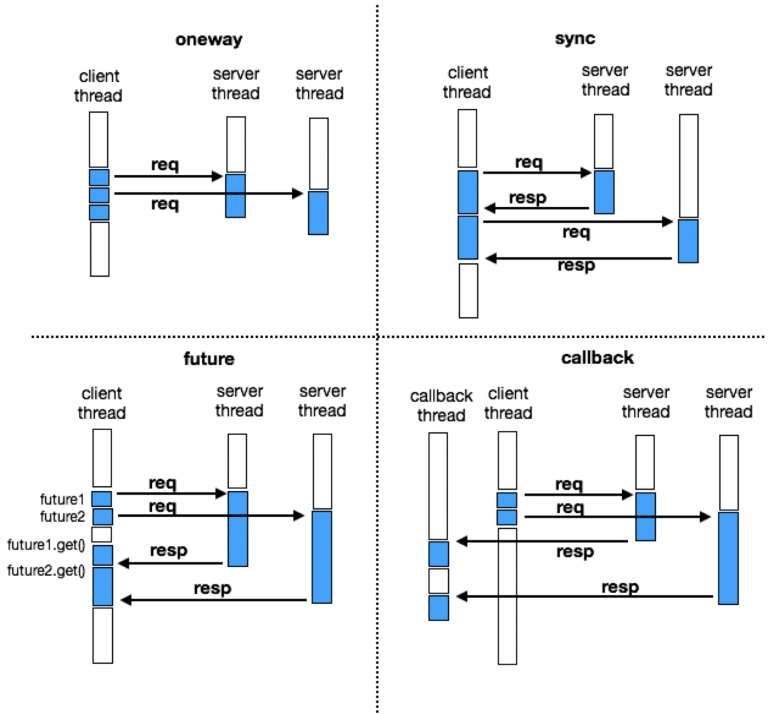

本篇为dubbo高性能剖析的下篇，侧重于剖析dubbo在网络层的源码实现及设计。（上篇传送门[dubbo的线程模型](./thread_model.md)）

## 概述

### Consumer端

整体上来看dubbo中的请求调用模型有以下几种

- oneway 客户端发出请求之后就结束了，不需要等待服务端响应。
- 同步请求，客户端请求之后当前线程同步等待消息返回，处理请求和响应是同一个线程。
- 异步请求，一种是通过上下文获取`Future`对象后主动调用`get`方法阻塞直到返回消息。处理请求和响应的也是同一个线程，只不过在等待响应的同时可以见缝插针的处理其他的任务。
- 异步请求，另一种是通过`Future`对象注册回调方法，处理请求和响应的是两个不同的线程。（这里抛出个问题响应和如何关联到对应的请求的呢）

示意图如下所示：




为了进一步区分异步请求阻塞`get()`与回调的区别，我们通过代码示例进一步说明

接口契约如下：

```java
public interface DemoService {

    String sayHello(String name);

    default CompletableFuture<String> sayHelloAsync(String name) {
        return CompletableFuture.completedFuture(sayHello(name));
    }

}
```

服务提供方实现：

```java
public class DemoServiceImpl implements DemoService {
    private static final Logger logger = LoggerFactory.getLogger(DemoServiceImpl.class);

    @Override
    public String sayHello(String name) {
        LockSupport.parkNanos(TimeUnit.SECONDS.toNanos(3));
        return "Hello " + name + ";
    }

}
```

调用方代码：

```java
DemoService demoService = ReferenceConfigCache.getCache().get(reference);

System.out.println("threadId:" + Thread.currentThread().getId() + " get 开始");
demoService.sayHello("get");
Future<String> future = RpcContext.getContext().getCompletableFuture();
future.get();
System.out.println("threadId:" + Thread.currentThread().getId() + " get 结束");


System.out.println("threadId:" + Thread.currentThread().getId() + " callback 开始");
demoService.sayHelloAsync("callback").whenComplete((r, e) -> {
    System.out.println("threadId:" + Thread.currentThread().getId() + " callback 结束");
    System.out.println("threadId:" + Thread.currentThread().getId() + " 执行完毕");
});

System.out.println("threadId:" + Thread.currentThread().getId() + " 执行完毕");
```

执行结果为：

```java
threadId:1 get 开始
threadId:1 get 结束
threadId:1 callback 开始
threadId:1 执行完毕
    
threadId:27 callback 结束
threadId:27 执行完毕
```

通过执行结果可以发现

- id为1的线程为主线程，id为27的线程为回调线程
- `CompletableFuture`回调使用单独的线程不会阻塞主流程的执行。
- 通过`Future.get()`会阻塞主线程执行。

### Provider端

