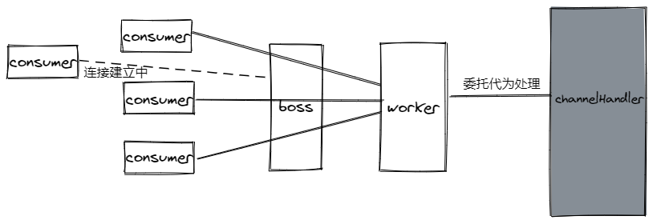
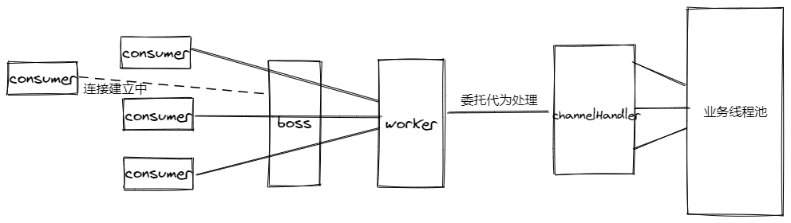

引用官方原句"Apache Dubbo is a high-performance, java based open source RPC framework."， dubbo是高性能的基于Java语言开发的RPC框架。我们这里就针对dubbo高性能这点分为上下两篇，就dubbo中的底层线程模型及网络模型展开剖析，本篇为上篇着重分析dubbo的线程模型，如果读者对于Java中的线程池原理不是很了解，可以先阅读[这里](./thread.md)。

## dubbo中有哪些类型的线程池

在具体分析每个线程池之前，我们分析的具体步骤是：

- 了解每个默认参数的作用
- 线程池阻塞队列特性
- 任务被拒绝后处理策略

### LimitedThreadPool

```java
public class LimitedThreadPool implements ThreadPool {

    @Override
    public Executor getExecutor(URL url) {
        String name = url.getParameter(THREAD_NAME_KEY, DEFAULT_THREAD_NAME);
        int cores = url.getParameter(CORE_THREADS_KEY, DEFAULT_CORE_THREADS);
        int threads = url.getParameter(THREADS_KEY, DEFAULT_THREADS);
        int queues = url.getParameter(QUEUES_KEY, DEFAULT_QUEUES);
        return new ThreadPoolExecutor(cores, threads, Long.MAX_VALUE, TimeUnit.MILLISECONDS,
                queues == 0 ? new SynchronousQueue<Runnable>() :
                        (queues < 0 ? new LinkedBlockingQueue<Runnable>()
                                : new LinkedBlockingQueue<Runnable>(queues)),
                new NamedInternalThreadFactory(name, true), new AbortPolicyWithReport(name, url));
    }

}
```

- 默认核心线程数量是0，最大线程数量是200。线程最大空闲时间基本无上限，可以理解线程一旦被创建线程池不会主动回收线程资源进行缩容。

- 任务队列使用`SynchronousQueue`，该队列容量为零，一旦有任务到达就一直阻塞直到有空闲的线程来处理。
- 当任务超时未处理时，该线程池会记录下线程栈信息并抛出`RejectedExecutionException`异常。

## FixedThreadPool

```java
public class FixedThreadPool implements ThreadPool {

    @Override
    public Executor getExecutor(URL url) {
        String name = url.getParameter(THREAD_NAME_KEY, DEFAULT_THREAD_NAME);
        int threads = url.getParameter(THREADS_KEY, DEFAULT_THREADS);
        int queues = url.getParameter(QUEUES_KEY, DEFAULT_QUEUES);
        return new ThreadPoolExecutor(threads, threads, 0, TimeUnit.MILLISECONDS,
                queues == 0 ? new SynchronousQueue<Runnable>() :
                        (queues < 0 ? new LinkedBlockingQueue<Runnable>()
                                : new LinkedBlockingQueue<Runnable>(queues)),
                new NamedInternalThreadFactory(name, true), new AbortPolicyWithReport(name, url));
    }

}
```

- 默认核心线程数量是200，最大线程数量也是200，所以当前线程池并不会主动回收线程资源进行缩容。
- 任务队列使用`SynchronousQueue`，该队列容量为零，一旦有任务到达就一直阻塞直到有空闲的线程来处理。
- 当任务超时未处理时，该线程池会记录下线程栈信息并抛出`RejectedExecutionException`异常。
- 如果没有显示的指定，那么该线程池也是dubbo中默认最为常用的线程池。

## EagerThreadPool

```java
public class EagerThreadPool implements ThreadPool {

    @Override
    public Executor getExecutor(URL url) {
        String name = url.getParameter(THREAD_NAME_KEY, DEFAULT_THREAD_NAME);
        int cores = url.getParameter(CORE_THREADS_KEY, DEFAULT_CORE_THREADS);
        int threads = url.getParameter(THREADS_KEY, Integer.MAX_VALUE);
        int queues = url.getParameter(QUEUES_KEY, DEFAULT_QUEUES);
        int alive = url.getParameter(ALIVE_KEY, DEFAULT_ALIVE);

        // init queue and executor
        TaskQueue<Runnable> taskQueue = new TaskQueue<Runnable>(queues <= 0 ? 1 : queues);
        EagerThreadPoolExecutor executor = new EagerThreadPoolExecutor(cores,
                threads,
                alive,
                TimeUnit.MILLISECONDS,
                taskQueue,
                new NamedInternalThreadFactory(name, true),
                new AbortPolicyWithReport(name, url));
        taskQueue.setExecutor(executor);
        return executor;
    }
}
```

这里`EagerThreadPool`涉及到另外两个类

- `TaskQueue` 该类继承自`LinkedBlockingQueue`, 重写了 `offer(Runnable runnable)`方法（这里需要结合`ThreadPoolExecutor`的`execute(Runnable command)`的代码一起理解），当添加任务失败返回**false**时线程池会尝试增加线程数。

  ```java
  public boolean offer(Runnable runnable) {
      if (executor == null) {
          throw new RejectedExecutionException("The task queue does not have executor!");
      }
  
      int currentPoolThreadSize = executor.getPoolSize();
      // 如果当前线程数量大于提交的任务数量，直接让空闲线程处理。
      if (executor.getSubmittedTaskCount() < currentPoolThreadSize) {
          return super.offer(runnable);
      }
  
      // 当线程池最大数量大于当前线程数量时，这里返回false，对应线程池会创建新的线程处理该任务。
      if (currentPoolThreadSize < executor.getMaximumPoolSize()) {
          return false;
      }
  
      // currentPoolThreadSize >= max
      return super.offer(runnable);
  }
  ```

- `EagerThreadPoolExecutor`该类继承自`ThreadPoolExecutor`，重写了`execute(Runnable command)`方法。

  ```java
  public void execute(Runnable command) {
      if (command == null) {
          throw new NullPointerException();
      }
      // do not increment in method beforeExecute!
      submittedTaskCount.incrementAndGet();
      try {
          super.execute(command);
      } catch (RejectedExecutionException rx) {
          // retry to offer the task into queue.
          final TaskQueue queue = (TaskQueue) super.getQueue();
          try {
              if (!queue.retryOffer(command, 0, TimeUnit.MILLISECONDS)) {
                  submittedTaskCount.decrementAndGet();
                  throw new RejectedExecutionException("Queue capacity is full.", rx);
              }
          } catch (InterruptedException x) {
              submittedTaskCount.decrementAndGet();
              throw new RejectedExecutionException(x);
          }
      } catch (Throwable t) {
          // decrease any way
          submittedTaskCount.decrementAndGet();
          throw t;
      }
  }
  ```

可以看到这里捕获了`RejectedExecutionException`异常，会重试一次将任务重新添加到队列，如果还是失败则抛出异常。

介绍完了`EagerThreadPool`涉及的两个类，我们继续分析该线程池的特性：

- 默认核心线程数量是0，最大线程数量是`Integer.MAX_VALUE`（无限制扩容线程数在大多数场景都是很危险的），如果线程空闲超过一分钟则会被回收。
- 任务队列使用`TaskQueue`，该队列容量为1，一旦有任务到达优先创建新的线程，然后才会阻塞直到有空闲的线程来处理。
- 当任务超时未处理时，该线程池重试一次将任务添加到任务队列，如果还是失败则会记录下线程栈信息并抛出`RejectedExecutionException`异常。

## CachedThreadPool

```java
public class CachedThreadPool implements ThreadPool {

    @Override
    public Executor getExecutor(URL url) {
        String name = url.getParameter(THREAD_NAME_KEY, DEFAULT_THREAD_NAME);
        int cores = url.getParameter(CORE_THREADS_KEY, DEFAULT_CORE_THREADS);
        int threads = url.getParameter(THREADS_KEY, Integer.MAX_VALUE);
        int queues = url.getParameter(QUEUES_KEY, DEFAULT_QUEUES);
        int alive = url.getParameter(ALIVE_KEY, DEFAULT_ALIVE);
        return new ThreadPoolExecutor(cores, threads, alive, TimeUnit.MILLISECONDS,
                queues == 0 ? new SynchronousQueue<Runnable>() :
                        (queues < 0 ? new LinkedBlockingQueue<Runnable>()
                                : new LinkedBlockingQueue<Runnable>(queues)),
                new NamedInternalThreadFactory(name, true), new AbortPolicyWithReport(name, url));
    }
}
```

- 默认核心线程数量是0，最大线程数量是`Integer.MAX_VALUE`（无限制扩容线程数在大多数场景都是很危险的），如果线程空闲超过一分钟则会被回收。
- 任务队列使用`SynchronousQueue`，该队列容量为零，一旦有任务到达就一直阻塞直到有空闲的线程来处理。
- 当任务超时未处理时，该线程池会记录下线程栈信息并抛出`RejectedExecutionException`异常。

通过上面的介绍我们已经了解掌握了dubbo中常见的线程池及其特性，下面我们继续了解这些线程池具体应用在dubbo中哪些地方以及作用是什么。

## 线程池被用在了哪些地方

这里只分析dubbo中使用了netty作为通讯框架这种场景（不同网络通讯框架线程模型可能会有很大的差异）。不管使用哪种通讯框架，在网络通讯层面都需要完成以下基础的功能：

- 请求连接的建立，以netty为例dubbo会在tcp层为每个服务消费者和提供者之间建立TCP长连接。
- 发送数据，通过已经建立的TCP连接发送数据。
- 接收数据，通过已经建立的TCP连接接收数据。
- 关闭连接，关闭TCP长连接。

就以上功能作为展开点，我们以dubbo中服务提供方`NettyServer`启动过程开始分析。

```java
protected void doOpen() throws Throwable {
    bootstrap = new ServerBootstrap();

    bossGroup = NettyEventLoopFactory.eventLoopGroup(1, "NettyServerBoss");
    workerGroup = NettyEventLoopFactory.eventLoopGroup(
            getUrl().getPositiveParameter(IO_THREADS_KEY, Constants.DEFAULT_IO_THREADS),
            "NettyServerWorker");

    final NettyServerHandler nettyServerHandler = new NettyServerHandler(getUrl(), this);
    channels = nettyServerHandler.getChannels();

    bootstrap.group(bossGroup, workerGroup)
            .channel(NettyEventLoopFactory.serverSocketChannelClass())
            .option(ChannelOption.SO_REUSEADDR, Boolean.TRUE)
            .childOption(ChannelOption.TCP_NODELAY, Boolean.TRUE)
            .childOption(ChannelOption.ALLOCATOR, PooledByteBufAllocator.DEFAULT)
            .childHandler(new ChannelInitializer<SocketChannel>() {
                @Override
                protected void initChannel(SocketChannel ch) throws Exception {
                    // FIXME: should we use getTimeout()?
                    int idleTimeout = UrlUtils.getIdleTimeout(getUrl());
                    NettyCodecAdapter adapter = new NettyCodecAdapter(getCodec(), getUrl(), NettyServer.this);
                    if (getUrl().getParameter(SSL_ENABLED_KEY, false)) {
                        ch.pipeline().addLast("negotiation",
                                SslHandlerInitializer.sslServerHandler(getUrl(), nettyServerHandler));
                    }
                    ch.pipeline()
                            .addLast("decoder", adapter.getDecoder())
                            .addLast("encoder", adapter.getEncoder())
                            .addLast("server-idle-handler", new IdleStateHandler(0, 0, idleTimeout, MILLISECONDS))
                            .addLast("handler", nettyServerHandler);
                }
            });
    // bind
    ChannelFuture channelFuture = bootstrap.bind(getBindAddress());
    channelFuture.syncUninterruptibly();
    channel = channelFuture.channel();

}
```

以上代码是使用netty中非常常见的用法，分别创建boss角色和worker角色两个工作组。其中boss角色负责连接的建立以及通信通道的建立，通道建立完成之后通讯的工作以及通道的断开则由worker角色负责。这么说可能有些抽象，可以简单的做个类比：我们去餐馆吃饭，进门的时候前台会负责引导你至座位上，然后会再帮你安排一名服务员。这时前台的工作结束了，他可以继续迎接其他客人，服务员则继续提供点餐送菜等工作。例子里的前台可以理解为boss的角色，服务员则可以对应的理解为worker的角色。
上面代码中涉及到`NettyServerHandler`这个对象，该对象继承自`ChannelDuplexHandler`（对netty不熟悉的小伙伴可以将该对象理解为一个双向的通道，提供了读写的功能，dubbo的通讯也是由此展开的）。

```java
public class NettyServerHandler extends ChannelDuplexHandler {
  	
    // 省略代码
    @Override
    public void channelRead(ChannelHandlerContext ctx, Object msg) throws Exception {
        NettyChannel channel = NettyChannel.getOrAddChannel(ctx.channel(), url, handler);
        handler.received(channel, msg);
    }
    
	@Override
    public void write(ChannelHandlerContext ctx, Object msg, ChannelPromise promise) throws Exception {
        super.write(ctx, msg, promise);
        NettyChannel channel = NettyChannel.getOrAddChannel(ctx.channel(), url, handler);
        handler.sent(channel, msg);
    }
    
}
```

上面代码不需要去精读就可以发现明显的规律，`NettyServerHandler`类重写的`channelRead`、`write`等方法都将具体的调用委托给了**`ChannelHandler`**这个对象。目前为止我们的线程模型可以简化为如下图所示：



暂且把**`channel`**当成黑盒，我们下面继续展开分析，`ChannelHandler`源码如下：

```java
@SPI
public interface ChannelHandler {

    void connected(Channel channel) throws RemotingException;

    void disconnected(Channel channel) throws RemotingException;
    
    void sent(Channel channel, Object message) throws RemotingException;
    
    void received(Channel channel, Object message) throws RemotingException;

    void caught(Channel channel, Throwable exception) throws RemotingException;
}
```

又可以看到熟悉身影`SPI`了（如果对此不了解的小伙伴，可以访问[链接](https://www.jianshu.com/p/fae144e6a8c2)）。先来看看在dubbo中有哪些实现，通过配置文件一番查找，不好意思没找到，就很气，dubbo为什么不按套路出牌？？？既然通过这种方式找不到，只能追踪源码慢慢的分析了。

通过进一步的追踪可以看到，在创建`NettyServer`对象是，构造方法中隐藏了一段非常重要的代码：

```java
public NettyServer(URL url, ChannelHandler handler) throws RemotingException {
    // you can customize name and type of client thread pool by THREAD_NAME_KEY and THREADPOOL_KEY in CommonConstants.
    // the handler will be wrapped: MultiMessageHandler->HeartbeatHandler->handler
    super(ExecutorUtil.setThreadName(url, SERVER_THREAD_POOL_NAME), ChannelHandlers.wrap(handler, url));
}
```

其中`ChannelHandlers.wrap(handler, url)`将`handler`做了进一步的包装（此处联想到装饰器模式的应用），我们继续看看它到底做了什么吧。

```java
public class ChannelHandlers {

	// 省略部分代码

    public static ChannelHandler wrap(ChannelHandler handler, URL url) {
        return ChannelHandlers.getInstance().wrapInternal(handler, url);
    }

    protected ChannelHandler wrapInternal(ChannelHandler handler, URL url) {
        return new MultiMessageHandler(new HeartbeatHandler(ExtensionLoader.getExtensionLoader(Dispatcher.class)
                .getAdaptiveExtension().dispatch(handler, url)));
    }
}
```

可以看到原来的`handler`分别被`MultiMessageHandler`、`HeartbeatHandler`、以及通过`ExtensionLoader`扩展加载器创建的`Dispatcher`调用`dispatch`进一步装饰，前面两个暂且放在一边，后续博文会有对应的剖析介绍。先来看看`Dispatcher`这个类有哪些实现吧，通过扩展配置文件可知：

```java
all=org.apache.dubbo.remoting.transport.dispatcher.all.AllDispatcher
direct=org.apache.dubbo.remoting.transport.dispatcher.direct.DirectDispatcher
message=org.apache.dubbo.remoting.transport.dispatcher.message.MessageOnlyDispatcher
execution=org.apache.dubbo.remoting.transport.dispatcher.execution.ExecutionDispatcher
connection=org.apache.dubbo.remoting.transport.dispatcher.connection.ConnectionOrderedDispatcher
```

在`Dispatcher`类中注解默认使用的是`AllDispatcher`，该类内容如下：

```java
public class AllDispatcher implements Dispatcher {

    public static final String NAME = "all";

    @Override
    public ChannelHandler dispatch(ChannelHandler handler, URL url) {
        return new AllChannelHandler(handler, url);
    }
}
```

到这里终于见到了倍感亲切的`ChannelHandler`，那么上面`Dispatcher`与`ChannelHandler`对应关系如下：

- `AllDispatcher` - `AllChannelHandler`
- `DirectDispatcher` - `DirectChannelHandler`
- `MessageOnlyDispatcher` - `MessageOnlyChannelHandler`
- `ExecutionDispatcher` - `ExecutionChannelHandler`
- `ConnectionOrderedDispatcher` - `ConnectionOrderedChannelHandler`

上面五种不同的实现原理都是相同的，我们就不一一展开分析了，这里以默认的`AllChannelHandler`为例抛砖引玉，感兴趣的小伙伴可以自行阅读。

```java
public class AllChannelHandler extends WrappedChannelHandler {

    public AllChannelHandler(ChannelHandler handler, URL url) {
        super(handler, url);
    }

    @Override
    public void connected(Channel channel) throws RemotingException {
        // 获取线程池
        ExecutorService executor = getExecutorService();
        try {
            // 将连接任务提交给线程池执行
            executor.execute(new ChannelEventRunnable(channel, handler, ChannelState.CONNECTED));
        } catch (Throwable t) {
            throw new ExecutionException("connect event", channel, getClass() + " error when process connected event .", t);
        }
    }

    @Override
    public void disconnected(Channel channel) throws RemotingException {
        // 获取线程池
        ExecutorService executor = getExecutorService();
        try {
            // 将断开连接任务提交给线程池执行
            executor.execute(new ChannelEventRunnable(channel, handler, ChannelState.DISCONNECTED));
        } catch (Throwable t) {
            throw new ExecutionException("disconnect event", channel, getClass() + " error when process disconnected event .", t);
        }
    }

    @Override
    public void received(Channel channel, Object message) throws RemotingException {
        // 获取线程池
        ExecutorService executor = getPreferredExecutorService(message);
        try {
            // 将接收信息任务提交给线程池执行
            executor.execute(new ChannelEventRunnable(channel, handler, ChannelState.RECEIVED, message));
        } catch (Throwable t) {
           if(message instanceof Request && t instanceof RejectedExecutionException){
                sendFeedback(channel, (Request) message, t);
                return;
           }
            throw new ExecutionException(message, channel, getClass() + " error when process received event .", t);
        }
    }

    @Override
    public void caught(Channel channel, Throwable exception) throws RemotingException {
        // 获取线程池
        ExecutorService executor = getExecutorService();
        try {
            executor.execute(new ChannelEventRunnable(channel, handler, ChannelState.CAUGHT, exception));
        } catch (Throwable t) {
            throw new ExecutionException("caught event", channel, getClass() + " error when process caught event .", t);
        }
    }
}
```

可以看到业务线程池代为处理了`connected`、`disconnected`、`received`、`caught`等事件，而`read`事件还是由netty中IO线程执行（这里跟官网的说法冲突了，官网文档错误已经有相应的[issues](https://github.com/apache/dubbo-website/issues/678)。到这里线程模型就比较完整了。



总结一下：

- boss线程池负责连接通道的创建
- worker线程池负责数据发送
- 业务线程池负责连接的建立、断开、数据接收、异常处理

顺便贴出官网文档关于不同`Dispatcher`特点介绍：

- `all` 所有消息都派发到线程池，包括请求，响应，连接事件，断开事件，心跳等。（注意这里不包含请求）
- `direct` 所有消息都不派发到线程池，全部在 IO 线程上直接执行。
- `message` 只有请求响应消息派发到线程池，其它连接断开事件，心跳等消息，直接在 IO 线程上执行。
- `execution` 只有请求消息派发到线程池，不含响应，响应和其它连接断开事件，心跳等消息，直接在 IO 线程上执行。
- `connection` 在 IO 线程上，将连接断开事件放入队列，有序逐个执行，其它消息派发到线程池。

通过本篇我们完成了对dubbo中线程模型的分析，希望让大家更加深入了解dubbo，知其然知其所以然。