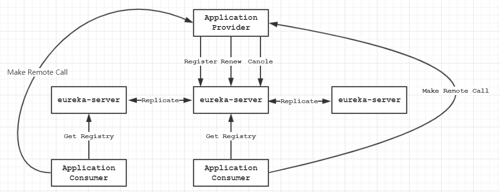
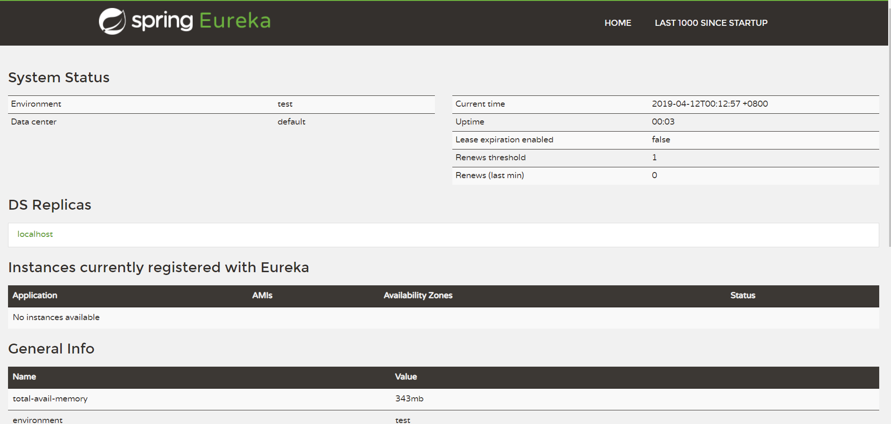

# 快速入门

## Why Eureka

随着微服务流行，原来巨型的单体工程会按照不同的领域模型划分出功能职责更加单一的服务，这样会导致应用服务的数量迅速膨胀。随之而来的是服务之间的调用关系的复杂度的上升，复杂度体现在下面几个问题：

- 依赖的服务调用地址怎么维护？
- 依赖服务DOWN机的时候，如何检测服务可用性？
- 依赖的服务扩容、缩容的场景下如何更新服务调用地址？

作为服务调用方还需要额外处理这么多本不需要关心的事情，还能不能愉快的写业务代码了！但是在引入了注册中心后这些事情统统都不需要关心。注册中心负责搞定这些事情，调用发需要做的只是告诉注册中心我要调用什么服务，注册中心返回给我服务的调用地址就可以了，瞬间整个世界变的清净了。

## 概览

Eureka相关的几个概念名词：

- **Provider** 服务提供方
- **Consumer** 服务调用方
- **Register Center** 注册中心

在实际的应用场景下一个应用同时可能既是服务提供方也是服务调用方。

Eureka相关的动词：

- **Register** 服务提供方向注册中心注册
- **Renew** 服务提供方向注册中心续约，告诉它我还活着，不要把我剔除
- **Cancel** 服务提供方向注册中心注销注册
- **Evict** 注册中心主动剔除长时间没有上报状态的服务
- **Get Registry** 服务调用方向注册中心请求可用的服务
- **Replicate** 注册中心之间信息互相同步备份

清楚了上面几个概念之后，俯瞰整个系统交互就变成了如下这样子：



（本图参考Eureka官方绘制）

## 上手使用

### 注册中心

1. 引入Maven依赖

```xml
<dependency>
    <groupId>org.springframework.cloud</groupId>
    <artifactId>spring-cloud-starter-netflix-eureka-server</artifactId>
</dependency>
```

2. 创建服务启动类

   ```java
   @EnableEurekaServer
   @SpringBootApplication
   public class EurekaServer {
       public static void main(String[] args) {
           SpringApplication.run(EurekaServer.class);
       }
   }
   ```

   配置内容如下：

   ```yaml
   eureka:
     client:
       fetch-registry: false
       register-with-eureka: false
   server:
     port: 8761
   ```

3. 启动服务后访问[http://localhost:8761/](http://localhost:8761/)即可看到如下界面

   

### 服务方与调用方

1.  引入Maven依赖

   ```xml
   <dependency>
       <groupId>org.springframework.cloud</groupId>
       <artifactId>spring-cloud-starter-netflix-eureka-client</artifactId>
   </dependency>
   <dependency>
       <groupId>org.springframework.boot</groupId>
       <artifactId>spring-boot-starter-web</artifactId>
   </dependency>
   ```

2. 配置内容如下：

   ```yaml
   spring:
     application:
       name: service-provider
   eureka:
     client:
       service-url:
         defaultZone: http://localhost:8761/eureka/
   ```

3.  启动类

   ```java
   @EnableEurekaClient
   @SpringBootApplication
   @RestController
   public class Service {
   
       @Bean
       @LoadBalanced
       public RestTemplate restTemplate() {
           return new RestTemplate();
       }
   
       @Autowired
       private RestTemplate restTemplate;
   
       public static void main(String[] args) {
           SpringApplication.run(Service.class);
       }
   
       @RequestMapping("hello")
       public String helloWorld() {
           return "hello world";
       }
   
       @RequestMapping("consumer")
       public String consumer() {
           return restTemplate.getForObject("http://service-provider/hello", String.class);
       }
   }
   ```

   这个类既提供服务，也担当了消费方的角色。访问http://localhost:8080/consumer，即可看到服务方返回"hello world"的内容。