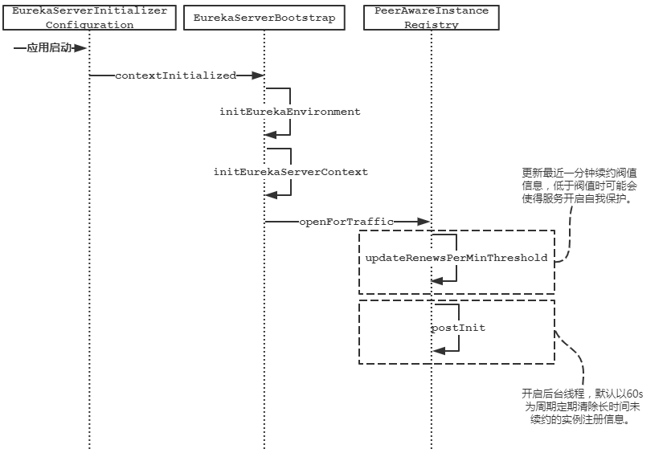
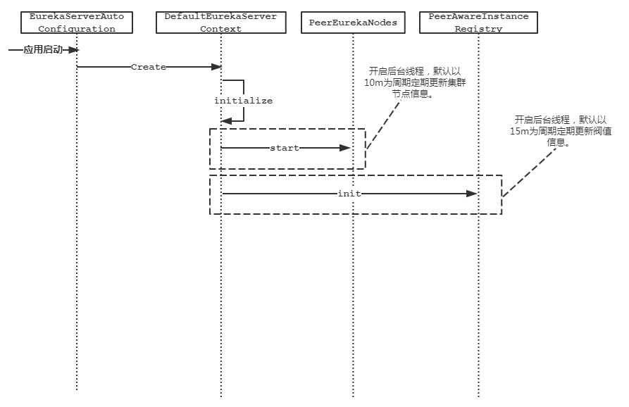

# Eureka集群节点同步

##  自动装配

借助Spring Cloud使用`Eureka`作为注册中心时，我们只需要使用`@EnableEurekaServer`注解，再加上些许配置即可使用。注解类内容如下：

```java
@Target(ElementType.TYPE)
@Retention(RetentionPolicy.RUNTIME)
@Documented
@Import(EurekaServerMarkerConfiguration.class)
public @interface EnableEurekaServer {

}
```

不难发现`EnableEurekaServer`又通过`Import`注解引入了`EurekaServerMarkerConfiguration`，那么`EurekaServerMarkerConfiguration`中配置的Bean对象就会被创建。

```java
@Configuration
public class EurekaServerMarkerConfiguration {

   @Bean
   public Marker eurekaServerMarkerBean() {
      return new Marker();
   }

   class Marker {

   }
}
```

但是这个Bean对象又是一空对象，所以创建一个空对象有什么用呢？

回到`EurekaServerAutoConfiguration`自动装配注解类内容如下，不能发现该类通过`@ConditionalOnBean`注解，来判断如果`EurekaServerMarkerConfiguration.Marker`对象被载入则自动装配会起作用。

```java
@Configuration
@Import(EurekaServerInitializerConfiguration.class)
// 通过判断EurekaServerMarkerConfiguration Marker对象有没有被载入判断是否启用自动配置
@ConditionalOnBean(EurekaServerMarkerConfiguration.Marker.class)
@EnableConfigurationProperties({ EurekaDashboardProperties.class,
		InstanceRegistryProperties.class })
@PropertySource("classpath:/eureka/server.properties")
public class EurekaServerAutoConfiguration extends WebMvcConfigurerAdapter {
    
}
```

## 启动引导

上面我们简单介绍了Eureka服务自动装配的原理。那么在`EurekaServerAutoConfiguration`中到底吃做了哪些工作呢？

- 自动了装配了以下几个关键bean对象：

```java
@Bean
public PeerAwareInstanceRegistry peerAwareInstanceRegistry(
      ServerCodecs serverCodecs) {
   this.eurekaClient.getApplications(); // force initialization
   return new InstanceRegistry(this.eurekaServerConfig, this.eurekaClientConfig,
         serverCodecs, this.eurekaClient,
         this.instanceRegistryProperties.getExpectedNumberOfClientsSendingRenews(),
         this.instanceRegistryProperties.getDefaultOpenForTrafficCount());
}

@Bean
@ConditionalOnMissingBean
public PeerEurekaNodes peerEurekaNodes(PeerAwareInstanceRegistry registry,
      ServerCodecs serverCodecs) {
   return new RefreshablePeerEurekaNodes(registry, this.eurekaServerConfig,
         this.eurekaClientConfig, serverCodecs, this.applicationInfoManager);
}

@Bean
public EurekaServerContext eurekaServerContext(ServerCodecs serverCodecs,
      PeerAwareInstanceRegistry registry, PeerEurekaNodes peerEurekaNodes) {
   return new DefaultEurekaServerContext(this.eurekaServerConfig, serverCodecs,
         registry, peerEurekaNodes, this.applicationInfoManager);
}

@Bean
public EurekaServerBootstrap eurekaServerBootstrap(PeerAwareInstanceRegistry registry,
      EurekaServerContext serverContext) {
   return new EurekaServerBootstrap(this.applicationInfoManager,
         this.eurekaClientConfig, this.eurekaServerConfig, registry,
         serverContext);
}
```

- 通过`Import`引入`EurekaServerInitializerConfiguration`来引导Eureka Server的启动过程。

```java
@Configuration
public class EurekaServerInitializerConfiguration
      implements ServletContextAware, SmartLifecycle, Ordered {
    // 省略
   @Override
   public void start() {
      new Thread(new Runnable() {
         @Override
         public void run() {
            try {
               // TODO: is this class even needed now?
               eurekaServerBootstrap.contextInitialized(
                     EurekaServerInitializerConfiguration.this.servletContext);
               log.info("Started Eureka Server");

               publish(new EurekaRegistryAvailableEvent(getEurekaServerConfig()));
               EurekaServerInitializerConfiguration.this.running = true;
               publish(new EurekaServerStartedEvent(getEurekaServerConfig()));
            }
            catch (Exception ex) {
               // Help!
               log.error("Could not initialize Eureka servlet context", ex);
            }
         }
      }).start();
   }
    // 省略
}
```

由于`EurekaServerInitializerConfiguration`实现了`SmartLifecycle`接口中的`start`方法。该接口方法在Spring容器初始化完毕之后会被调用。剩下的就委托给真正的启动引导类`EurekaServerBootstrap`的`contextInitialized`了。

```java
public void contextInitialized(ServletContext context) {
   try {
       // 初始化环境变量
      initEurekaEnvironment();
       // 初始化Server端上下文
      initEurekaServerContext();

      context.setAttribute(EurekaServerContext.class.getName(), this.serverContext);
   }
   catch (Throwable e) {
      log.error("Cannot bootstrap eureka server :", e);
      throw new RuntimeException("Cannot bootstrap eureka server :", e);
   }
}
```

## 启动过程分析

在上面我们可得知，在自动装配过程中创建了如下的对象。

- `InstanceRegistry`
- `RefreshablePeerEurekaNodes`
- `DefaultEurekaServerContext`
- `EurekaServerBootstrap`

等Spring 容器将所有的对象创建完毕后，再调用`EurekaServerInitializerConfiguration`的`contextInitialized`方法。

不得不说大佬写的代码还真的难懂，等我点开`DefaultEurekaServerContext`时，看到了如下的代码眼泪就流了下来

```java
@PostConstruct
@Override
public void initialize() {
    logger.info("Initializing ...");
    peerEurekaNodes.start();
    try {
        registry.init(peerEurekaNodes);
    } catch (Exception e) {
        throw new RuntimeException(e);
    }
    logger.info("Initialized");
}
```

隐藏了一个`@PostConstruct`注解（该注解功能是，在创建对象之前，先调用被该注解注释的方法内容），所以这里也是一个隐藏的比较深的引导启动点。

那么总结下来服务端的启动流程就有两条主线路，由于启动过程代码过于繁杂。下面给出整体的启动时序图，以便从整体上把握脉络，体会其设计的原理。





以上两个时序图可以看出，Eureka Server端仅仅提供了简单的定时任务去更新缓存信息，来保护其时效性。极端场景下有可能服务已经离线两分钟了才被剔除掉。（默认剔除时间是60s运行一次，默认认为服务离线规则为90s内没有续约上报状态。那么极端场景下就需要两个剔除检测周期才能有效的剔除离线的服务）

## Peer to Peer

从这里开始才是正题（手动滑稽）。在多机部署的同时，虽然保证服务的高可用，但是同样也会带来数据的不一致的副作用。那么Eureka是如何通过何种协议互通数据的呢，节点间是如何协同的呢。

- 使用HTTP协议，
- 被动接受由**Provider** 服务提供方发送的`registry`、`cancle`、`renew`请求。接受到请求后，遍历其他的**Peer**发送相同的请求完成节点间的数据同步操作。

概括完了原理，下面进行源码分析过程，以下的接口是为了节点的复制的目的而设。

- 