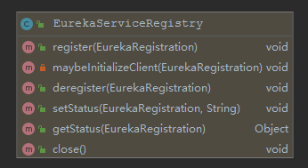
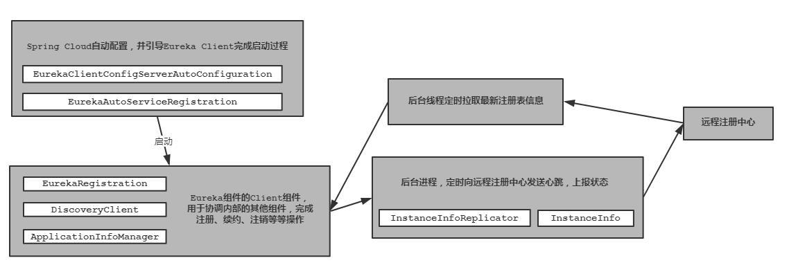
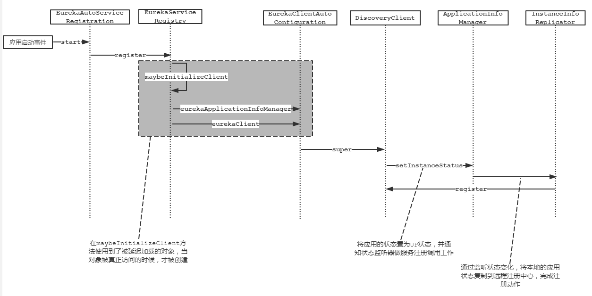
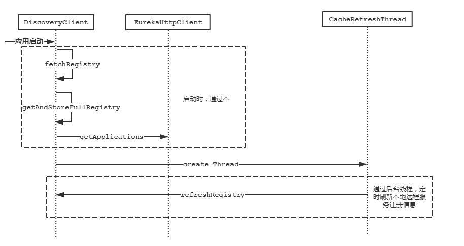

# 服务注册与发现

注册中心最最主要的功能莫过于对应用服务的注册于发现。那么在本篇中我们将一起探究Eureka中的注册与发现功能的设计原理和实现细节。

## 服务注册

### 从EurekaServiceRegistry说起

这个类归属于Spring Cloud体系下，为了便于使用对Eureka做了进一步的封装。该类的UML类图如下所示，从图中可知它提供了服务注册、服务注销、服务状态变更、服务状态获取、以及初始化Eureka客户端等功能。在使用Spring Cloud的时候`register`方法伴随着应用的启动会被调用，将当前集成了Eureka Client的应用进行注册等操作。



该类的内容如下：

```java
public void register(EurekaRegistration reg) {
   maybeInitializeClient(reg);

   if (log.isInfoEnabled()) {
      log.info("Registering application "
            + reg.getApplicationInfoManager().getInfo().getAppName()
            + " with eureka with status "
            + reg.getInstanceConfig().getInitialStatus());
   }

   reg.getApplicationInfoManager()
         .setInstanceStatus(reg.getInstanceConfig().getInitialStatus());

   reg.getHealthCheckHandler().ifAvailable(healthCheckHandler -> reg
         .getEurekaClient().registerHealthCheck(healthCheckHandler));
}

private void maybeInitializeClient(EurekaRegistration reg) {
    // force initialization of possibly scoped proxies
    reg.getApplicationInfoManager().getInfo();
    reg.getEurekaClient().getApplications();
}
```

在`maybeInitializeClient`方法中访问了`EurekaRegistration`对象的`ApplicationInfoManager`、`CloudEurekaClient`成员变量，这两个变量在自动装配时使用了懒加载特性，此时才会触发Spring Cloud创建对象实例的动作。

在`EurekaClientAutoConfiguration`中二者自动装配的代码如下：

```java
@Bean(destroyMethod = "shutdown")
@ConditionalOnMissingBean(value = EurekaClient.class, search = SearchStrategy.CURRENT)
@org.springframework.cloud.context.config.annotation.RefreshScope
@Lazy
public EurekaClient eurekaClient(ApplicationInfoManager manager,
      EurekaClientConfig config, EurekaInstanceConfig instance,
      @Autowired(required = false) HealthCheckHandler healthCheckHandler) {
   // If we use the proxy of the ApplicationInfoManager we could run into a
   // problem
   // when shutdown is called on the CloudEurekaClient where the
   // ApplicationInfoManager bean is
   // requested but wont be allowed because we are shutting down. To avoid this
   // we use the
   // object directly.
   ApplicationInfoManager appManager;
   if (AopUtils.isAopProxy(manager)) {
      appManager = ProxyUtils.getTargetObject(manager);
   }
   else {
      appManager = manager;
   }
   CloudEurekaClient cloudEurekaClient = new CloudEurekaClient(appManager,
         config, this.optionalArgs, this.context);
   cloudEurekaClient.registerHealthCheck(healthCheckHandler);
   return cloudEurekaClient;
}

@Bean
@ConditionalOnMissingBean(value = ApplicationInfoManager.class, search = SearchStrategy.CURRENT)
@org.springframework.cloud.context.config.annotation.RefreshScope
@Lazy
public ApplicationInfoManager eurekaApplicationInfoManager(
    EurekaInstanceConfig config) {
    InstanceInfo instanceInfo = new InstanceInfoFactory().create(config);
    return new ApplicationInfoManager(config, instanceInfo);
}
```

### CloudEurekaClient

`CloudEurekaClient`继承Eureka原生类`DiscoveryClient`。在创建`CloudEurekaClient`对象的同时会调用其父类的构造方法。在其父类`DiscoveryClient`对象构建过程，由于涉及的细节代码较多就不贴出来了，下面对其大致过程进行简要的总结。

- 创建`heartbeat`后台线程，定时向注册中心续约（默认时间为30s）。
- 创建`cacheRefresh`后台线程，定时从注册中心增量获取最新的注册表信息（默认时间为30s）。
- 全量拉取远程注册信息

### 服务状态上报

随着上面`CloudEurekaClient`初始化完毕，继续执行`EurekaServiceRegistry`中应用状态变更的动作。将当前应用由`Starting`状态变更为`UP`状态。此时监听应用状态变动监听器在接受到事件通知后，会触发调用`instanceInfoReplicator`的`onDemandUpdate`方法，执行注册的动作。方法关键部分内容如下：

```java
public void run() {
    try {
        discoveryClient.refreshInstanceInfo();

        Long dirtyTimestamp = instanceInfo.isDirtyWithTime();
        if (dirtyTimestamp != null) {
            // 调用注册方法
            discoveryClient.register();
            instanceInfo.unsetIsDirty(dirtyTimestamp);
        }
    } catch (Throwable t) {
        logger.warn("There was a problem with the instance info replicator", t);
    } finally {
        Future next = scheduler.schedule(this, replicationIntervalSeconds, TimeUnit.SECONDS);
        scheduledPeriodicRef.set(next);
    }
}
```

### 进一步说明关键类

在上面我们将应用端的服务注册的流程进行了粗略的分析，其中涉及到多个类的交互，初次看此博文的各位很有可能会被绕进去，所以下面对涉及的关键类及其功能作用进行进一步解释和说明，最终给出一张时序图，方便大家从整体上进行把握其核心设计思想。






## 服务发现

服务发现的过程就是自动从注册中心拉取已注册服务信息的过程。在Eureka启动时，不仅仅伴随着上面提到的应用注册的步骤，还包含了下面将要介绍的远程服务注册信息的获取步骤。在介绍之前，我们先简单了解下Eureka是如何抽象这些注册信息的。

- `Applications` 包含了远程注册服务器上所有的注册信息，包含了多个应用的注册信息。
- `Application` 一个应用的抽象，包含了当前这个应用部署的所有实例。
- `InstanceInfo` 部署实例信息。

拉取注册信息的时序图如下所示：



1. 在应用启动时全量获取远程的注册信息，创建并创建`CacheRefreshThread`后台进程。
2. 通过后台进程默认以30s为周期增量拉取一次远程注册信息。

## 参数

Eureka本身可配置的参数还是非常多的，在配合Spring Cloud使用中以下参数的含义（客户端）你可能需要了解知道

- `eureka.client.disable-delta` 是否禁用增量获取远程注册信息。该参数默认为`false`，即每次都使用增量方式获取。
- `eureka.client.registry-fetch-interval-seconds` 客户端定期拉取注册信息的时间间隔，默认30s。
- `eureka.instance.lease-renewal-interval-in-seconds` 客户端定期上注册中心续约时间间隔，默认30s。