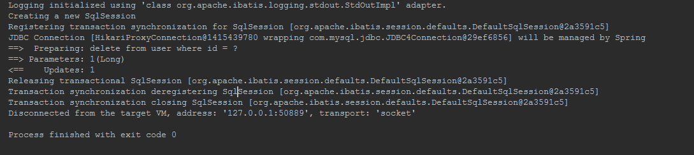
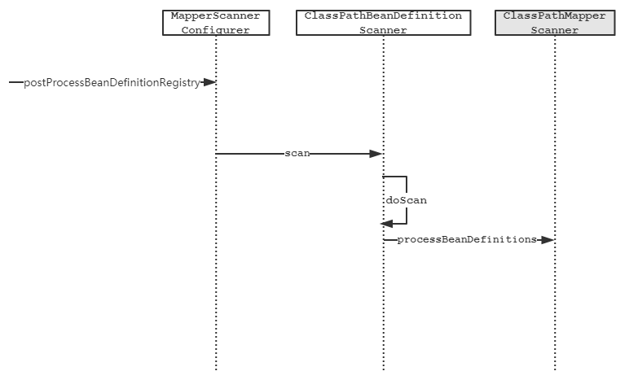

# 适配Spring

之前的系列篇对Mybatis的核心功能特性原理进行了深入的剖析，Mybatis社区为了使Mybatis能够更好的与Spring Framework框架适配，开发出了[mybatis-spring](http://www.mybatis.org/spring/index.html)项目。借助该项目的助力，不仅可以极大减少硬编码的工作量，也可以使用Spring Framework的很多其他的特性，比如声明式事务管理、IOC等。下面我们以mybatis与spring整合为例，探究mybatis-spring是如何做到的。

## 示例

1. 配置文件内容如下：

   ```xml
   <?xml version="1.0" encoding="UTF-8"?>
   <beans xmlns="http://www.springframework.org/schema/beans"
          xmlns:xsi="http://www.w3.org/2001/XMLSchema-instance"
          xmlns:context="http://www.springframework.org/schema/context" xmlns:tx="http://www.springframework.org/schema/tx"
          xsi:schemaLocation="http://www.springframework.org/schema/beans
          http://www.springframework.org/schema/beans/spring-beans.xsd http://www.springframework.org/schema/context http://www.springframework.org/schema/context/spring-context.xsd http://www.springframework.org/schema/tx http://www.springframework.org/schema/tx/spring-tx.xsd">
   
       <context:component-scan base-package="org.rhine.mybatis"/>
   
       <!-- 配置sqlSessionTemplate -->
       <bean name="sqlSessionTemplate" class="org.mybatis.spring.SqlSessionTemplate">
           <constructor-arg index="0" ref="sqlSessionFactory"/>
       </bean>
   
       <bean name="sqlSessionFactory" class="org.mybatis.spring.SqlSessionFactoryBean">
           <property name="dataSource" ref="dataSource"/>
           <property name="configuration">
               <bean class="org.apache.ibatis.session.Configuration">
                   <property name="logImpl" value="org.apache.ibatis.logging.stdout.StdOutImpl"/>
               </bean>
           </property>
       </bean>
   
       <!-- 扫描Mapper -->
       <bean class="org.mybatis.spring.mapper.MapperScannerConfigurer">
           <property name="basePackage" value="org.rhine.mybatis.demo.annotation"/>
           <property name="sqlSessionTemplateBeanName" value="sqlSessionTemplate"/>
       </bean>
   
       <!-- 开启声明式事务管理 -->
       <tx:annotation-driven/>
       <bean name="transactionManager" class="org.springframework.jdbc.datasource.DataSourceTransactionManager">
           <property name="dataSource" ref="dataSource"/>
       </bean>
   
       <!-- 数据源 -->
       <bean name="dataSource" class="com.zaxxer.hikari.HikariDataSource" destroy-method="close">
           <property name="driverClassName" value="com.mysql.jdbc.Driver"/>
           <property name="jdbcUrl" value=""/>
           <property name="username" value=""/>
           <property name="password" value=""/>
       </bean>
   </beans>
   ```

2.  `org.rhine.mybatis.demo.annotation`下的Mapper添加`Transactional`注解。正常的情况下没有人会在mapper中开启事务，而应该在业务层开启事务。

3.  运行单元测试

   ```java
   @RunWith(SpringJUnit4ClassRunner.class)
   @ContextConfiguration("classpath*:spring-config.xml")
   public class IntegrationWithSpring {
   
       @Autowired
       private UserMapper userMapper;
   
       @Test
       @Transactional
       public void testDeleteUserById() {
           Assert.assertNotNull(userMapper.deleteUserById(1L));
       }
   }
   ```

   运行结果如图：

   

##  委托IOC容器

上面的示例使用mapper时，再也不用调用`getMapper()`方法，直接通过spring ioc容器提供的依赖注入功能拿到mapper后即可使用。如果单独使用Mybatis时mapper接口依赖`getMapper()`方法的调用来生成代理对象，那么spring又是如何做到的呢。

配置文件中用来扫描Mapper的类`MapperScannerConfigurer`，so 这个类就是突破口了，进一步查看该类主要流程的时序图如下所示。



时序图中`MapperScannerConfigurer`、`ClassPathMapperScanner`均为mybatis-spring项目中所实现，`ClassPathBeanDefinition`则为Spring Framework的范畴了。

`MapperScannerConfigurer`实现了`BeanDefinitionRegistryPostProcessor`、`InitializingBean`等等接口。而`BeanDefinitionRegistryPostProcessor`接口，在IOC应用启动期间会调用它的`postProcessBeanDefinitionRegistry`方法，用来载入用户自定义的bean对象。

`MapperScannerConfigurer`自定义载入bean对象实现如下：

```java
public void postProcessBeanDefinitionRegistry(BeanDefinitionRegistry registry) {
  if (this.processPropertyPlaceHolders) {
    processPropertyPlaceHolders();
  }

  ClassPathMapperScanner scanner = new ClassPathMapperScanner(registry);
  scanner.setAddToConfig(this.addToConfig);
  scanner.setAnnotationClass(this.annotationClass);
  scanner.setMarkerInterface(this.markerInterface);
  scanner.setSqlSessionFactory(this.sqlSessionFactory);
  scanner.setSqlSessionTemplate(this.sqlSessionTemplate);
  scanner.setSqlSessionFactoryBeanName(this.sqlSessionFactoryBeanName);
  scanner.setSqlSessionTemplateBeanName(this.sqlSessionTemplateBeanName);
  scanner.setResourceLoader(this.applicationContext);
  scanner.setBeanNameGenerator(this.nameGenerator);
  scanner.registerFilters();
  scanner.scan(StringUtils.tokenizeToStringArray(this.basePackage, ConfigurableApplicationContext.CONFIG_LOCATION_DELIMITERS));
}
```

可以看到`MapperScannerConfigurer`进一步调用了`ClassPathMapperScanner`的`scan`方法（`ClassPathMapperScanner`继承自`ClassPathBeanDefinitionScanner`，并且重写了`doScan`方法），

```java
public int scan(String... basePackages) {
   int beanCountAtScanStart = this.registry.getBeanDefinitionCount();

   // 这里调用子类ClassPathMapperScanner的doScan方法
   doScan(basePackages);

   // Register annotation config processors, if necessary.
   if (this.includeAnnotationConfig) {
      AnnotationConfigUtils.registerAnnotationConfigProcessors(this.registry);
   }

   return (this.registry.getBeanDefinitionCount() - beanCountAtScanStart);
}
```

子类`ClassPathMapperScanner`的`doScan`方法如下：

```java
public Set<BeanDefinitionHolder> doScan(String... basePackages) {
  Set<BeanDefinitionHolder> beanDefinitions = super.doScan(basePackages);

  if (beanDefinitions.isEmpty()) {
    LOGGER.warn(() -> "No MyBatis mapper was found in '" + Arrays.toString(basePackages) + "' package. Please check your configuration.");
  } else {
    processBeanDefinitions(beanDefinitions);
  }

  return beanDefinitions;
}
```

进一步查看`processBeanDefinitions`方法内容如下：

```java
private void processBeanDefinitions(Set<BeanDefinitionHolder> beanDefinitions) {
  GenericBeanDefinition definition;
  // 指定包路径下的mapper集合,每个Mapper接口类都被抽象为GenericBeanDefinition
  for (BeanDefinitionHolder holder : beanDefinitions) {
    definition = (GenericBeanDefinition) holder.getBeanDefinition();
    String beanClassName = definition.getBeanClassName();
    LOGGER.debug(() -> "Creating MapperFactoryBean with name '" + holder.getBeanName()
        + "' and '" + beanClassName + "' mapperInterface");

    // the mapper interface is the original class of the bean
    // but, the actual class of the bean is MapperFactoryBean
    definition.getConstructorArgumentValues().addGenericArgumentValue(beanClassName);
    // 将创建Mapper的类替换为MapperFactoryBean
    definition.setBeanClass(this.mapperFactoryBean.getClass());

    definition.getPropertyValues().add("addToConfig", this.addToConfig);

    // 省略配置项的相关的代码
  }
```

`processBeanDefinitions`在`definition.setBeanClass(this.mapperFactoryBean.getClass());`这一行，将创建mapper的类从原来的mapper接口类，替换为`MapperFactoryBean`类。这也代表应用使用到的mapper对象则交由`MapperFactoryBean`创建了，其内容如下。

```java
public class MapperFactoryBean<T> extends SqlSessionDaoSupport implements FactoryBean<T> {

  private Class<T> mapperInterface;

  private boolean addToConfig = true;

  public MapperFactoryBean() {
    //intentionally empty 
  }
  
  public MapperFactoryBean(Class<T> mapperInterface) {
    this.mapperInterface = mapperInterface;
  }

  /**
   * {@inheritDoc}
   */
  @Override
  public T getObject() throws Exception {
    return getSqlSession().getMapper(this.mapperInterface);
  }

  /**
   * {@inheritDoc}
   */
  @Override
  public Class<T> getObjectType() {
    return this.mapperInterface;
  }

  // 省略代码
}
```

请注意`MapperFactoryBean`类实现了`FactoryBean`接口！（实现了`FactoryBean`接口的bean，创建实例时会调用`getObject`方法，区别于普通bean通过反射调用构造方法的方式。）`getObject()`方法实现内容是不是又回到了之前熟悉的硬编码的方式？

mybatis-spring借助Spring Framework的两个扩展接口优雅的实现了从硬编码到自动注入。通过实现`BeanDefinitionRegistryPostProcessor`接口来完成在Spring IOC容器启动期间，将所有的mapper委托给Spring IOC容器管理。通过实现`FactoryBean`接口将mapper的创建委托`SqlSessionTemplate`的`getMapper`方法。

## SqlSession的新实现

还记得之前提到的过的`DefaultSqlSession`的么，在Mybatis中它`SqlSession`的唯一实现类。在mybatis-spring出现后又提供了新的实现类`SqlSessionTemplate`。先思考