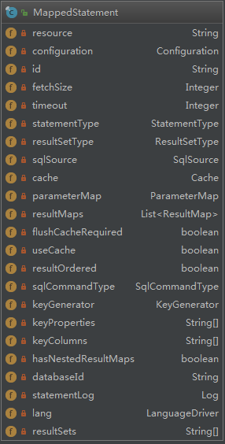

# 注解式Mapper的实现原理

在Mybatis中我们既可以借助XML文件来搞定SQL，也可以使用Mybatis中提供的注解将SQL直接定义在Mapper接口中。那么这么棒的功能特性是如何实现的呢？本篇源码部分比较多，请做好心理准备。。。

## 使用示例

1. 创建注解版本的Mapper

```java
public interface UserMapper {

    @ResultType(org.rhine.mybatis.demo.User.class)
    @Select("select * from user where id = #{id}")
    User queryUser(@Param("id") Long id);

}
```

2. 将新建的Mapper配置到Mybatis全局配置文件中

   ```xml
   <mappers>
       <mapper resource="UserMapper.xml"/>
       <mapper resource="JobMapper.xml"/>
       <mapper resource="JobDataMapper.xml"/>
       <!-- 注意和XML版本使用的区别,一个是使用resource指定,一个使用class指定 -->
       <mapper class="org.rhine.mybatis.demo.annotation.UserMapper"/>
   </mappers>
   ```

3. 使用方式和普通的XML没有任何区别，我们这里就省略使用的过程。

## 原理剖析

### 配置解析

关于配置解析的过程，在[上一篇](./plugin.md)中也有提到过。我们这里就直接贴出`XMLConfigBuilder`解析部分代码部分

```java
private void parseConfiguration(XNode root) {
  try {
    //issue #117 read properties first
    propertiesElement(root.evalNode("properties"));
    Properties settings = settingsAsProperties(root.evalNode("settings"));
    loadCustomVfs(settings);
    loadCustomLogImpl(settings);
    // 解析别名
    typeAliasesElement(root.evalNode("typeAliases"));
    // 解析插件
    pluginElement(root.evalNode("plugins"));
    objectFactoryElement(root.evalNode("objectFactory"));
    objectWrapperFactoryElement(root.evalNode("objectWrapperFactory"));
    reflectorFactoryElement(root.evalNode("reflectorFactory"));
    settingsElement(settings);
    // read it after objectFactory and objectWrapperFactory issue #631
    environmentsElement(root.evalNode("environments"));
    databaseIdProviderElement(root.evalNode("databaseIdProvider"));
    typeHandlerElement(root.evalNode("typeHandlers"));
    // 解析mapper
    mapperElement(root.evalNode("mappers"));
  } catch (Exception e) {
    throw new BuilderException("Error parsing SQL Mapper Configuration. Cause: " + e, e);
  }
}
```

`mapperElement(root.evalNode("mappers"));`这一行很明显是负责解析配置文件中的`mappers`的节点，解析内容如下

```java
private void mapperElement(XNode parent) throws Exception {
  if (parent != null) {
    for (XNode child : parent.getChildren()) {
      // 可以直接指定包名,默认扫描当前包下所有的接口作为mapper
      if ("package".equals(child.getName())) {
        String mapperPackage = child.getStringAttribute("name");
        configuration.addMappers(mapperPackage);
      } else {
        String resource = child.getStringAttribute("resource");
        String url = child.getStringAttribute("url");
        String mapperClass = child.getStringAttribute("class");
        // 通过xml文件方式
        if (resource != null && url == null && mapperClass == null) {
          ErrorContext.instance().resource(resource);
          InputStream inputStream = Resources.getResourceAsStream(resource);
          XMLMapperBuilder mapperParser = new XMLMapperBuilder(inputStream, configuration, resource, configuration.getSqlFragments());
          mapperParser.parse();
          // 通过url方式,加载远程xml文件
        } else if (resource == null && url != null && mapperClass == null) {
          ErrorContext.instance().resource(url);
          InputStream inputStream = Resources.getUrlAsStream(url);
          XMLMapperBuilder mapperParser = new XMLMapperBuilder(inputStream, configuration, url, configuration.getSqlFragments());
          mapperParser.parse();
          // 通过接口方式
        } else if (resource == null && url == null && mapperClass != null) {
          Class<?> mapperInterface = Resources.classForName(mapperClass);
          configuration.addMapper(mapperInterface);
        } else {
          throw new BuilderException("A mapper element may only specify a url, resource or class, but not more than one.");
        }
      }
    }
  }
}
```

代码虽然有点多，但是结构非常的清晰，可以很容易的看出Mybatis支持四种方式来配置mapper。

- 直接指定包路径，Mybatis会自动扫描该路径下所有的接口类，并将它们视为mapper。
- 通过`resource`属性，指定xml文件路径
- 通过`url`属性，指定一个网络地址来下载xml文件
- 通过`class`属性，指定mapper接口类

在这一步`XMLConfigBuilder`通过调用`onfiguration`的`addMapper`方法将识别到的mapper接口类传入，后续就开始了对mapper中注解的解析过程。

### 注解解析过程

继续跟踪`addMapper`调用链会发现以下解析相关的核心代码：

```java
public <T> void addMapper(Class<T> type) {
    // 判断当前类是否为接口
    if (type.isInterface()) {
      // 是否已经存在当前mapper
      if (hasMapper(type)) {
        throw new BindingException("Type " + type + " is already known to the MapperRegistry.");
      }
      boolean loadCompleted = false;
      try {
        // 将mapper放入到knownMappers
        knownMappers.put(type, new MapperProxyFactory<>(type));
        // It's important that the type is added before the parser is run
        // otherwise the binding may automatically be attempted by the
        // mapper parser. If the type is already known, it won't try.
        // 开始对mapper的解析过程
        MapperAnnotationBuilder parser = new MapperAnnotationBuilder(config, type);
        parser.parse();
        loadCompleted = true;
      } finally {
        if (!loadCompleted) {
          knownMappers.remove(type);
        }
      }
    }
  }
```

这个类解析过成比较简单，就不进行分析介绍了，下面直接开始`parse()`的过程分析

```java
public void parse() {
    String resource = type.toString();
    // 没有被加载过
    if (!configuration.isResourceLoaded(resource)) {
      // 在当前类路径下查找对应的的XML配置文件
      loadXmlResource();
      // 将当前类添加到loadedResources集合中,标志当前类已经被加载
      configuration.addLoadedResource(resource);
      // 设置namespace
      assistant.setCurrentNamespace(type.getName());
      // 解析CacheNamespace注解
      parseCache();
      // 解析CacheNamespaceRef注解
      // 请注意parseCacheRef如果有配置,将会覆盖CacheNamespace的缓存配置
      parseCacheRef();
      // 解析接口中方法
      Method[] methods = type.getMethods();
      for (Method method : methods) {
        try {
          // issue #237
          // 跳过mapper中编译时生成的桥接方法
          if (!method.isBridge()) {
            // 将方法解析为MappedStatement
            parseStatement(method);
          }
        } catch (IncompleteElementException e) {
          // 如果当前mapper中引用了其他的mapper中的内容，但是被引用的mapper还没有被加载则会抛出异常
          configuration.addIncompleteMethod(new MethodResolver(this, method));
        }
      }
    }
    // 每次进来一个新的mapper,都会将上面因为引用其他mapper,而其他的mapper还没有来及被加载而导致解析失败的内容重新执行
    // 最终全部加载完毕时,所有的mapper也都会被完整的装配完毕
    parsePendingMethods();
  }
```

这个类因为加了注释的原因，内容略显冗长。大致做了以下几个方便的工作：

- 解析mapper接口，如果在当前类路径下有同名的XML文件，那么也会被解析。
- 解析缓存相关的注解配置。这里特别强调`CacheNamespaceRef`注解和`CacheNamespace`注解两者不要同时使用，因为代码中后面出现的`parseCacheRef();`会将前面`parseCache();`中缓存的设置覆盖。
- 将mapper接口中出现的所有方法，都通过调用`parseStatement(method)`解析成`MappedStatement`。
- Mybatis是如何处理mapper间的相互引用的？它提供了一种截然不同与spring的方式，具体的处理细节请看上面的注释内容。

将方法解析成`MappedStatement`内容如下：

```java
void parseStatement(Method method) {
  // 解析方法的参数类型,若果是多个参数解析为Map
  Class<?> parameterTypeClass = getParameterType(method);
  // 解析SQL语句使用的模板引擎,默认使用XMLLanguageDriver
  LanguageDriver languageDriver = getLanguageDriver(method);
  // 解析注解中的SQL语句
  SqlSource sqlSource = getSqlSourceFromAnnotations(method, parameterTypeClass, languageDriver);
  if (sqlSource != null) {
    // 可选项配置信息(缓存刷新策略,超时时间,自增配置等等)
    Options options = method.getAnnotation(Options.class);
    final String mappedStatementId = type.getName() + "." + method.getName();
    Integer fetchSize = null;
    Integer timeout = null;
    StatementType statementType = StatementType.PREPARED;
    ResultSetType resultSetType = null;
    // SQL类型
    SqlCommandType sqlCommandType = getSqlCommandType(method);
    boolean isSelect = sqlCommandType == SqlCommandType.SELECT;
    boolean flushCache = !isSelect;
    boolean useCache = isSelect;

    // 自增主键相关配置解析
    KeyGenerator keyGenerator;
    String keyProperty = null;
    String keyColumn = null;
    if (SqlCommandType.INSERT.equals(sqlCommandType) || SqlCommandType.UPDATE.equals(sqlCommandType)) {
      // first check for SelectKey annotation - that overrides everything else
      SelectKey selectKey = method.getAnnotation(SelectKey.class);
      if (selectKey != null) {
        keyGenerator = handleSelectKeyAnnotation(selectKey, mappedStatementId, getParameterType(method), languageDriver);
        keyProperty = selectKey.keyProperty();
      } else if (options == null) {
        keyGenerator = configuration.isUseGeneratedKeys() ? Jdbc3KeyGenerator.INSTANCE : NoKeyGenerator.INSTANCE;
      } else {
        keyGenerator = options.useGeneratedKeys() ? Jdbc3KeyGenerator.INSTANCE : NoKeyGenerator.INSTANCE;
        keyProperty = options.keyProperty();
        keyColumn = options.keyColumn();
      }
    } else {
      keyGenerator = NoKeyGenerator.INSTANCE;
    }

    // 解析Options注解
    if (options != null) {
      // 缓存刷新策略
      if (FlushCachePolicy.TRUE.equals(options.flushCache())) {
        flushCache = true;
      } else if (FlushCachePolicy.FALSE.equals(options.flushCache())) {
        flushCache = false;
      }
      useCache = options.useCache();
      fetchSize = options.fetchSize() > -1 || options.fetchSize() == Integer.MIN_VALUE ? options.fetchSize() : null; //issue #348
      timeout = options.timeout() > -1 ? options.timeout() : null;
      statementType = options.statementType();
      resultSetType = options.resultSetType();
    }

    // 解析ResultMap
    String resultMapId = null;
    ResultMap resultMapAnnotation = method.getAnnotation(ResultMap.class);
    if (resultMapAnnotation != null) {
      resultMapId = String.join(",", resultMapAnnotation.value());
    } else if (isSelect) {
      resultMapId = parseResultMap(method);
    }

    // 省略addMappedStatement方法的构造参数
    assistant.addMappedStatement();
  }
}
```

通过反射解析方法上的注解内容，最终方法上的注解被完整的解析为`MappedStatement`。

### 总结一哈

既然上面注解中所有的配置信息，最终都会被解析到`MappedStatement`中。那么很容易就可以推测出“通过XML配置或者其他的方式，最终也都会是通过`MappedStatement`对象来聚合配置的属性”。

到这里来就可以联想到`MappedStatement`与一条SQL是一一对应的关系，对象中包括SQL语句、出入参数、缓存配置等等。为了验证我们的猜测，下面贴出该类的UML类图。



读到这里想必注解的神秘面纱已经被剥下，看是强大的注解到底还是用了最最基本的Java反射的技术所实现。