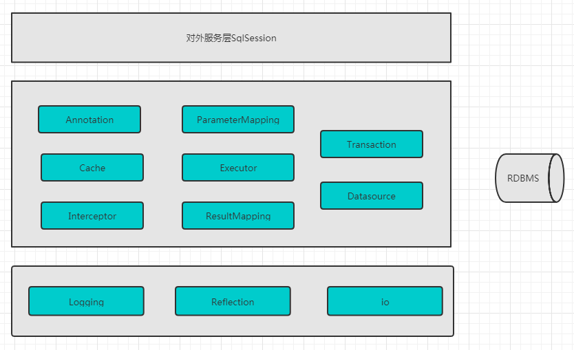
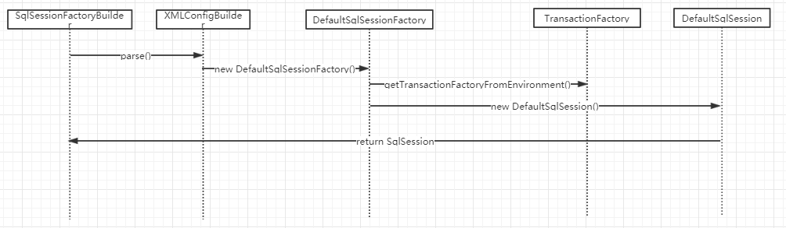
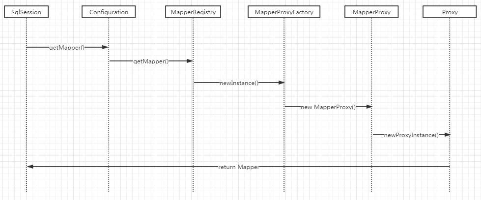
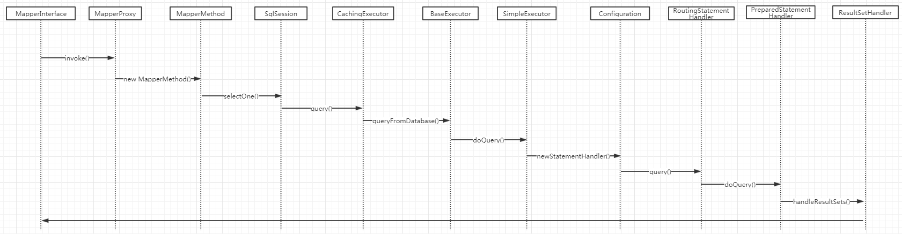

# 架构总览

## 核心功能

上图将Mybatis分为三层：

1. 最下面一层是基础服务，提供了日志、对XML文件的读取解析、以及在Mybatis中大量应用到的反射功能。
   - 日志服务启动时按照以下顺序`slf4j`、`commons logging`、`log4j2`、`log4j`、`jdk logging`，自动加载存在的日志系统。并通过适配器模式提供了统一的日志门面`Log`接口，并提供了适配不同日志系统的实现。Mybatis中通过`ErrorContext`类在流程的各个关键位置提供了错误追溯的功能，做到错误有迹可循。
   - XML文件的读取及解析工作由io包下的`Resources`类读取配置文件配合上`builder`包下的`XMLConfigBuilder`配合完成，并将外部的配置属性统一收口到类`Configuration`中。
   - 提供了反射功能，有cglib、javassist等可以选择，默认是cglib。
2. 应用中定义的`Mapper`接口通过Mybatis中`Reflection`包提供的代理反射功能，将参数的解析，数据库连接获取、sql执行、结果集映射、数据库连接的关闭、以及事务等等工作帮我们在内部隐藏消化。
3. 而最上层的SqlSession则是对外服务的门面。

## 关键步骤的时序图

###  SqlSession创建

###mapper代理类创建

### select执行

高清大图请点击[链接](https://www.processon.com/view/link/5c8b53a2e4b0f88919af568d)