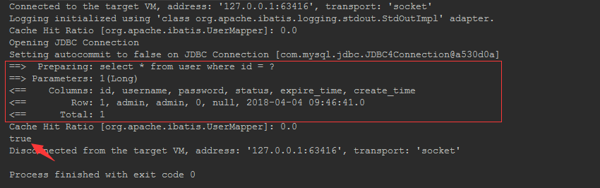

# 缓存的那些事

## 开篇

性能不够缓存来凑。在互联网高并发大流量的业务场景，基本上都会选择使用缓存这个杀手锏来抗住巨大的流量，来保护我们的应用不会被流量冲垮。不管是Mybatis或者Hibernate出于对性能的考虑，内部都提供了缓存的功能，来提高应用的性能。跟着本篇博文我们一起来从源码级别来深入的探讨一下Mybatis中一二级缓存的实现原理、以及隐藏的一些深坑。懂了底层的实现原理机制，相信在使用时也会更加的得心应手。

## 一级缓存

第一步我们先来最简单的测试用例，来验证下我们最最常见的查询中一级缓存的存在

```java
@Test
public void queryUserTest() {
    UserMapper userMapper = sqlSession.getMapper(UserMapper.class);
    User user1 = userMapper.queryUser(1L);
    User user2 = userMapper.queryUser(1L);
    System.out.println(user1 == user2);
}
```

控制台结果:



可以看到在同一个查询在SqlSession生命周期内只被执行了一次，返回的对象地址也是完全一致的，可以证明一级缓存的存在。在一定程度上一级缓存确实可以提升应用的查询性能，一切看似很美好，但是如果使用不当也会出现问题。

请考虑以下应用场景：在一个SqlSession生命周期内的同一个SQL前后多次执行时，如果在多次执行的期间有其他的线程对数据进行变更，但是由于缓存的存在，那么多次读取都会始终返回第一次查询的结果，在这种情况下就会产生缓存和数据库数据一致的情况。

但是实际业务场景下会有人这样写代码么，即便存在特殊的业务场景必须要这么处理，但毕竟还是少数。所以综合考量我认为Mybatis开发者这么去架构设计是综合考量的结果（利 > 弊），同时针对这种特殊的业务场景也提供了关闭一级缓存的选项。比如本例子中的`user-mapper.xml`就可以将查询语句中的`flushCache`由默认的`false`更改为`true`：

```xml
<mapper namespace="org.apache.ibatis.UserMapper">
    <select id="queryUser" resultType="org.apache.ibatis.User" flushCache="true">
        select * from user where id = #{id}
    </select>
</mapper>
```

更新完配置之后再次执行单元测试，控制台输出结果如下：


可以看出同一个SqlSession内的第二次查询不再从缓存中获取，而是直连db查询。

### 探究实现原理

上面我们讨论完了一级缓存的利与弊，下面我们从源码上一起来探究一级缓存究竟是如何被写入和缓存的更新机制。

首先先来认识下Mybatis中一级缓存的实现类`PerpetualCache`，内容如下：

```java
public class PerpetualCache implements Cache {

    private final String id;

    private Map<Object, Object> cache = new HashMap<>();

    public PerpetualCache(String id) {
      this.id = id;
    }

    @Override
    public String getId() {
      return id;
    }

    @Override
    public int getSize() {
      return cache.size();
    }

    @Override
    public void putObject(Object key, Object value) {
      cache.put(key, value);
    }

    @Override
    public Object getObject(Object key) {
      return cache.get(key);
    }

    @Override
    public Object removeObject(Object key) {
      return cache.remove(key);
    }

    @Override
    public void clear() {
      cache.clear();
    }
    // 省略非主要代码
}
```

这里可以看到默认的一级缓存使用非线程安全集合类`HashMap`来实现。为什么不会出现线程安全的问题呢？且听我慢慢道来。`PerpetualCache`这里跟`BaseExecutor`有着千丝万缕的关系（`BaseExecutor`又是什么，没关系请继续往下看）。

在[代码模块中](./code_modules)有提到`Executor`是执行SQL的执行器，与它相关的类家族UML图如下所示，其中`SimpleExecutor`是默认使用的执行器；`ReuseExecutor`则是将Statement与SQL建立关联关系缓存起来，这样就不用每次都要重复创建新的Statement；`BatchExecutor`则是批量执行器，通过封装底层JDBC的BATCH相关的API，来加速批量相关的操作。而我们关心的一级缓存`PerpetualCache`则以全局变量存在于`BaseExecutor`中。


那么执行器是在什么时候创建的呢？我们先来看下创建的时序图。


在时序图中我们可以看到`Executor`在获取`SqlSession`时每次都会被重新创建，在开篇的时候有提到`SqlSession`随着请求而创建，伴随着请求结束而消亡，作用域也是限于当前线程的上下文。所以在并发请求的业务场景，`Executor`也是不同的，一级缓存也不会是多线程共享的，故而不会出现并发问题（但是你如果非要调皮在单个请求里创建子线程，去玩些骚操作那也没得办法）。这里我们的一级缓存容器已经创建完毕，那么缓存是如何被使用、存入以及更新的呢？且看下面的分析。

缓存被使用肯定是在查询的环节，我们先看下整体的粗略的查询流程的时序图：


图中我们可以看到最终会调用`BaseExecutor`中的`query`方法，`query`方法的内容如下：

```java
public <E> List<E> query(MappedStatement ms, Object parameter, RowBounds rowBounds, ResultHandler resultHandler, CacheKey key, BoundSql boundSql) throws SQLException {
    ErrorContext.instance().resource(ms.getResource()).activity("executing a query").object(ms.getId());
    if (closed) {
      throw new ExecutorException("Executor was closed.");
    }
    // 如果不是嵌套查询或者嵌套查询执行完毕，并且flushCache配置为true
    if (queryStack == 0 && ms.isFlushCacheRequired()) {
      // 清空一级缓存
      clearLocalCache();
    }
    List<E> list;
    try {
      // 本次查询执行查询次数+1
      queryStack++;
      list = resultHandler == null ? (List<E>) localCache.getObject(key) : null;
      if (list != null) {
        // 处理储存过程，针对OUT的参数设定缓存值
        handleLocallyCachedOutputParameters(ms, key, parameter, boundSql);
      } else {
        // 没有命中缓存则到数据库中查询
        list = queryFromDatabase(ms, parameter, rowBounds, resultHandler, key, boundSql);
      }
    } finally {
      // 本次查询执行查询次数-1
      queryStack--;
    }
    // 查询执行完毕
    if (queryStack == 0) {
      for (DeferredLoad deferredLoad : deferredLoads) {
        deferredLoad.load();
      }
      deferredLoads.clear();
      // 如果本地缓存Scope被配置为STATEMENT，则每次执行的SQL的时候都要清空缓存。
      // 因为有queryStack == 0的判断，所以查询如果是嵌套查询，缓存还是起作用的。
      if (configuration.getLocalCacheScope() == LocalCacheScope.STATEMENT) {
        clearLocalCache();
      }
    }
    return list;
  }
```

1. 在源码`if (queryStack == 0 && ms.isFlushCacheRequired())`这一行，如果条件为true时会清空本地的缓存。这个正是我们上面在mapper中查询的SQL中使用到的`flushCache = true`参数。

2. 在`handleLocallyCachedOutputParameters`这一行，我们可以看到Mybatis针对存储过程也设立缓存。

3. 后续的则是正常的判断缓存是否存在，不存则从数据库中查询的套路。

4. 源码的`if (configuration.getLocalCacheScope() == LocalCacheScope.STATEMENT)`这一行关系到了另外一个比较重要的参数`localCacheScope`。从代码中可知，如果设置为`STATEMENT`那么每次执行查询操作的时候都会清空一级缓存（嵌套查询除外）。对照下官方的解释：“若设置值为 STATEMENT，本地会话仅用在语句执行上，对相同 SqlSession 的不同调用将不会共享数据。”

   那么怎么使用呢？这个参数的可选项有`SESSION`、`STATEMENT`两种，官方默认值为`SESSION`，可以通过如下配置更改默认值。

   ```xml
   <configuration>
       <settings>
           <setting name="localCacheScope" value="STATEMENT"/>
       </settings>
   </configuration>
   ```

上面我们一起在源码级别探讨了Mybatis是如何使用一级缓存的（普通的查询、存储过程都设有缓存），以及影响缓存刷新机制两个非常重要的参数。下面我们继续探讨缓存存放过程。

下面是真正查询以及对查询结果进行缓存的代码：

```java
private <E> List<E> queryFromDatabase(MappedStatement ms, Object parameter, RowBounds rowBounds, ResultHandler resultHandler, CacheKey key, BoundSql boundSql) throws SQLException {
  List<E> list;
  // 缓存预占位
  localCache.putObject(key, EXECUTION_PLACEHOLDER);
  try {
    // 执行DB查询操作
    list = doQuery(ms, parameter, rowBounds, resultHandler, boundSql);
  } finally {
    // 释放预占位
    localCache.removeObject(key);
  }
  // 放入真正的缓存
  localCache.putObject(key, list);
  // 如果是存储过程的调用则将储存过程的执行的结果保存至localOutputParameterCache中
  if (ms.getStatementType() == StatementType.CALLABLE) {
    localOutputParameterCache.putObject(key, parameter);
  }
  return list;
}
```

内容非常的简单，就不一一分析了，下面我们继续分析一级缓存在执行更新、删除、插入操作时的更新策略，执行时序图如下：


增删改不同的操作最终到执行器时仅对应到一个`update`的方法，内容如下：

```java
@Override
public int update(MappedStatement ms, Object parameter) throws SQLException {
  ErrorContext.instance().resource(ms.getResource()).activity("executing an update").object(ms.getId());
  if (closed) {
    throw new ExecutorException("Executor was closed.");
  }
  // 清空一级缓存、清空存储过程缓存
  clearLocalCache();
  // 执行DB操作
  return doUpdate(ms, parameter);
}
```

可以得出结论，只要在一个SqlSession声明周期内有执行增删改的任何一种操作，那么与SqlSession关联的所有的一级缓存内容将被清空。。。（这个更新策略简单粗暴- - !）。

## 二级缓存

二级缓存在Mybatis是默认关闭，我们通过配置首先启用它。启用它的配置很简单只要在Mapper文件中配置中加入`<cache/>`即可

```xml
<mapper namespace="org.rhine.mybatis.demo.UserMapper">
    <select id="queryUser" resultType="org.apache.ibatis.User" flushCache="true">
        select * from user where id = #{id}
    </select>
    <!-- 开启二级缓存 -->
    <cache/>
</mapper>
```

单元测试用户例如下：

```java
@Test
public void secondLevelCacheTest() {
    UserMapper userMapper = sqlSession.getMapper(UserMapper.class);
    UserMapper userMapper2 = sqlSession2.getMapper(UserMapper.class);
    userMapper.queryUser(1L);
    sqlSession.commit();
    userMapper2.queryUser(1L);
}
```

程序执行结果如下：


通过控制台输出可以看到我们第二次查询成功了命中了第一次查询时的缓存。

那么我们在Mapper文件中加入了一行`<cache/>`，默认会启用以下的效果：

- Mapper中所有的查询结果将会被缓存。
- `insert`、`update`、`delete`语句会刷新缓存。
- 默认使用`LRU`算法来刷新缓存。
- 缓存不会定时进行刷新。
- 缓存对象的上限默认设置为1024（不管返回的结果是对象和还是列表）
- 缓存结果是线程安全的。

二级缓存可配置项有`eviction`、`flushInterval`、`size`、`readOnly`、`blocking`、`type`。缓存相关的实现类多达有11个。（淡定反正生产环境很少使用，看个乐呵知道怎么个回事就好）

各个配置项的具体含义及意义解释如下：

- `eviction` 缓存的淘汰机制，有`FIFO`、`LRU`、`SOFT` 、`WEAK` 可供选择使用。
  - `FIFO` 先进先出：按对象进入缓存的顺序来移除它们。
  - `Lru` 最近最少使用，移除最长时间不被使用的对象。
  - `SOFT` 使用软引用建立的缓存
  - `WEAK` 使用弱引用建立的缓存
- `flushInterval` 缓存刷新间隔，可以设置为任意的整数（毫秒为单位），默认不刷新。所谓刷新不是Mybatis主动和数据库同步数据，仅仅是清空缓存，而且是被动式清除。
- `size` 设定缓存的可以存放结果集数量上限，默认大小1024。
- `readOnly` 是否为只读，可设定为`true`或者`false`，默认为false。如果设定为`true`，则每次都返回同一个实例，如果对返回的对象进行了更新操作，那么缓存的值就会被污染。如果设定为`false`（需要缓存的对象实现`Serializable`接口），则每次都通过反序列化的方式返回一个新的对象，那么对返回的对象再怎么操作，也不会污染真正的缓存。
- `blocking`  可设定为`true`或者`false`，默认为false。设定为`true`时，查询前会以当前缓存key为维度建立可重入锁，如果查询命中不到缓存，会阻塞其他的线程继续访问数据库，直到缓存有数据。
- `type` 可以自定实现`Cache`接口，指定自定义实现了`Cache`接口的全类名。

介绍完了这么配置选项，来一张`Cache`的全家福增进下大家对缓存的功能性的认识


灰色的为全部的实现类，绿色部分为默认的缓存功能组合。到这里相信大家已经对二级缓存有了全局的认识，下面我们按照一级缓存的分析套路研究其具体的源码，分析其缓存的使用、写入淘汰等细节实现。

### 探究实现原理

查询时序图如下


对比一级缓存的查询流程，时序图中特意将之前省略掉的`CachingExecutor`补充上。`CachingExecutor`包含了二级缓存实现的关键步骤，`query`部分代码如下：

```java
public <E> List<E> query(MappedStatement ms, Object parameterObject, RowBounds rowBounds, ResultHandler resultHandler, CacheKey key, BoundSql boundSql)
      throws SQLException {
    // 获取二级缓存，如果Mapper中没有配置则返回为空（二级缓存是以Mapper的namespace为维度划分）
    Cache cache = ms.getCache();
    if (cache != null) {
      // 在查询之前是否清除二级缓存
      flushCacheIfRequired(ms);
      // 是否使用缓存
      if (ms.isUseCache() && resultHandler == null) {
        // 二级缓存不知道存储过程中使用OUT参数
        ensureNoOutParams(ms, boundSql);
        @SuppressWarnings("unchecked")
        // 获取缓存
        List<E> list = (List<E>) tcm.getObject(cache, key);
        if (list == null) {
          // 执行DB查询
          list = delegate.query(ms, parameterObject, rowBounds, resultHandler, key, boundSql);
          // 放入缓存
          tcm.putObject(cache, key, list);
        }
        return list;
      }
    }
    return delegate.query(ms, parameterObject, rowBounds, resultHandler, key, boundSql);
  }
```

跟一级缓存差不多的套路，有以下点要重点说下：

- 如果没有在Mapper文件中配置`<cache/>`，那么`ms.getCache();`就获取不到Mapper对应的二级缓存，及二级缓存没有启用。
- 如果配置Mapper中SQL配置`flushCache=true`，那么`flushCacheIfRequired(ms)`这一行代码，会将二级缓存强制清空，执行任何的SQL都不会命中二级缓存。
- 二级缓存不支持存储过程中使用OUT参数。
- `tcm.putObject(cache, key, list);`此时缓存还没有起作用，还需要后续`TransactionalCacheManager`对缓存进行`commit()`操作。

更新操作时序图如下，较一级缓存也是多出了`CachingExecutor`一层，二级缓存的刷新策略也是在这一层实现。


`CachingExecutor`的`update`的内容源码如下：

```java
public int update(MappedStatement ms, Object parameterObject) throws SQLException {
  // 刷新缓存
  flushCacheIfRequired(ms);
  return delegate.update(ms, parameterObject);
}
```

内容非常的简单，如果配置而二级缓存并配置了`flushCache="true"`选项，那么执行增删改的时候缓存将会被清除。

### 二级缓存中的事务

在介绍二级缓存时，单元测试的代码如下，代码中必须显示的调用`SqlSession`关闭方法才能使缓存生效：

```java
@Test
public void secondLevelCacheTest() {
    UserMapper userMapper = sqlSession.getMapper(UserMapper.class);
    UserMapper userMapper2 = sqlSession2.getMapper(UserMapper.class);
    User user = userMapper.queryUser(1L);
    // 必须提交事务缓存才能生效
    sqlSession.commit();
    User user2 = userMapper2.queryUser(1L);
    System.out.println(user == user2);
}
```

这个是因为Mybatis对二级缓存抽象了事务的概念，会随着数据库操作的`commit()`、`rollback()`而提交或者回滚缓存的资源。

继续追踪在`CachingExecutor`中执行`query`操作时放入缓存的代码`tcm.putObject(cache, key, list);`，源码内容如下：

```java
public class TransactionalCacheManager {
  /**
   * 将Cache通过getTransactionalCache()方法的调用，通过装饰器模式创建一个新的TransactionalCache与原来的Cache对应
   */
  private final Map<Cache, TransactionalCache> transactionalCaches = new HashMap<>();

  public void clear(Cache cache) {
    getTransactionalCache(cache).clear();
  }

  public Object getObject(Cache cache, CacheKey key) {
    return getTransactionalCache(cache).getObject(key);
  }

  public void putObject(Cache cache, CacheKey key, Object value) {
    getTransactionalCache(cache).putObject(key, value);
  }

  public void commit() {
    for (TransactionalCache txCache : transactionalCaches.values()) {
      txCache.commit();
    }
  }

  public void rollback() {
    for (TransactionalCache txCache : transactionalCaches.values()) {
      txCache.rollback();
    }
  }

  private TransactionalCache getTransactionalCache(Cache cache) {
    return transactionalCaches.computeIfAbsent(cache, TransactionalCache::new);
  }
}
```

可以看到`TransactionalCacheManager`内部维护了`transactionalCaches`来映射原来的`Cache`以及进一步装饰过的`TransactionalCache`关系，`clear`、`getObject`、`putObject`、`commit`、`rollback`等操作都是通过委托`TransactionalCache`来实现，那么我们下面来一起学习下这个二级缓存的事务性实现的核心类。

源码中文档对它的功能描述信息如下：

> ```
> The 2nd level cache transactional buffer.
> This class holds all cache entries that are to be added to the 2nd level cache during a Session.
> Entries are sent to the cache when commit is called or discarded if the Session is rolled back.
> Blocking cache support has been added. Therefore any get() that returns a cache miss
> will be followed by a put() so any lock associated with the key can be released.
> ```

大意是：它是二级缓存事务缓冲区。在一个SqlSession声明周期内，保持了即将被添加的所有缓存。当事务提交时缓存会被添加到真正的缓存集合中，当事务回滚时，缓存将被忽略。最后一句话极具误导性。。。，标注说支持阻塞性缓存，阻塞性缓存是由`BlockingCache`提供功能实现，而且默认是不开启该功能，跟这个类半毛钱关系都没有，不知道为什么要在这个地方提这点！下面是`TransactionalCacheManager`的UML类图，可从整体上看到有哪些属性及对外功能方法，对类功能的理解非常有用。


属性有：

- `delegate` 委派对象，其他的功能，比如提供命中率统计、提供线程安全、提供缓存功能等等都是通过委派一层层传递，将各个功能组合在一起。（同源加委派很容易想到装饰器模式）
- `clearOnCommit` 事务提交的时候是否清空缓存，默认为`false`，当配置了`flushCache="true"`时值就变为`true`
- `entriesToAddOnCommit` 在事务`commit`时需要正真提交的缓存集合
- `entriesMissedInCache` 未命中的缓存集合，在事务`commit`时通过将缓存值放入null的方式预占位后，再放入的缓存集合中。这里卖个关子，提出个小问题问题：“为什么没有命中的缓存通过放入null的方式也要放到缓存集合中？设计的目的和意义是什么？”

方法实现部分源码如下，加了比较相信的中文注释，相信对于大家理解会有一定的帮助。

```java
public class TransactionalCache implements Cache {

  private static final Log log = LogFactory.getLog(TransactionalCache.class);

  private final Cache delegate;
  private boolean clearOnCommit;
  private final Map<Object, Object> entriesToAddOnCommit;
  private final Set<Object> entriesMissedInCache;

  public TransactionalCache(Cache delegate) {
    this.delegate = delegate;
    this.clearOnCommit = false;
    this.entriesToAddOnCommit = new HashMap<>();
    this.entriesMissedInCache = new HashSet<>();
  }

  @Override
  public String getId() {
    return delegate.getId();
  }

  @Override
  public int getSize() {
    return delegate.getSize();
  }

  @Override
  public Object getObject(Object key) {
    // 从缓存集合中获取缓存
    Object object = delegate.getObject(key);
    if (object == null) {
      // 缓存为空时记录下key，在commit时会将没有命中的缓存，统一设置值为NULL放入缓存集合中
      entriesMissedInCache.add(key);
    }
    // 如果配置了flushCache="true"的选项，这里clearOnCommit值为true
    if (clearOnCommit) {
      // 不使用缓存值，返回null
      return null;
    } else {
      // 返回缓存
      return object;
    }
  }

  @Override
  public ReadWriteLock getReadWriteLock() {
    return null;
  }

  @Override
  public void putObject(Object key, Object object) {
    // 将需要缓存的值方法暂存集合
    entriesToAddOnCommit.put(key, object);
  }

  @Override
  public Object removeObject(Object key) {
    return null;
  }

  @Override
  public void clear() {
    clearOnCommit = true;
    entriesToAddOnCommit.clear();
  }

  public void commit() {
    // 如果配置了flushCache="true"，那么将清空之前的二级缓存。
    if (clearOnCommit) {
      delegate.clear();
    }
    // 将缓冲区的缓存加入到缓存集合中
    flushPendingEntries();
    // 重置属性
    reset();
  }

  public void rollback() {
    // 撤销之前没有命中缓存的在缓存集合中的预占位
    unlockMissedEntries();
    // 重置属性
    reset();
  }

  private void reset() {
    clearOnCommit = false;
    entriesToAddOnCommit.clear();
    entriesMissedInCache.clear();
  }

  private void flushPendingEntries() {
    // 批量将待缓存的值放入缓存集合中
    for (Map.Entry<Object, Object> entry : entriesToAddOnCommit.entrySet()) {
      delegate.putObject(entry.getKey(), entry.getValue());
    }
    // 没有命中的缓存，通过null预占位的方式也放入缓存集合中
    for (Object entry : entriesMissedInCache) {
      if (!entriesToAddOnCommit.containsKey(entry)) {
        delegate.putObject(entry, null);
      }
    }
  }

  private void unlockMissedEntries() {
    for (Object entry : entriesMissedInCache) {
      try {
        delegate.removeObject(entry);
      } catch (Exception e) {
        log.warn("Unexpected exception while notifiying a rollback to the cache adapter."
            + "Consider upgrading your cache adapter to the latest version.  Cause: " + e);
      }
    }
  }
}
```

## 执行流程

简单总结了在一张缓存作用的流程图，希望对大家有用。（不知道为什么网上都是错误的认为先走一级缓存，然后才是二级缓存~）


## 总结

在上面我们一起实践了一二级缓存在Mybatis中的使用，并深入到源码层面探讨了实现原理。但是还有一些知识需要和大家分享，并也期望通过这段对影响缓存的配置项进行总结和归纳，方便大家在应用的时候查阅。

### 作用域与生命周期

比较重要的对象的作用域和生命周期：

|     实例对象      |   作用域   |                           生命周期                           |
| :---------------: | :--------: | :----------------------------------------------------------: |
| SqlSessionFactory | 应用作用域 |                  应用启动创建，应用停止销毁                  |
|    SqlSession     | 请求作用域 | 非线程安全，保持在请求的ThreadLocal中，随着请求而创建、请求结束销毁 |
|      Mapper       | 请求作用域 |                       同SqlSession一样                       |

一二级缓存的作用域和生命周期

|          |            作用域             |                     生命周期                     |                启动方式                |
| :------: | :---------------------------: | :----------------------------------------------: | :------------------------------------: |
| 一级缓存 |        SqlSession级别         | 伴随SqlSession创建而生，随着SqlSession关闭而消亡 |                默认开启                |
| 二级缓存 | 以Mapper对应的namesapce为纬度 |              伴随着整个应用生命周期              | 需要在对应的mapper下配置<cache/>来开启 |

### 配置项

- 全局配置
  1. `cacheEnabled`，可选项为`true`或者`false`，默认为`true`。当设置为`false`时，SQL执行器由默认的`CachingExecutor`转变为`SimpleExecutor`，而二级缓存又依赖于`CachingExecutor`执行器。废话了这么其实就是设置为`false`时二级缓存就没了。
  2. `localCacheScope`，可选项为`SESSION `或者`STATEMENT`，默认为`SESSION`。如果配置为`STATEMENT`本地会话仅用在语句执行上（嵌套查询可以使用到缓存），对相同 SqlSession 的不同调用将不会共享数据。
- Mapper中的配置
  1. 可以通过`cache`定制二级缓存的行为，具体的选项可以参照上面详细描述。
  2. 可以通过`<cache-ref namespace=""/>`来引用其他Mapper的二级缓存
  3. SQL语句中的`flushCache="true"`，可以理解为每次执行SQL之前都会主动清空缓存，然后再从数据库中查询结果，在查询语句中默认值为`false`，其他情况下为`true`。
  4. SQL语句中的`useCache="true"，每次执行这条SQL的时候都会主动的使用缓存，在查询语句中默认值为`true`,其他情况下为`false`。