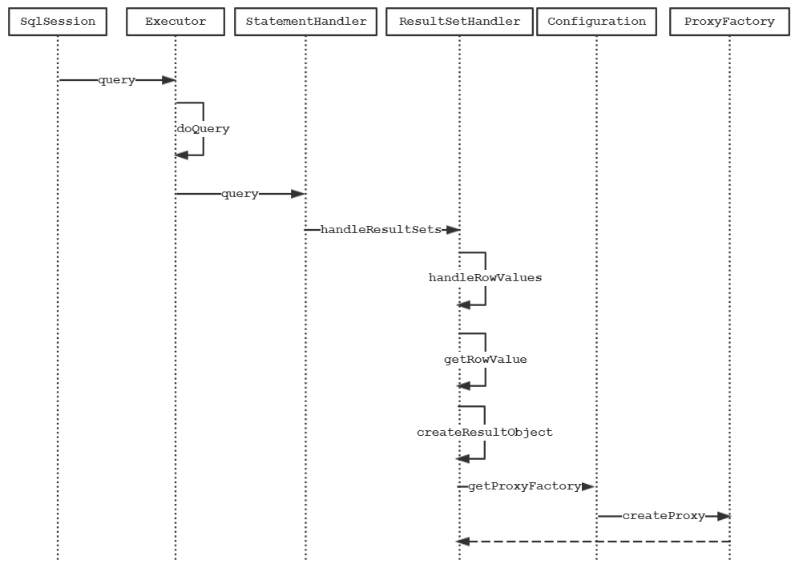

# 延迟加载

## 背景

延迟加载的目的是为了解决“N+1查询问题”。引下来自Mybatis官网对该问题的表述：

> For example:
>
> ```xml
> <resultMap id="blogResult" type="Blog">
>   <association property="author" column="author_id" javaType="Author" select="selectAuthor"/>
> </resultMap>
> 
> <select id="selectBlog" resultMap="blogResult">
>   SELECT * FROM BLOG WHERE ID = #{id}
> </select>
> 
> <select id="selectAuthor" resultType="Author">
>   SELECT * FROM AUTHOR WHERE ID = #{id}
> </select>
> ```
>
> That's it. We have two select statements: one to load the Blog, the other to load the Author, and the Blog's resultMap describes that the `selectAuthor` statement should be used to load its author property.
>
> All other properties will be loaded automatically assuming their column and property names match.
>
> While this approach is simple, it will not perform well for large data sets or lists. This problem is known as the "N+1 Selects Problem". In a nutshell, the N+1 selects problem is caused like this:
>
> - You execute a single SQL statement to retrieve a list of records (the "+1").
> - For each record returned, you execute a select statement to load details for each (the "N").
>
> This problem could result in hundreds or thousands of SQL statements to be executed. This is not always desirable.
>
> The upside is that MyBatis can lazy load such queries, thus you might be spared the cost of these statements all at once. However, if you load such a list and then immediately iterate through it to access the nested data, you will invoke all of the lazy loads, and thus performance could be very bad.

大概意思的是当我们使用嵌套查询的时候：

- 通过一次查询返回一个列表集合（就是“1”）
- 列表里的每条记录中与其他表关联的信息都需要通过嵌套子查询才能取得（就是“N”）

这个问题会导致同时一时刻大量的SQL被执行。Mybatis可以通过延迟加载，在需要数据的时候才进行加载，将大量的查询语句分散开来。然而，当你在加载列表之后立刻进行遍历获取嵌套的数据，就会触发所有的延迟加载，性能反而会变得更加的糟糕。

## 使用

1. `mybatis-config.xml`配置文件中增加以下配置即可开启延迟加载功能

   ```xml
    <!-- 开启全局延迟加载功能 -->
   <setting name="lazyLoadingEnabled" value="true"/>
   <!-- 当开启时任何方法的调用都会加载该对象的所有属性 否则每个属性会按需加载 -->
   <setting name="aggressiveLazyLoading" value="false"/>
   <!-- 指定哪些对象的方法触发一次延迟加载,以下值为默认,列举出来仅为了突出说明之用 -->
   <setting name="lazyLoadTriggerMethods" value="equals,clone,hashCode,toString"/>
   ```

2. 现有两个业务表，`job`和`job_data`，`job_data`是`job`的子表，`job_data`通过`job_id`字段来维护与`Job`的关系，`job`与`job_data`的对应关系为`1:n`。

3. 现在需要通过唯一`id`查询`job`记录时，将关联的所有的`job_data`的记录也查出来。分别创建`JobMapper.xml`、`JobDataMapper.xml`文件。

   - `JobMapper.xml`内容如下

   ```xml
   <?xml version="1.0" encoding="UTF-8" ?>
   <!DOCTYPE mapper
           PUBLIC "-//mybatis.org//DTD Mapper 3.0//EN"
           "http://mybatis.org/dtd/mybatis-3-mapper.dtd">
   <mapper namespace="org.rhine.mybatis.demo.lazyload.JobMapper">
   
       <resultMap id="jobDetail" type="org.rhine.mybatis.demo.lazyload.Job">
           <id column="id" property="id"/>
           <result column="keyword" property="keyword"/>
           <result column="floor_price" property="floorPrice"/>
           <result column="status" property="status"/>
           <result column="create_time" property="createTime"/>
           <collection property="jobDataList" ofType="org.rhine.mybatis.demo.lazyload.JobData" column="id"
                       select="org.rhine.mybatis.demo.lazyload.JobDataMapper.queryJobDataListByJobId">
               <id column="id" property="id"/>
               <result column="title" property="title"/>
               <result column="url" property="url"/>
               <result column="price" property="price"/>
           </collection>
       </resultMap>
   
       <select id="queryJobById" resultMap="jobDetail">
         select * from job where id = #{id}
       </select>
   </mapper>
   ```

   - `JobDataMapper.xml`内容如下：

     ```xml
     <?xml version="1.0" encoding="UTF-8" ?>
     <!DOCTYPE mapper
             PUBLIC "-//mybatis.org//DTD Mapper 3.0//EN"
             "http://mybatis.org/dtd/mybatis-3-mapper.dtd">
     <mapper namespace="org.rhine.mybatis.demo.lazyload.JobDataMapper">
         <select id="queryJobDataListByJobId" resultType="org.rhine.mybatis.demo.lazyload.JobData">
             select * from job_data where job_id = #{jobId}
         </select>
     </mapper>
     ```

4. 创建单元测试类

   ```java
   @Test
   public void testLazyLoad1() {
       JobMapper jobMapper = sqlSession.getMapper(JobMapper.class);
       jobMapper.queryJobById(1L);
   }
   
   @Test
   public void testLazyLoad2() {
       JobMapper jobMapper = sqlSession.getMapper(JobMapper.class);
       Job job = jobMapper.queryJobById(1L);
       System.out.println(job.getJobDataList());
   }
   ```

第二个测试类通过主动访问方法`getJobDataList()`，肯定会触发延迟加载的动作。

5. 两次控制台输出结果如下：

   - 第一个测试类输出结果：

   

- 第二个测试类输出结果：

  

这里可以看到，第二个输出了查询`job_data`SQL日志较第一个输出结果验证了延迟加载的功能。但是这种魔法般的特性是如何实现呢？大胆的猜测，肯定是对返回的结果集中需要延迟加载的对象使用了动态代理，带着这个猜想开始我们下面的源码分析的环节。

## 原理剖析

创建动态代理时序图如下:



核心代码`ResultSetHandler`的`ceateResultObject`内容如下：

```java
private Object createResultObject(ResultSetWrapper rsw, ResultMap resultMap, ResultLoaderMap lazyLoader, String columnPrefix) throws SQLException {
  this.useConstructorMappings = false; // reset previous mapping result
  final List<Class<?>> constructorArgTypes = new ArrayList<>();
  final List<Object> constructorArgs = new ArrayList<>();
  // 构造返回结果对象
  Object resultObject = createResultObject(rsw, resultMap, constructorArgTypes, constructorArgs, columnPrefix);
  if (resultObject != null && !hasTypeHandlerForResultObject(rsw, resultMap.getType())) {
    final List<ResultMapping> propertyMappings = resultMap.getPropertyResultMappings();
    for (ResultMapping propertyMapping : propertyMappings) {
      // issue gcode #109 && issue #149
      // 如果存在嵌套查询并且是懒加载
      if (propertyMapping.getNestedQueryId() != null && propertyMapping.isLazy()) {
        // 创建代理对象
        resultObject = configuration.getProxyFactory().createProxy(resultObject, lazyLoader, configuration, objectFactory, constructorArgTypes, constructorArgs);
        break;
      }
    }
  }
  this.useConstructorMappings = resultObject != null && !constructorArgTypes.isEmpty(); // set current mapping result
  return resultObject;
}
```

核心代码`if (propertyMapping.getNestedQueryId() != null && propertyMapping.isLazy())`，如果属性存在嵌套查询并且是懒加载，则通过`ProxyFactory`对结果对象进行代理。使用`Javassist`代理工厂核心内容如下：

```java
private static class EnhancedResultObjectProxyImpl implements MethodHandler {
    
  // 省略无关代码 
    
  @Override
  public Object invoke(Object enhanced, Method method, Method methodProxy, Object[] args) throws Throwable {
    final String methodName = method.getName();
    try {
      synchronized (lazyLoader) {
        // 序列化时
        if (WRITE_REPLACE_METHOD.equals(methodName)) {
          // 未被代理的属性对象
          Object original;
          // 构造方法参数为空
          if (constructorArgTypes.isEmpty()) {
            original = objectFactory.create(type);
            // 不为空
          } else {
            original = objectFactory.create(type, constructorArgTypes, constructorArgs);
          }
          // 将代理对象的属性copy到原对象中
          PropertyCopier.copyBeanProperties(type, enhanced, original);
          if (lazyLoader.size() > 0) {
            return new JavassistSerialStateHolder(original, lazyLoader.getProperties(), objectFactory, constructorArgTypes, constructorArgs);
          } else {
            return original;
          }
        } else {
          // 如果存在懒加载属性并且调用方式不是finalize
          if (lazyLoader.size() > 0 && !FINALIZE_METHOD.equals(methodName)) {
            // 如果设置aggressiveLazyLoading=true或者调用方法为(equals,clone,hashCode,toString)中的一种
            if (aggressive || lazyLoadTriggerMethods.contains(methodName)) {
              // 全部加载
              lazyLoader.loadAll();
              // 如果是set方法
            } else if (PropertyNamer.isSetter(methodName)) {
              final String property = PropertyNamer.methodToProperty(methodName);
              // 移除对应属性的懒加载
              lazyLoader.remove(property);
              // 如果是get方法
            } else if (PropertyNamer.isGetter(methodName)) {
              final String property = PropertyNamer.methodToProperty(methodName);
              if (lazyLoader.hasLoader(property)) {
                // 执行懒加载
                lazyLoader.load(property);
              }
            }
          }
        }
      }
      // 执行正常调用
      return methodProxy.invoke(enhanced, args);
    } catch (Throwable t) {
      throw ExceptionUtil.unwrapThrowable(t);
    }
  }
}
```

被代理对象所有的方法在执行的时候都会走`invoke`方法，关于懒加载的规则可以总结为以下几点：

- 如果属性配置为懒加载并且调用属性的`get`方法时会触发懒加载动作
- 如果配置Mybatis全局属性`aggressiveLazyLoading`为`true`并且执行的方法为`equals、clone、hashCode、toString`（默认，可通过`lazyLoadTriggerMethods`变更）则所有的懒加载属性都会被触发。
- 如果在懒加载被触发前调用了属性的`set`方法则懒加载的特性会被移除

## 配置项总结

1. `lazyLoadingEnabled`延迟加载的全局开关，默认值为`false`，当设置为`true`时，所有关联对象都会延迟加载。可通过`fetchType`来覆盖配置某个关联对象的延迟加载的特性，默认值为`lazy`，当配置为`eager`时则对象不会延迟加载。
2. `aggressiveLazyLoading`全局开关（`aggressive`不太好翻译。。。），版本小于等于3.4.1时默认为`true`，否则为`false`。当前开启时，如果调用了`lazyLoadTriggerMethods`属性中配置的方法就会触发该对象所有的属性加载，否则按需加载。
3. ``lazyLoadTriggerMethods`指定哪些对象的方法的调用会触发对象的所有的属性加载。


