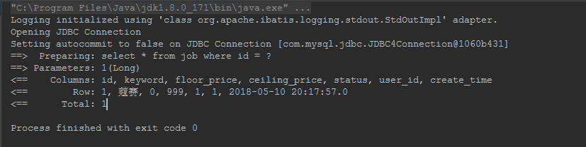
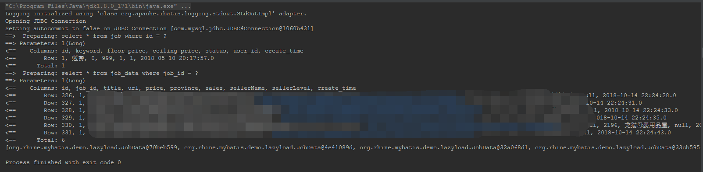

# 延迟加载

## 背景

延迟加载的目的是为了解决“N+1查询问题”。引下来自Mybatis官网对该问题的表述：

> For example:
>
> ```xml
> <resultMap id="blogResult" type="Blog">
>   <association property="author" column="author_id" javaType="Author" select="selectAuthor"/>
> </resultMap>
> 
> <select id="selectBlog" resultMap="blogResult">
>   SELECT * FROM BLOG WHERE ID = #{id}
> </select>
> 
> <select id="selectAuthor" resultType="Author">
>   SELECT * FROM AUTHOR WHERE ID = #{id}
> </select>
> ```
>
> That's it. We have two select statements: one to load the Blog, the other to load the Author, and the Blog's resultMap describes that the `selectAuthor` statement should be used to load its author property.
>
> All other properties will be loaded automatically assuming their column and property names match.
>
> While this approach is simple, it will not perform well for large data sets or lists. This problem is known as the "N+1 Selects Problem". In a nutshell, the N+1 selects problem is caused like this:
>
> - You execute a single SQL statement to retrieve a list of records (the "+1").
> - For each record returned, you execute a select statement to load details for each (the "N").
>
> This problem could result in hundreds or thousands of SQL statements to be executed. This is not always desirable.
>
> The upside is that MyBatis can lazy load such queries, thus you might be spared the cost of these statements all at once. However, if you load such a list and then immediately iterate through it to access the nested data, you will invoke all of the lazy loads, and thus performance could be very bad.

大概意思的是当我们使用嵌套查询的时候：

- 通过一次查询返回一个列表集合（就是“1”）
- 列表里的每条记录的其他表关联的信息都需要通过嵌套子查询才能取得（就是“N”）

这个问题会导致同时一时刻大量的SQL被执行。Mybatis可以通过延迟加载，在需要数据的时候才进行加载，将大量的查询语句分散开来。然而，当你在加载列表之后立刻进行遍历获取嵌套的数据，就会触发所有的延迟加载，性能反而会变得更加的糟糕。

## 使用

1. `mybatis-config.xml`配置文件中增加以下配置可以延迟加载

   ```xml
    <!-- 开启全局延迟加载功能 -->
   <setting name="lazyLoadingEnabled" value="true"/>
   <!-- 当开启时任何方法的调用都会加载该对象的所有属性 否则每个属性会按需加载 -->
   <setting name="aggressiveLazyLoading" value="false"/>
   <!-- 指定哪些对象的方法触发一次延迟加载,以下值为默认,列举出来仅为了突出说明之用 -->
   <setting name="lazyLoadTriggerMethods" value="equals,clone,hashCode,toString"/>
   ```

2. 现有两个实体类，`Job`和`JobData`，`JobData`是`Job`的子表，并通过`JobData`中`job_id`来维护与`Job`的关系。

3. 创建`JobMapper.xml`、`JobDataMapper.xml`内容如下：

   - `JobMapper.xml`内容如下

   ```xml
   <?xml version="1.0" encoding="UTF-8" ?>
   <!DOCTYPE mapper
           PUBLIC "-//mybatis.org//DTD Mapper 3.0//EN"
           "http://mybatis.org/dtd/mybatis-3-mapper.dtd">
   <mapper namespace="org.rhine.mybatis.demo.lazyload.JobMapper">
   
       <resultMap id="jobDetail" type="org.rhine.mybatis.demo.lazyload.Job">
           <id column="id" property="id"/>
           <result column="keyword" property="keyword"/>
           <result column="floor_price" property="floorPrice"/>
           <result column="status" property="status"/>
           <result column="create_time" property="createTime"/>
           <collection property="jobDataList" ofType="org.rhine.mybatis.demo.lazyload.JobData" column="id"
                       select="org.rhine.mybatis.demo.lazyload.JobDataMapper.queryJobDataListByJobId">
               <id column="id" property="id"/>
               <result column="title" property="title"/>
               <result column="url" property="url"/>
               <result column="price" property="price"/>
           </collection>
       </resultMap>
   
       <select id="queryJobById" resultMap="jobDetail">
         select * from job where id = #{id}
       </select>
   </mapper>
   ```

   - `JobDataMapper.xml`内容如下：

     ```xml
     <?xml version="1.0" encoding="UTF-8" ?>
     <!DOCTYPE mapper
             PUBLIC "-//mybatis.org//DTD Mapper 3.0//EN"
             "http://mybatis.org/dtd/mybatis-3-mapper.dtd">
     <mapper namespace="org.rhine.mybatis.demo.lazyload.JobDataMapper">
         <select id="queryJobDataListByJobId" resultType="org.rhine.mybatis.demo.lazyload.JobData">
             select * from job_data where job_id = #{jobId}
         </select>
     </mapper>
     ```

4. 创建单元测试类

   ```java
   @Test
   public void testLazyLoad1() {
       JobMapper jobMapper = sqlSession.getMapper(JobMapper.class);
       jobMapper.queryJobById(1L);
   }
   
   @Test
   public void testLazyLoad2() {
       JobMapper jobMapper = sqlSession.getMapper(JobMapper.class);
       Job job = jobMapper.queryJobById(1L);
       System.out.println(job.getJobDataList());
   }
   ```

第二个测试类通过主动访问方法`getJobDataList()`，肯定会触发延迟加载的动作。

5. 两次控制台输出结果如下：

   - 第一个测试类输出结果：

   

- 第二个测试类输出结果：

  

这里可以看到，第二个输出了查询`job_data`SQL日志较第一个输出结果验证了延迟加载的功能。但是这种魔法般的特性是如何实现呢？大胆的猜测，肯定是对返回的结果集中需要延迟加载的对象使用了动态代理，带着这个猜想开始我们下面的源码分析的环节。

## 原理剖析

