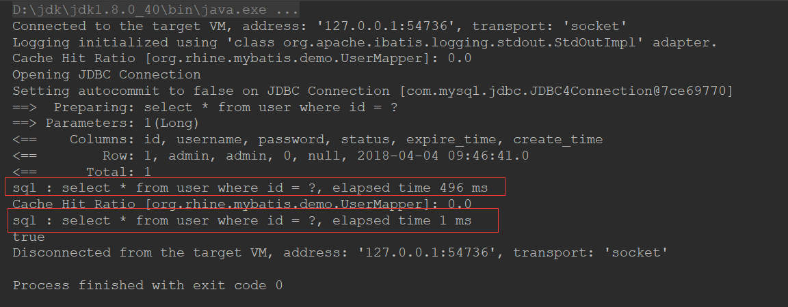
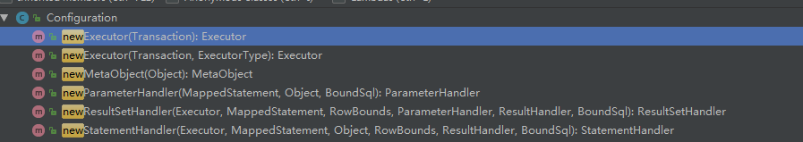
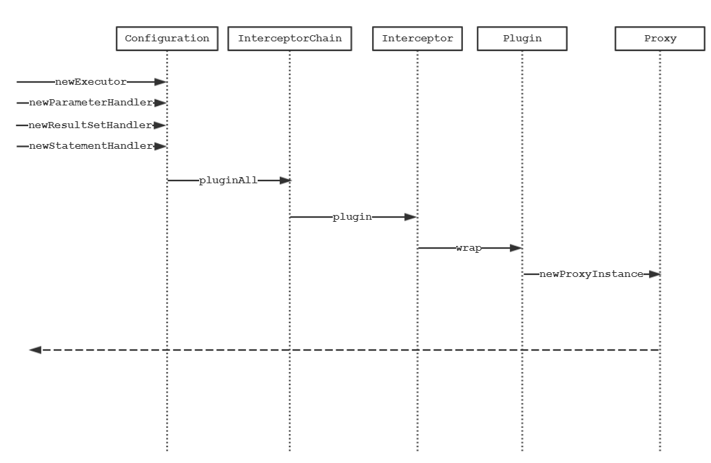
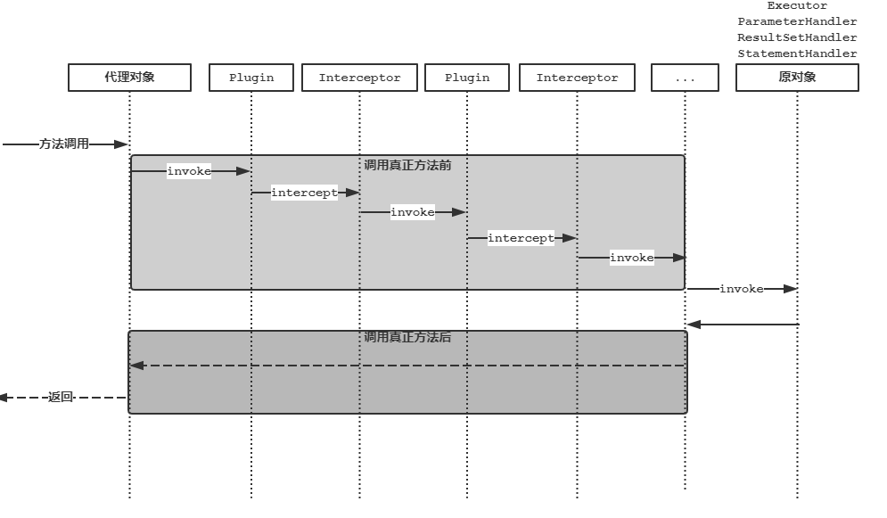

# 插件

## 概要

Mybatis允许在SQL执行过程某些点进行拦截。默认情况，Mybatis允许的调用拦截点有：

- Executor (update, query, flushStatements, commit, rollback, getTransaction, close, isClosed) 
- ParameterHandler (getParameterObject, setParameters)
- StatementHandler (prepare, parameterize, batch, update, query)
- ResultSetHandler (handleResultSets, handleOutputParameters)

`Executor `扮演者执行器的角色，是所有的SQL执行的总入口；`ParameterHandler`负责对SQL语句的输入参数进行处理；`StatementHandler `负责SQL语句执行调用、`Statement`的初始化、调用`ParameterHandler`将输入参数绑定到`Statement`上；`ResultSetHandler `对执行的结果集和实体进行映射处理。

可以看出Mybatis在SQL执行前、输入参数处理、SQL执行、结果集处理等这些重要的步骤中都预留了丰富的拦截点。即便我们平时用到的分页插件`PageHelper`也是基于这些基本的拦截点开发的。如果你现在已经迫不及待的想要想开发出自己的插件，但是需要特别注意官网强调的内容：

> The details of these classes methods can be discovered by looking at the full method signature of each, and the source code which is available with each MyBatis release. You should understand the behaviour of the method you’re overriding, assuming you’re doing something more than just monitoring calls. If you attempt to modify or override the behaviour of a given method, you’re likely to break the core of MyBatis. These are low level classes and methods, so use plug-ins with caution.

大概意思：如果你想做的不仅仅方法调用的监控，那么你最好需要了解重写方法的行为（“了解”翻译为“作用”可能会更好）。如果你尝试修改或者重写这些方法的内容，你很可能会破坏Mybatis的核心功能。因为它们都是比较底层的类和方法，所以使用插件的时候要特别的小心！今天我们不是要去探讨上面每个方法的作用，而是探究Mybatis这么强大的插件机制是如何实现。

## 简单的示例

在这个示例中我们将开发一个自己的监控的插件，用以监控每个SQL执行的真正时长。

1. 插件内容如下

   ```java
   @Intercepts({
           @Signature(type = Executor.class, method = "query", args = {MappedStatement.class, Object.class, RowBounds.class, ResultHandler.class}),
           @Signature(type = Executor.class, method = "query", args = {MappedStatement.class, Object.class, RowBounds.class, ResultHandler.class, CacheKey.class, BoundSql.class}),
           @Signature(type = Executor.class, method = "update", args = {MappedStatement.class, Object.class})})
   public class MonitorSQLExecutionTimePlugin implements Interceptor {
       public Object intercept(Invocation invocation) throws Throwable {
           Object[] args = invocation.getArgs();
           MappedStatement mappedStatement = (MappedStatement) args[0];
           Object param = args[1];
   
           BoundSql boundSql = mappedStatement.getBoundSql(param);
           String sql = boundSql.getSql();
   
           long beginTime = System.currentTimeMillis();
           Object result = invocation.proceed();
           long endTime = System.currentTimeMillis();
   
           System.out.println(MessageFormat.format("sql : {0}, elapsed time {1} ms", sql, endTime - beginTime));
           return result;
       }
   
       public Object plugin(Object target) {
           return Plugin.wrap(target, this);
       }
   
       @Override
       public void setProperties(Properties properties) {
   
       }
   }
   ```

2. 在全局配置文件中将刚刚开发完成的插件配置启用

   ```xml
   <plugins>
       <plugin interceptor="org.rhine.mybatis.demo.plugins.MonitorSQLExecutionTimePlugin"/>
   </plugins>
   ```

3. 在运行查询的时候，控制台输出如下的内容

   

   控制台输出了我们所期望的SQL语句及SQL的执行时间。

## 原理探究

### 配置的解析

提到Mybatis配置文件的解析不得不提到`XMLConfigBuilder`,从命名的上就可以推断出该类负责对XML文件的解析的工作，我们本篇只探讨它对plugins的解析部分。

```java
private void parseConfiguration(XNode root) {
    try {
      //issue #117 read properties first
      propertiesElement(root.evalNode("properties"));
      Properties settings = settingsAsProperties(root.evalNode("settings"));
      loadCustomVfs(settings);
      loadCustomLogImpl(settings);
      // 解析别名
      typeAliasesElement(root.evalNode("typeAliases"));
      // 解析插件
      pluginElement(root.evalNode("plugins"));
      objectFactoryElement(root.evalNode("objectFactory"));
      objectWrapperFactoryElement(root.evalNode("objectWrapperFactory"));
      reflectorFactoryElement(root.evalNode("reflectorFactory"));
      settingsElement(settings);
      // read it after objectFactory and objectWrapperFactory issue #631
      environmentsElement(root.evalNode("environments"));
      databaseIdProviderElement(root.evalNode("databaseIdProvider"));
      typeHandlerElement(root.evalNode("typeHandlers"));
      mapperElement(root.evalNode("mappers"));
    } catch (Exception e) {
      throw new BuilderException("Error parsing SQL Mapper Configuration. Cause: " + e, e);
    }
  }
```

解析plugins节点下的子节点plugin内容如下：

```java
private void pluginElement(XNode parent) throws Exception {
  if (parent != null) {
    // 遍历plugins下的孩子节点,将每个插件都实例化并添加到InterceptorChain中
    for (XNode child : parent.getChildren()) {
      String interceptor = child.getStringAttribute("interceptor");
      Properties properties = child.getChildrenAsProperties();
      Interceptor interceptorInstance = (Interceptor) resolveClass(interceptor).newInstance();
      interceptorInstance.setProperties(properties);
      configuration.addInterceptor(interceptorInstance);
    }
  }
}
```

通过以上的解析工作Mybatis成功的将配置文件中插件实例化并添加到`InterceptorChain`中。

### 代理对象的创建

开头部分官网介绍扩展点时提到了以下几个类`Executor`、`ParameterHandler `、`StatementHandler `、`ResultSetHandler `，它们为什么会拥有插件的扩展出的功能呢？答案肯定是动态代理啦，那么它们又是在何时被创建的呢？使用了哪种动态代理技术？

下图展现了刚刚提到类都是经由`Configuration`所创建，以`Executor`创建为例继续深挖其创建的细节。



```java
public Executor newExecutor(Transaction transaction, ExecutorType executorType) {
    executorType = executorType == null ? defaultExecutorType : executorType;
    executorType = executorType == null ? ExecutorType.SIMPLE : executorType;
    Executor executor;
    if (ExecutorType.BATCH == executorType) {
      executor = new BatchExecutor(this, transaction);
    } else if (ExecutorType.REUSE == executorType) {
      executor = new ReuseExecutor(this, transaction);
    } else {
      executor = new SimpleExecutor(this, transaction);
    }
    // 如果开启了二级缓存
    if (cacheEnabled) {
      executor = new CachingExecutor(executor);
    }
    // 使用JDK代理,对Executor进行增强,使其拥有插件的功能
    executor = (Executor) interceptorChain.pluginAll(executor);
    return executor;
  }
```

在代码的最后几行可以看到`Executor`借助`interceptorChain.pluginAll(executor)`的调用，将插件的功能增强到`Executor`对象中。

### InterceptorChain

```java
public class InterceptorChain {

  /**
   * 保存了所有的插件
   */
  private final List<Interceptor> interceptors = new ArrayList<>();

  public Object pluginAll(Object target) {
    for (Interceptor interceptor : interceptors) {
      // 调用interceptor的plugin对原对象增强,从这里也验证了JDK代理是可以再次被代理的
      target = interceptor.plugin(target);
    }
    return target;
  }

  public void addInterceptor(Interceptor interceptor) {
    interceptors.add(interceptor);
  }

  public List<Interceptor> getInterceptors() {
    return Collections.unmodifiableList(interceptors);
  }
}
```

这里可以看到`InterceptorChain`也是借助`interceptor`对`plugin`的调用获得插件的功能。通过对插件集合的遍历，不断的对代理之后的对象再次进行代理，这样就使得原始的对象获得所有的插件的功能。但是这里的`interceptor`依赖于具体的实现，如果`plugin`方法实现内容不是下面这样，就很有可能导致整个代理过程被破坏，达不到设计的预期目的。（所以在这个细节点的设计上作者的考虑可能有些欠缺，可以考虑使用接口的默认实现将下面的内容提升至`Interceptor`中。）

```java
@Override
public Object plugin(Object target) {
  return Plugin.wrap(target, this);
}
```

### Plugin

```java
public static Object wrap(Object target, Interceptor interceptor) {
  Map<Class<?>, Set<Method>> signatureMap = getSignatureMap(interceptor);
  Class<?> type = target.getClass();
  Class<?>[] interfaces = getAllInterfaces(type, signatureMap);
  if (interfaces.length > 0) {
    return Proxy.newProxyInstance(
        type.getClassLoader(),
        interfaces,
        new Plugin(target, interceptor, signatureMap));
  }
  return target;
}
```

可以看到Mybatis插件同Mapper的一样，也是基于JDK原生的动态代理来实现。

### 总览

探究完细节，我们在从全局上俯瞰下代理对象创建时序：



调用时序图如下：



