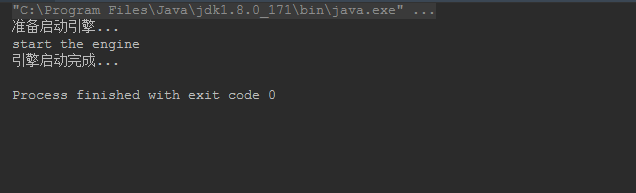
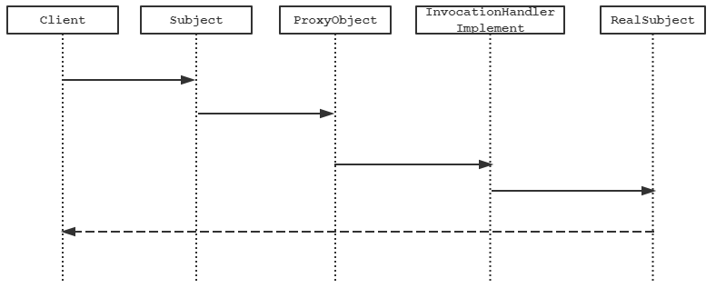
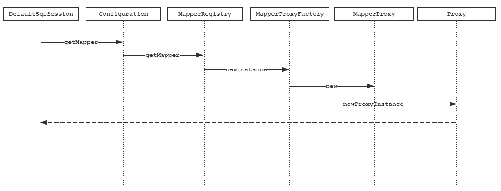

# Mapper动态代理

写这篇的博文的目的是源于对“为什么项目中可以直接调用mapper接口？”这个问题的思考。第一感觉肯定是使用了动态代理，但是Mybatis底层是如何实现的？使用到了什么技术？

## JDK中的动态代理

### 先举个栗子

在正式介绍MyBatis动态代理之前，先了解下JDK动态代理用法。

接口类`Engine`内容：

```java
interface Engine {

    void startEngine();

}
```

接口实现类`Car`:

```java
public class Car implements Engine {

    @Override
    public void startEngine() {
        System.out.println("start the engine");
    }
}
```

现在我们想在`startEngine`这个方法执行的时候进行代理，在方法执行前后织入我们自己的业务内容。需要实现`InvocationHandler`这个接口，内容如下：

```java
public class ProxyImplement implements InvocationHandler {

    private Engine engine;

    public ProxyImplement(Engine engine) {
        this.engine = engine;
    }

    @Override
    public Object invoke(Object proxy, Method method, Object[] args) throws Throwable {
        System.out.println("准备启动引擎...");
        Object result = method.invoke(engine, args);
        System.out.println("引擎启动完成...");
        return result;
    }
}
```

通过`Proxy`类的`newProxyInstance`动态生成代理类。

```java
public class ProxyFactory {

    public static <T> T getInstance(Engine engine, InvocationHandler invocationHandler) {
        return (T) Proxy.newProxyInstance(engine.getClass().getClassLoader(), engine.getClass().getInterfaces(), invocationHandler);
    }
}
```

测试代码如下：

```java
public class Main {

    public static void main(String[] args) {

        Engine engine = new Car();
        ProxyImplement proxyImplement = new ProxyImplement(engine);

        Engine proxyEngine = ProxyFactory.getInstance(engine, proxyImplement);
        proxyEngine.startEngine();
    }
}
```

控制台运行结果：



### JDK代理的原理

通过执行的结果可以看到，我们成功的在`startEngine`的方法执行的前后织入了我们自己的业务内容，达到了我们使用代理的目的，方法调用执行时序图如下：



客户端在通过`Subject`的引用来访问方法，此时`Subject`的引用已经指向了被代理过的`ProxyObject`，而`ProxyObject`内部所有的方法已经被`InvocationHandler`所代理。在使用`InvocationHandler`之前，我们上面首先实现了它的接口，并实现了唯一的一个`invoke`的方法，还记的我们上面创建时传入了`Subject`的实现类`RealSubject`的对象吗，通过在`invoke`方法内使用`RealSubject`对象，既完成了本身的功能，也达到了我们织入额外功能的目的。

下面探究下Java中生成的动态代理类到底是什么样子的：

```java
public final class $Proxy0 extends Proxy implements Engine {
    private static Method m1;
    private static Method m3;
    private static Method m2;
    private static Method m0;

    public $Proxy0(InvocationHandler var1) throws  {
        super(var1);
    }

    public final boolean equals(Object var1) throws  {
        try {
            return (Boolean)super.h.invoke(this, m1, new Object[]{var1});
        } catch (RuntimeException | Error var3) {
            throw var3;
        } catch (Throwable var4) {
            throw new UndeclaredThrowableException(var4);
        }
    }

    public final void startEngine() throws  {
        try {
            super.h.invoke(this, m3, (Object[])null);
        } catch (RuntimeException | Error var2) {
            throw var2;
        } catch (Throwable var3) {
            throw new UndeclaredThrowableException(var3);
        }
    }

    public final String toString() throws  {
        try {
            return (String)super.h.invoke(this, m2, (Object[])null);
        } catch (RuntimeException | Error var2) {
            throw var2;
        } catch (Throwable var3) {
            throw new UndeclaredThrowableException(var3);
        }
    }

    public final int hashCode() throws  {
        try {
            return (Integer)super.h.invoke(this, m0, (Object[])null);
        } catch (RuntimeException | Error var2) {
            throw var2;
        } catch (Throwable var3) {
            throw new UndeclaredThrowableException(var3);
        }
    }

    static {
        try {
            m1 = Class.forName("java.lang.Object").getMethod("equals", Class.forName("java.lang.Object"));
            m3 = Class.forName("org.apache.ibatis.Engine").getMethod("startEngine");
            m2 = Class.forName("java.lang.Object").getMethod("toString");
            m0 = Class.forName("java.lang.Object").getMethod("hashCode");
        } catch (NoSuchMethodException var2) {
            throw new NoSuchMethodError(var2.getMessage());
        } catch (ClassNotFoundException var3) {
            throw new NoClassDefFoundError(var3.getMessage());
        }
    }
}
```

从上面的代码中可以看到，所有的方法在调用的时候都是统一通过`InvocationHandler`来调用，而需要传入到`InvocationHandler`方法的`Method`参数则在创建动态类的时候已经被创建完成。

- m1 = Class.forName("java.lang.Object").getMethod("equals", Class.forName("java.lang.Object"));
- m2 = Class.forName("java.lang.Object").getMethod("toString");
- m0 = Class.forName("java.lang.Object").getMethod("hashCode");
- m3 = Class.forName("org.apache.ibatis.Engine").getMethod("startEngine");

另外我们可以看到代理已经继承了Java里的`Proxy`，实现了我们声明的`Engine`接口。Java的JDK为什么只能代理接口，因为已经继承了`Proxy`，没办法再继承一个Class了啊。。。

##  Mapper中的动态代理

上面介绍JDK动态代理的原因是，Mybatis中的Mapper代理也是使用原生的JDK动态代理所完成，只不过织入了更多的代码，原理都是相同。

生成Mapper代理的时序图如下所示：



看到`MapperProxyFactory`、`MapperProxy`是不是再联想到上面的`ProxyFactory`、`ProxyImplement`是不是很亲切，再看到`new `的动作，没错就是里了。

`MapperProxyFactory`内容如下

```java
public class MapperProxyFactory<T> {

  private final Class<T> mapperInterface;
  private final Map<Method, MapperMethod> methodCache = new ConcurrentHashMap<>();

  public MapperProxyFactory(Class<T> mapperInterface) {
    this.mapperInterface = mapperInterface;
  }

  public Class<T> getMapperInterface() {
    return mapperInterface;
  }

  public Map<Method, MapperMethod> getMethodCache() {
    return methodCache;
  }

  @SuppressWarnings("unchecked")
  protected T newInstance(MapperProxy<T> mapperProxy) {
    // JDK原生动态代理
    return (T) Proxy.newProxyInstance(mapperInterface.getClassLoader(), new Class[] { mapperInterface }, mapperProxy);
  }

  public T newInstance(SqlSession sqlSession) {
    final MapperProxy<T> mapperProxy = new MapperProxy<>(sqlSession, mapperInterface, methodCache);
    return newInstance(mapperProxy);
  }
}
```

内容非常的简单，调用Java原生的生成动态代理类的方法，生成代理类。而织入的内容肯定是`MapperProxy`啦。

```java
public class MapperProxy<T> implements InvocationHandler, Serializable {

  private static final long serialVersionUID = -6424540398559729838L;
  private final SqlSession sqlSession;
  private final Class<T> mapperInterface;
  private final Map<Method, MapperMethod> methodCache;

  public MapperProxy(SqlSession sqlSession, Class<T> mapperInterface, Map<Method, MapperMethod> methodCache) {
    this.sqlSession = sqlSession;
    this.mapperInterface = mapperInterface;
    this.methodCache = methodCache;
  }

  @Override
  public Object invoke(Object proxy, Method method, Object[] args) throws Throwable {
    try {
      // 如果是Object的方法直接放过，不做任何代理
      if (Object.class.equals(method.getDeclaringClass())) {
        return method.invoke(this, args);
      }
      // 如果是接口中声明的default方法
      else if (isDefaultMethod(method)) {
        return invokeDefaultMethod(proxy, method, args);
      }
    } catch (Throwable t) {
      throw ExceptionUtil.unwrapThrowable(t);
    }
    // 真正的SQL执行委托给MapperMethod
    final MapperMethod mapperMethod = cachedMapperMethod(method);
    return mapperMethod.execute(sqlSession, args);
  }
}
```

代理类的实现内容非常简洁，先判断要执行的方法是否为`Object`中的方法，最后将SQL执行委托给`MapperMethod`来完成。