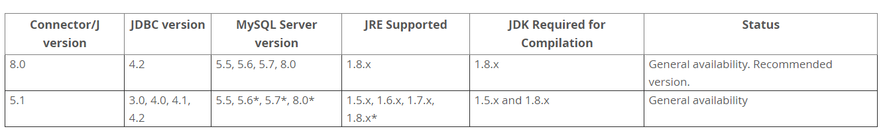
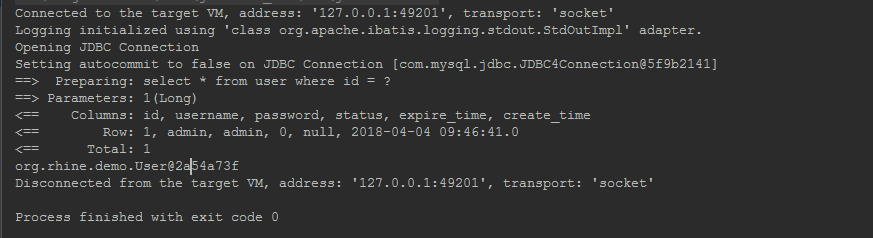

# 快速入门

1. 通过IDEA创建一个Maven的标准结构的工程。

2. 引入Mybatis的依赖包、引入对应数据库的连接器依赖包。（我这里使用的是MySQL数据库，版本为5.7.24）

   查找官网MySQL数据库与连接器版本的对应关系如下图：

   

   完整Maven依赖内容如下：

   ```xml
    <!-- https://mvnrepository.com/artifact/org.mybatis/mybatis -->
   <dependency>
       <groupId>org.mybatis</groupId>
       <artifactId>mybatis</artifactId>
       <version>3.5.0</version>
   </dependency>
   <!-- https://mvnrepository.com/artifact/mysql/mysql-connector-java -->
   <dependency>
       <groupId>mysql</groupId>
       <artifactId>mysql-connector-java</artifactId>
       <version>5.1.47</version>
   </dependency>
   ```

3. 在项目resources目录下创建配置文件及mapper文件

   `mybatis-config.xml`内容如下：

   ```xml
   <?xml version="1.0" encoding="UTF-8" ?>
   <!DOCTYPE configuration
     PUBLIC "-//mybatis.org//DTD Config 3.0//EN"
     "http://mybatis.org/dtd/mybatis-3-config.dtd">
   <configuration>
     <environments default="development">
       <environment id="development">
         <transactionManager type="JDBC"/>
         <dataSource type="POOLED">
           <property name="driver" value="com.mysql.jdbc.Driver"/>
           <property name="url" value="jdbc:mysql://ipaddress:3306/databasename"/>
           <property name="username" value="root"/>
           <property name="password" value=""/>
         </dataSource>
       </environment>
     </environments>
     <mappers>
       <mapper resource="user-mapper.xml"/>
     </mappers>
   </configuration>
   ```

   `user-mapper.xml`文件内容如下：

   ```xml
   <?xml version="1.0" encoding="UTF-8" ?>
   <!DOCTYPE mapper
           PUBLIC "-//mybatis.org//DTD Mapper 3.0//EN"
           "http://mybatis.org/dtd/mybatis-3-mapper.dtd">
   <mapper namespace="org.rhine.demo.UserMapper">
       <select id="queryUser" resultType="org.rhine.demo.User">
         select * from user where id = #{id}
       </select>
   </mapper>
   ```

4.  创建接口`UserMapper`

   ```java
   public interface UserMapper {
   
       User queryUser(Long id);
   
   }
   ```

   实体类`User`

   ```java
   package org.rhine.demo;
   
   import java.sql.Timestamp;
   
   public class User {
   
       private long id;
   
       private String username;
   
       private String password;
   
       private int status;
   
       private Timestamp expireTime;
   
       private Timestamp createTime;
   }
   ```

5. 创建测试类代码

```java
public class UserMapperTest {

    private SqlSession sqlSession;

    @Before
    public void prepareSqlSession() {
        String resource = "mybatis-config.xml";
        InputStream inputStream = null;
        try {
            inputStream = Resources.getResourceAsStream(resource);
        } catch (IOException e) {
            e.printStackTrace();
        }
        SqlSessionFactory sqlSessionFactory =
                new SqlSessionFactoryBuilder().build(inputStream);
        sqlSession = sqlSessionFactory.openSession();
    }

    @Test
    public void queryUserTest() {
        UserMapper userMapper = sqlSession.getMapper(UserMapper.class);
        User user = userMapper.queryUser(1L);
        Assert.assertNotNull(user);
    }
}
```

6. 运行单元测试类。

   

最后附上demo的[github地址](https://github.com/EvanDylan/mybatisdemo)

