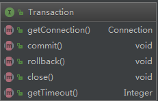
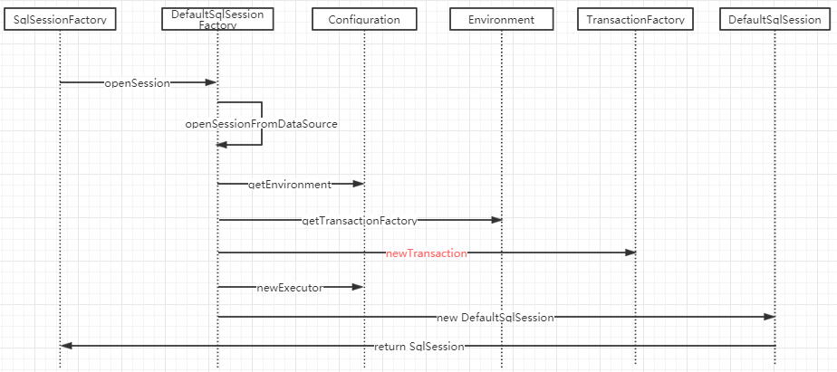

# 事务管理

## 开篇词

在介绍事务管理之前，先简单介绍下Mybatis中对于数据库连接管理的方案。Mybatis中默认提供了三种解决方案，分别为：`JndiDataSourceFactory`、`PooledDataSourceFactory`、`UnpooledDataSourceFactory`。第一个`JndiDataSourceFactory`依赖外部通过JNDI的方式“注入”外部的数据库连接；第二个是Mybatis内部实现比较简单的连接池方案；第三个则是随用随开的方案，没有使用连接池。但是我们平时在开发时往往会更加青睐于选择功能更加完善、性能更加强劲的其他开源实现，譬如`druid`、`HikariCP`等。但是不管框架千变万化，连接池初衷始终是为了减少连接频繁的打开和关闭操作，减少IO的开销来提升应用的性能。

## 事务的抽象与实现

Mybatis抽象出的`Transaction`接口，内容如下



实现接口的子类有：`JdbcTransaction`、`ManagedTransaction`，第一种通过jdbc的Connection使用数据库层支持的事务操作，而第二种则使用容器提供的事务管理方案。

`JdbcTransaction`核心内容如下：

```java
@Override
  public Connection getConnection() throws SQLException {
    if (connection == null) {
      openConnection();
    }
    return connection;
  }

  @Override
  public void commit() throws SQLException {
    if (connection != null && !connection.getAutoCommit()) {
      if (log.isDebugEnabled()) {
        log.debug("Committing JDBC Connection [" + connection + "]");
      }
      connection.commit();
    }
  }

  @Override
  public void rollback() throws SQLException {
    if (connection != null && !connection.getAutoCommit()) {
      if (log.isDebugEnabled()) {
        log.debug("Rolling back JDBC Connection [" + connection + "]");
      }
      connection.rollback();
    }
  }

  @Override
  public void close() throws SQLException {
    if (connection != null) {
      resetAutoCommit();
      if (log.isDebugEnabled()) {
        log.debug("Closing JDBC Connection [" + connection + "]");
      }
      connection.close();
    }
  }
```

`ManagedTransaction`核心内容如下：

```java
@Override
public Connection getConnection() throws SQLException {
  if (this.connection == null) {
    openConnection();
  }
  return this.connection;
}

@Override
public void commit() throws SQLException {
  // Does nothing
}

@Override
public void rollback() throws SQLException {
  // Does nothing
}

@Override
public void close() throws SQLException {
  if (this.closeConnection && this.connection != null) {
    if (log.isDebugEnabled()) {
      log.debug("Closing JDBC Connection [" + this.connection + "]");
    }
    this.connection.close();
  }
}

protected void openConnection() throws SQLException {
  if (log.isDebugEnabled()) {
    log.debug("Opening JDBC Connection");
  }
  this.connection = this.dataSource.getConnection();
  if (this.level != null) {
    this.connection.setTransactionIsolation(this.level.getLevel());
  }
}
```

可以看到这里commit、rollback等操作并没有实现，而是依托于容器的事务管理。

## 事务在Mybatis中的生命周期

### 事务获取

在第一篇快速入门的时候在单元测试类中获取`SqlSession`获取方式如下：

```java
private SqlSession sqlSession;

@Before
public void prepareSqlSession() {
    String resource = "mybatis-config.xml";
    InputStream inputStream = null;
    try {
        inputStream = Resources.getResourceAsStream(resource);
    } catch (IOException e) {
        e.printStackTrace();
    }
    SqlSessionFactory sqlSessionFactory =
            new SqlSessionFactoryBuilder().build(inputStream);
    sqlSession = sqlSessionFactory.openSession();
}
```

获取`sqlsession`的时序图如下所示



`DefaultSqlSession`中`openSessionFromDataSource`方法内容如下:

```java
private SqlSession openSessionFromDataSource(ExecutorType execType, TransactionIsolationLevel level, boolean autoCommit) {
  Transaction tx = null;
  try {
    final Environment environment = configuration.getEnvironment();
    final TransactionFactory transactionFactory = getTransactionFactoryFromEnvironment(environment);
    tx = transactionFactory.newTransaction(environment.getDataSource(), level, autoCommit);
    final Executor executor = configuration.newExecutor(tx, execType);
    return new DefaultSqlSession(configuration, executor, autoCommit);
  } catch (Exception e) {
    closeTransaction(tx); // may have fetched a connection so lets call close()
    throw ExceptionFactory.wrapException("Error opening session.  Cause: " + e, e);
  } finally {
    ErrorContext.instance().reset();
  }
}
```

这里通过`environment`获取事务工厂，并通过调用`newTransaction`方法创建事务连接然后传入执行器`Executor`。

### 事务提交、回滚

`BaseExecutor`中事务提交和回滚的方法内容如下：

```java
@Override
public void commit(boolean required) throws SQLException {
  if (closed) {
    throw new ExecutorException("Cannot commit, transaction is already closed");
  }
  clearLocalCache();
  flushStatements();
  if (required) {
    transaction.commit();
  }
}

@Override
public void rollback(boolean required) throws SQLException {
  if (!closed) {
    try {
      clearLocalCache();
      flushStatements(true);
    } finally {
      if (required) {
        transaction.rollback();
      }
    }
  }
}
```

很容可以推断出，Mybatis通过执行器在适时地地方通过调用这两个方法来完成事务的提交和回滚的操作。

