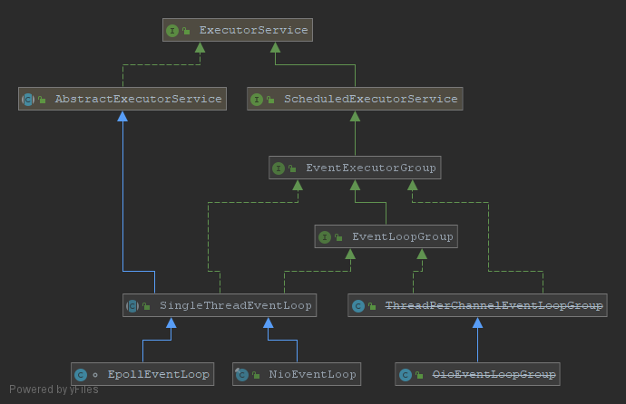

# NioEventLoop创建过程

## 介绍

在剖析`NioEventLoop`创建细节之前，我们先了解下`EventLoop`的相关类。对它们的旁系的相关类及其关系进行全局上的认识，相关类图如下：



`NioEventLoop`及对应jdk中的nio了，由于jdk封装和设配在各个平台都有不错的性能表现。

`EpollEventLoop`对应linux系统下的epoll，如果部署机器是linux可以率先考虑使用以提升性能。

`OioEventLoopGroup`在(4.1.38.Final版本中没找到`OioEventLoop`），可以看到类已经处于废弃的状态，性能较低每个连接打开的`channel`都需要一个单独的线程处理，而不能向前面的两位大佬一样多路复用（多路复用的就是线程，一个线程可以同时处理多个连接通道的读写事件），读写都是阻塞式的，此时的线程啥事也干不了，只能干等，所以效率较低。

另外在最新的代码中（4.1.39快照版本）中发现了一个新的`KQueueEventLoop`，适配FreeBSD平台的事件循环处理器。

## 剖析

### 构造参数的含义

在简单的介绍了netty中出现的不同的**EventLoop**下面我们开始剖析最为经典和常用的`NioEventLoop`创建的过程。

创建过程的调用链可以简化为：`NioEventLoopGroup` -> `MultithreadEventLoopGroup` -> `MultithreadEventExecutorGroup` -> `MultithreadEventExecutorGroup#newChild`，在`MultithreadEventExecutorGroup`类中`newChild`方法签名如下：

```java
protected abstract EventExecutor newChild(Executor executor, Object... args) throws Exception;
```

该方法第二个参数`args`使用变长的参数，真实的传入参数在`NioEventLoopGroup`构造函数中，内容如下：

```java
public NioEventLoopGroup(int nThreads, Executor executor, EventExecutorChooserFactory chooserFactory,
                             final SelectorProvider selectorProvider,
                             final SelectStrategyFactory selectStrategyFactory,
                             final RejectedExecutionHandler rejectedExecutionHandler,
                             final EventLoopTaskQueueFactory taskQueueFactory) {
        super(nThreads, executor, chooserFactory, selectorProvider, selectStrategyFactory,
                rejectedExecutionHandler, taskQueueFactory);
}
```

每个参数的解释如下：

- `nThreads` 线程数量，即要创建多少个`NioEventLoop`
- `executor` 用来执行事件、任务的线程池（只有一个线程），默认使用的是`ThreadPerTaskExecutor`
- `chooserFactory` 可以理解为一个负载均衡算法的工厂，比如来了一个新的连接，由这个工厂产生的均衡算法负责分配一个`EventLoop`来处理。
- `selectorProvider` jdk提供的方法，通过spi机制最终会创建对应的`selector`
- `selectStrategyFactory` 当`EventLoop`执行周期性事件轮询时，执行`select`操作时的策略（后续分析事件轮询时再详细分析）。
- `rejectedExecutionHandler` 任务太多时执行的拒绝策略，默认是直接抛出`RejectedExecutionException`异常
- `taskQueueFactory` 创建任务队列的工厂方法

弄懂了每个参数的含义之后，我们继续分析`NioEventLoopGroup`类中的创建`NioEventLoop`过程：

```java
@Override
protected EventLoop newChild(Executor executor, Object... args) throws Exception {
    EventLoopTaskQueueFactory queueFactory = args.length == 4 ? (EventLoopTaskQueueFactory) args[3] : null;
    return new NioEventLoop(this, executor, (SelectorProvider) args[0],
                            ((SelectStrategyFactory) args[1]).newSelectStrategy(), (RejectedExecutionHandler) args[2], queueFactory);
}

// 上面调用构造方法，代码如下
NioEventLoop(NioEventLoopGroup parent, Executor executor, SelectorProvider selectorProvider,
                 SelectStrategy strategy, RejectedExecutionHandler rejectedExecutionHandler,
                 EventLoopTaskQueueFactory queueFactory) {
        super(parent, executor, false, newTaskQueue(queueFactory), newTaskQueue(queueFactory),
                rejectedExecutionHandler);
        if (selectorProvider == null) {
            throw new NullPointerException("selectorProvider");
        }
        if (strategy == null) {
            throw new NullPointerException("selectStrategy");
        }
        provider = selectorProvider;
        final SelectorTuple selectorTuple = openSelector();
        selector = selectorTuple.selector;
        unwrappedSelector = selectorTuple.unwrappedSelector;
        selectStrategy = strategy;
    }
```

进一步追踪调用链如下`NioEventLoop` -> `SingleThreadEventLoop` -> `SingleThreadEventExecutor` -> ，我们按照倒叙的顺序逐步分析调用过程：

### SingleThreadEventExecutor

#### ThreadPerTaskExecutor

`SingleThreadEventExecutor`调用方法内容如下：

```java
protected SingleThreadEventExecutor(
            EventExecutorGroup parent, ThreadFactory threadFactory,
            boolean addTaskWakesUp, int maxPendingTasks, RejectedExecutionHandler rejectedHandler) {
    this(parent, new ThreadPerTaskExecutor(threadFactory), addTaskWakesUp, maxPendingTasks, rejectedHandler);
}
```

可以看到中间隐藏了`new ThreadPerTaskExecutor(threadFactory)`这一段代码，在这时将创建之后的`ThreadPerTaskExecutor`向上转型之后（默认发生的）传递到下一个调用方法参数，但是下一个方法中在使用时又没有感知到这里的`Executor`已经被装饰过了。

那么netty具体装饰的什么东西？织入了哪些隐藏的步骤呢？

```java
public final class ThreadPerTaskExecutor implements Executor {
    private final ThreadFactory threadFactory;

    public ThreadPerTaskExecutor(ThreadFactory threadFactory) {
        if (threadFactory == null) {
            throw new NullPointerException("threadFactory");
        }
        this.threadFactory = threadFactory;
    }

    @Override
    public void execute(Runnable command) {
        threadFactory.newThread(command).start();
    }
}
```

很明显是对`execute()`方法进行了装饰，当调用`EventLoop`的`execute()`方法时会执行`threadFactory.newThread(command).start();`这一行代码，跟踪代码到`DefaultThreadFactory#newThread()`方法，内容如下：

```java
public Thread newThread(Runnable r) {
    Thread t = newThread(FastThreadLocalRunnable.wrap(r), prefix + nextId.incrementAndGet());
    try {
        if (t.isDaemon() != daemon) {
            t.setDaemon(daemon);
        }

        if (t.getPriority() != priority) {
            t.setPriority(priority);
        }
    } catch (Exception ignored) {
        // Doesn't matter even if failed to set.
    }
    return t;
}
```

该方法创建了一个线程，并且指定了线程的名字，具体的规则感兴趣的可以自行阅读，代码还是比较容易懂的。创建完毕之后，将线程返回给上一步的`ThreadPerTaskExecutor#execute()`方法，接着执行`start()`方法，到这里和`EventLoop`绑定的线程创建过程就分析完毕了（此时由于`ThreadPerTaskExecutor#execute()`还没有被调用，所以线程初始化并不是在创建过程中，具体调用可以参考下篇）。

上面我们对穿插进来的`ThreadPerTaskExecutor`做了分析，下面继续分析主流程：

```java
protected SingleThreadEventExecutor(
            EventExecutorGroup parent, ThreadFactory threadFactory,
            boolean addTaskWakesUp, int maxPendingTasks, RejectedExecutionHandler rejectedHandler) {
    this(parent, new ThreadPerTaskExecutor(threadFactory), addTaskWakesUp, maxPendingTasks, rejectedHandler);
}

// 上面方法执行完成之后紧接着调用次方法
protected SingleThreadEventExecutor(EventExecutorGroup parent, Executor executor,
                                        boolean addTaskWakesUp, Queue<Runnable> taskQueue,
                                        RejectedExecutionHandler rejectedHandler) {
    super(parent);
    this.addTaskWakesUp = addTaskWakesUp;
    this.maxPendingTasks = DEFAULT_MAX_PENDING_EXECUTOR_TASKS;
    this.executor = ThreadExecutorMap.apply(executor, this);
    this.taskQueue = ObjectUtil.checkNotNull(taskQueue, "taskQueue");
    rejectedExecutionHandler = ObjectUtil.checkNotNull(rejectedHandler, "rejectedHandler");
}
```

其中**DEFAULT_MAX_PENDING_EXECUTOR_TASKS**赋值逻辑如下

```java
static final int DEFAULT_MAX_PENDING_EXECUTOR_TASKS = Math.max(16,
        SystemPropertyUtil.getInt("io.netty.eventexecutor.maxPendingTasks", Integer.MAX_VALUE));
```

即默认情况下，之前创建的默认任务队列大小是`Integer.MAX_VALUE`。

对`Executor`的再一次的装饰：

```java
this.executor = ThreadExecutorMap.apply(executor, this);
```

`ThreadExecuortMap`类的功能注释内容如下：

> Allow to retrieve the {@link EventExecutor} for the calling {@link Thread}.

即通过`Thread`可以取出来这个线程对应的`EventExecutor` ，很容易想到是通过`ThreadLocal`来实现类似的功能，但是netty通过造轮子实现自己的`FastThreadLocal`（可以加速访问过程，具体原理后续单独开篇进行分析），那么具体是如何实现的呢？

```java
public static Executor apply(final Executor executor, final EventExecutor eventExecutor) {
    ObjectUtil.checkNotNull(executor, "executor");
    ObjectUtil.checkNotNull(eventExecutor, "eventExecutor");
    return new Executor() {
        @Override
        public void execute(final Runnable command) {
            executor.execute(apply(command, eventExecutor));
        }
    };
}

public static Runnable apply(final Runnable command, final EventExecutor eventExecutor) {
    ObjectUtil.checkNotNull(command, "command");
    ObjectUtil.checkNotNull(eventExecutor, "eventExecutor");
    return new Runnable() {
        @Override
        public void run() {
            setCurrentEventExecutor(eventExecutor);
            try {
                command.run();
            } finally {
                setCurrentEventExecutor(null);
            }
        }
    };
}
```

看到如上的代码第一个`apply`方法其实就是一个装饰器模式，重载了`execute`方法，在执行真正的`execute`方法执行，先调用了第二个`apply`方法。

那么第二方法将传入的`Runnable`对象也进行了一次装饰，重载了它的`run`方法，在执行真正的任务执行先调用了`setCurrentEventExecutor(eventExecutor);`将`eventExecurot`和当前线程绑定，任务执行完之后在清除掉绑定关系。

至此`SingleThreadEventExecutor`内的创建过程分析完毕，根据上面的调用链我们接着分析：

### SingleThreadEventLoop

```java
// 没有任何的其他逻辑，所以略过 
super(parent, executor, addTaskWakesUp, taskQueue, rejectedExecutionHandler);
        tailTasks = ObjectUtil.checkNotNull(tailTaskQueue, "tailTaskQueue");
```

 那么下面就到`NioEventLoop`过程的分析了

### NioEventLoop

构造方法内容如下：

```java
super(parent, executor, false, newTaskQueue(queueFactory), newTaskQueue(queueFactory),
                rejectedExecutionHandler);
if (selectorProvider == null) {
    throw new NullPointerException("selectorProvider");
}
if (strategy == null) {
    throw new NullPointerException("selectStrategy");
}
provider = selectorProvider;
final SelectorTuple selectorTuple = openSelector();
selector = selectorTuple.selector;
unwrappedSelector = selectorTuple.unwrappedSelector;
selectStrategy = strategy;
```

我们着重分析下`final SelectorTuple selectorTuple = openSelector();`方法内容如下：

```java
private SelectorTuple openSelector() {
    final Selector unwrappedSelector;
    try {
        unwrappedSelector = provider.openSelector();
    } catch (IOException e) {
        throw new ChannelException("failed to open a new selector", e);
    }

    if (DISABLE_KEY_SET_OPTIMIZATION) {
        return new SelectorTuple(unwrappedSelector);
    }

    Object maybeSelectorImplClass = AccessController.doPrivileged(new PrivilegedAction<Object>() {
        @Override
        public Object run() {
            try {
                return Class.forName(
                        "sun.nio.ch.SelectorImpl",
                        false,
                        PlatformDependent.getSystemClassLoader());
            } catch (Throwable cause) {
                return cause;
            }
        }
    });

    if (!(maybeSelectorImplClass instanceof Class) ||
        // ensure the current selector implementation is what we can instrument.
        !((Class<?>) maybeSelectorImplClass).isAssignableFrom(unwrappedSelector.getClass())) {
        if (maybeSelectorImplClass instanceof Throwable) {
            Throwable t = (Throwable) maybeSelectorImplClass;
            logger.trace("failed to instrument a special java.util.Set into: {}", unwrappedSelector, t);
        }
        return new SelectorTuple(unwrappedSelector);
    }

    final Class<?> selectorImplClass = (Class<?>) maybeSelectorImplClass;
    final SelectedSelectionKeySet selectedKeySet = new SelectedSelectionKeySet();

    Object maybeException = AccessController.doPrivileged(new PrivilegedAction<Object>() {
        @Override
        public Object run() {
            try {
                Field selectedKeysField = selectorImplClass.getDeclaredField("selectedKeys");
                Field publicSelectedKeysField = selectorImplClass.getDeclaredField("publicSelectedKeys");

                if (PlatformDependent.javaVersion() >= 9 && PlatformDependent.hasUnsafe()) {
                    // Let us try to use sun.misc.Unsafe to replace the SelectionKeySet.
                    // This allows us to also do this in Java9+ without any extra flags.
                    long selectedKeysFieldOffset = PlatformDependent.objectFieldOffset(selectedKeysField);
                    long publicSelectedKeysFieldOffset =
                            PlatformDependent.objectFieldOffset(publicSelectedKeysField);

                    if (selectedKeysFieldOffset != -1 && publicSelectedKeysFieldOffset != -1) {
                        PlatformDependent.putObject(
                                unwrappedSelector, selectedKeysFieldOffset, selectedKeySet);
                        PlatformDependent.putObject(
                                unwrappedSelector, publicSelectedKeysFieldOffset, selectedKeySet);
                        return null;
                    }
                    // We could not retrieve the offset, lets try reflection as last-resort.
                }

                Throwable cause = ReflectionUtil.trySetAccessible(selectedKeysField, true);
                if (cause != null) {
                    return cause;
                }
                cause = ReflectionUtil.trySetAccessible(publicSelectedKeysField, true);
                if (cause != null) {
                    return cause;
                }

                selectedKeysField.set(unwrappedSelector, selectedKeySet);
                publicSelectedKeysField.set(unwrappedSelector, selectedKeySet);
                return null;
            } catch (NoSuchFieldException e) {
                return e;
            } catch (IllegalAccessException e) {
                return e;
            }
        }
    });

    if (maybeException instanceof Exception) {
        selectedKeys = null;
        Exception e = (Exception) maybeException;
        logger.trace("failed to instrument a special java.util.Set into: {}", unwrappedSelector, e);
        return new SelectorTuple(unwrappedSelector);
    }
    selectedKeys = selectedKeySet;
    logger.trace("instrumented a special java.util.Set into: {}", unwrappedSelector);
    return new SelectorTuple(unwrappedSelector,
                             new SelectedSelectionKeySetSelector(unwrappedSelector, selectedKeySet));
}
```

方法内容不是很多，其实就做了一件事情，通过反射的方式将jdk原生的`Selector`实现类`SelectorImpl`中的成员变量`publicSelectedKeys`和`publicSelectedKeys`（这两个均使用`HashSet`）替换成由数组实现的`SelectedSelectionKeySet`。

这样做无非是提升性能，性能提升表现在两个方面：

1. `HashSet`使用`HashMap`来实现，空间利用率不高（负载因子默认是0.75，有25%的空间浪费）。`HashSet`只使用到了key，value虽然没用到也是需要保持一个对象的引用。
2. `HashMap`存放时需要做一次hash值的计算，然后再根据哈希值计算出对应的存放位置，如果出现哈希冲突的话时间复杂度还会进一步上升。并且默认的大小是16，在netty使用一般都是高并发的场景，那么这点承载容量可能就远不够，而会出现频繁扩容的操作，性能近一步变低。

附上`SelectedSelectionKeySet`源码

```java
final class SelectedSelectionKeySet extends AbstractSet<SelectionKey> {

    SelectionKey[] keys;
    int size;

    SelectedSelectionKeySet() {
        keys = new SelectionKey[1024];
    }

    @Override
    public boolean add(SelectionKey o) {
        if (o == null) {
            return false;
        }

        keys[size++] = o;
        if (size == keys.length) {
            increaseCapacity();
        }

        return true;
    }

    @Override
    public boolean remove(Object o) {
        return false;
    }

    @Override
    public boolean contains(Object o) {
        return false;
    }

    @Override
    public int size() {
        return size;
    }

    @Override
    public Iterator<SelectionKey> iterator() {
        return new Iterator<SelectionKey>() {
            private int idx;

            @Override
            public boolean hasNext() {
                return idx < size;
            }

            @Override
            public SelectionKey next() {
                if (!hasNext()) {
                    throw new NoSuchElementException();
                }
                return keys[idx++];
            }

            @Override
            public void remove() {
                throw new UnsupportedOperationException();
            }
        };
    }

    void reset() {
        reset(0);
    }

    void reset(int start) {
        Arrays.fill(keys, start, size, null);
        size = 0;
    }

    private void increaseCapacity() {
        SelectionKey[] newKeys = new SelectionKey[keys.length << 1];
        System.arraycopy(keys, 0, newKeys, 0, size);
        keys = newKeys;
    }
}
```

## 总结

在`NioEventLoop`创建过程中简化以后其实就做了一下两件事情：

1. 通过jdk的`SelectorProvider`创建`Selector`，将原生的`Selector`通过反射替换成数组进行性能优化。
2. 将线程和当前的`NioEventLoop`绑定。