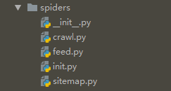
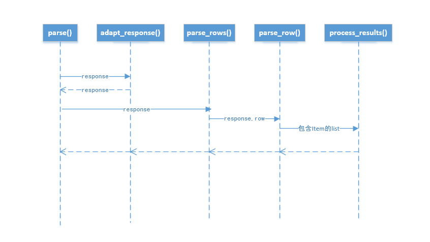

## Spiders组件

### Spiders的作用

Spiders定义了如何爬取一个目标站点或者一组站点，包括如何执行爬取和如何提取目标网页的结构化的数据。换句话说Spiders是你定义爬虫的行为以及如何解析网页的地方。

### Spiders工作流程

对于爬虫，抓取的步骤流程如下：

1. 生成初始种子地址，并指定一个在下载器完成下载后被回调的函数。

   **Requests**通过调用`start_request()`方法获得的，该方法在默认情况下会生成

   由`start_urls`中指定的URL，并将`parse()`作为这个**Requests**的回调函数。

2. 在回调函数中，转换解析由**Downloader**组件完成下载后返回的**Response**并返回提取的数据字典、多个**Item**对象、多个**Request**对象，或者一个包含以上这些可供遍历的对象集合。这些**Request**同样也可以包含自己的回调函数，在由**Downloader**组件完成下载后返回**Response**，并被指定的回调函数执行。

3. 在回调函数中解析网页的内容，可以使用`Selectors`(由Scrapy提供的解析器)，当然也可以使用`BeautifulSoup`、`lxml`等等，将数据包装成单个`Item`或者多个`Item`

4. 最后生成的**items**通过`Item Pipeline`处理，可以对提取过的格式化数据做进一步处理，比如落地到数据库、或者写入文件等。

### Scrapy自带的Spiders特点及不同



在来了解各个Spider之前，先来看下它们的老祖宗类`Spider`，内容如下：

```python
class Spider(object_ref):
    """Base class for scrapy spiders. All spiders must inherit from this
    class.
    """

    name = None
    custom_settings = None

    def __init__(self, name=None, **kwargs):
        if name is not None:
            self.name = name
        elif not getattr(self, 'name', None):
            raise ValueError("%s must have a name" % type(self).__name__)
        self.__dict__.update(kwargs)
        if not hasattr(self, 'start_urls'):
            self.start_urls = []

    @property
    def logger(self):
        logger = logging.getLogger(self.name)
        return logging.LoggerAdapter(logger, {'spider': self})

    def log(self, message, level=logging.DEBUG, **kw):
        """Log the given message at the given log level

        This helper wraps a log call to the logger within the spider, but you
        can use it directly (e.g. Spider.logger.info('msg')) or use any other
        Python logger too.
        """
        self.logger.log(level, message, **kw)

    @classmethod
    def from_crawler(cls, crawler, *args, **kwargs):
        spider = cls(*args, **kwargs)
        spider._set_crawler(crawler)
        return spider

    def set_crawler(self, crawler):
        warnings.warn("set_crawler is deprecated, instantiate and bound the "
                      "spider to this crawler with from_crawler method "
                      "instead.",
                      category=ScrapyDeprecationWarning, stacklevel=2)
        assert not hasattr(self, 'crawler'), "Spider already bounded to a " \
                                             "crawler"
        self._set_crawler(crawler)

    def _set_crawler(self, crawler):
        self.crawler = crawler
        self.settings = crawler.settings
        crawler.signals.connect(self.close, signals.spider_closed)

    def start_requests(self):
        cls = self.__class__
        if method_is_overridden(cls, Spider, 'make_requests_from_url'):
            warnings.warn(
                "Spider.make_requests_from_url method is deprecated; it "
                "won't be called in future Scrapy releases. Please "
                "override Spider.start_requests method instead (see %s.%s)." % (
                    cls.__module__, cls.__name__
                ),
            )
            for url in self.start_urls:
                yield self.make_requests_from_url(url)
        else:
            for url in self.start_urls:
                yield Request(url, dont_filter=True)

    def make_requests_from_url(self, url):
        """ This method is deprecated. """
        return Request(url, dont_filter=True)

    def parse(self, response):
        raise NotImplementedError('{}.parse callback is not defined'.format(self.__class__.__name__))

    @classmethod
    def update_settings(cls, settings):
        settings.setdict(cls.custom_settings or {}, priority='spider')

    @classmethod
    def handles_request(cls, request):
        return url_is_from_spider(request.url, cls)

    @staticmethod
    def close(spider, reason):
        closed = getattr(spider, 'closed', None)
        if callable(closed):
            return closed(reason)

    def __str__(self):
        return "<%s %r at 0x%0x>" % (type(self).__name__, self.name, id(self))

    __repr__ = __str__
```

从以上的代码中可以大致看到有以下主要的属性

- `name`定义这个爬虫的名词，不能和其他的重复
- `start_urls` 爬取的网址集合
- `logger` 日志记录
- `crawler` 在类初始化时由`from_crawler(*crawler*, *args, **kwargs)`设定的，封装了很多组件（extensions, middlewares, signals managers等）并提供统一的访问API。后续另外介绍。。。
- `settings ` 全局设置
- `custom_settings` 自定义设置，可以覆盖全局的设置，假如想针对某个爬虫设置单独属性，可以使用这个属性，

主要的方法有：

- `log(self, message, level=logging.DEBUG, **kw)`

- `set_crawler(self, crawler)` 已经被废弃，使用`from_crawler(*crawler*, *args, **kwargs)`替代

- `start_requests(self)` 方法仅在开始爬取的时候访问一次，用于定义爬虫的网络访问部分的功能，默认实现如下

  ```python
  for url in self.start_urls:
                  yield Request(url, dont_filter=True)
  ```

- `parse(self, response)` 当下载器完成下载时该方法会被回调，用于执行数据提取的功能。

- `from_crawler(*crawler*, *args, **kwargs)` 初始化`crawler` 属性

### CrawlSpider

大多数情况下最为通用的爬虫模板。

提供`rules`属性（一组`Rule`对象）可以定义一组抓取网站时的规则，参数列表如下：

```python
class Rule(object):

    def __init__(self, link_extractor, callback=None, cb_kwargs=None, follow=None, process_links=None, process_request=identity):
        self.link_extractor = link_extractor
        self.callback = callback
        self.cb_kwargs = cb_kwargs or {}
        self.process_links = process_links
        self.process_request = process_request
        if follow is None:
            self.follow = False if callback else True
        else:
            self.follow = follow
```

`link_extractor`是`LinkExtractor`的对象，需提供`extract_links`方法来从抓取页内容中提取出链接。


#### XMLFeedSpider

#### CSVFeedSpider

与`XMLFeedSpider`非常相似，但是它是通过rows来进行迭代，而`XMLFeedSpider`是通过nodes。

主要的属性和方法如下：

- `delimiter` 指定CSV文件中一行数据的字段之间的分隔符，默认为`,`
- `quotechar` 指定CSV文件中字符串字段的闭合标志，默认为`"`
- `headers` CSV文件中每一列的名称
- 方法`parse_row(self, response, row)`其中row是一个字典，属性key为headers所指定的，value则为抓取的值。
- 方法`process_results(self, response, results)`、`adapt_response(self, response)`则为parse_row之前后之后提供了钩子函数，时序图如下




#### SitemapSpider 

