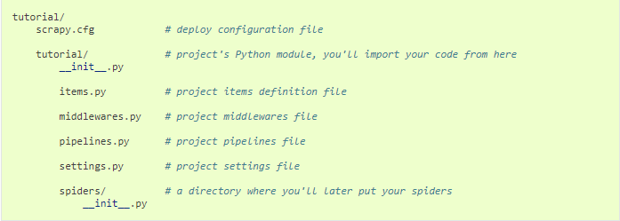

## Qucik start

### 概述

Scrapy 是一个用来抓取网站以及提取结构化数据的应用框架，被广泛应用于数据挖掘、信息处理、对历史数据进行归档处理。虽然Scrapy原本设计是用来网页抓取，但是它也可以从接口中提取数据或者更加通用化的网络爬虫。

### 安装

Scrapy 运行在Python2.7和Python3.4及更高的版本(默认CPython：C语言实现的Python解释器)，或者PyPy5.9(Python实现的解释器)

1. 如果使用Anaconda或者Miniconda

   `conda install -c conda-forge scarpy`

2. 或者直接使用`pip install scrapy`

### Scrapy依赖关键包

Scrapy是使用纯Python编写以及额外的几个关键依赖包

- **lxml** XML以及HTML解析器
- **parsel** XML、HTML数据提取工具，基于lxml构建
- **w3lib**  用于处理URL以及网页编码
- **twisted** 异步网络框架
- **cryptography**、**pyOpenSSL** 处理各种网络级安全需求

### 创建项目

通过命令行终端运行 `scrapy startproject tutorial`命令，则会生成一个tutorial文件夹并包含以下内容


### 开始第一个爬虫

1. 将tutorial引入PyCharm，在spiders目录下创建自己的爬虫，以百度首页抓取为例。
2. 在spiders目录下创建了`baidu_spider.py`的文件，内容如下：

```
import scrapy

class BaiduSpider(scrapy.Spider):

    name = "baidu"
    start_urls = ['http://www.baidu.com']

    def parse(self, response):
        self.log(response.body)
```

1. 在运行前需要注意，scrapy默认生成的项目是遵守robots协议的，需要修改`settings.py`文件下将`ROBOTSTXT_OBEY`设为`False`
2. 控制台输入`scrapy crawl baidu`命令运行爬虫，就会看到爬虫将百度首页信息输出到控制台。