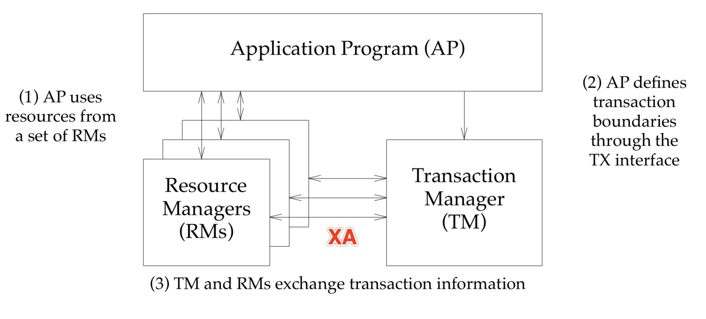

# 分布式事务

## 概念

> A **distributed transaction** is a [database transaction](https://en.wikipedia.org/wiki/Database_transaction) in which two or more network hosts are involved. 
>
> 有多个两个或者多个网络主机参与的数据库事务被称为分布式事务。

## 解决方案有哪些

- 刚性事务
- 柔性事务

|          | 本地事务         | 两（三）阶段事务 | *柔性事务*      |
| :------- | :--------------- | :--------------- | --------------- |
| 业务改造 | 无               | 无               | 实现相关接口    |
| 一致性   | 不支持           | 支持             | 最终一致        |
| 隔离性   | 不支持           | 支持             | 业务方保证      |
| 并发性能 | 无影响           | 严重衰退         | 略微衰退        |
| 适合场景 | 业务方处理不一致 | 短事务 & 低并发  | 长事务 & 高并发 |

**sharding-jdbc**作为一个分库分表中间件，并没有直接提供分布式事务的解决方案，而是集成了已有的解决方案。比如用于强一致性的的**Atomikos**（当然也可以选择其他的方案），用于弱一致性的**seata**。

### 原理分析

在开始之前先对一些必要的概念进行简单的介绍。

JTA（Java Transaction API）

> Java Transaction API (JTA) specifies standard Java interfaces between a transaction manager and the parties involved in a distributed transaction system: the resource manager, the application server, and the transactional applications. 
>
> JTA在事务制定了在事务管理器与分布式系统涉及的各方之间的标准的Java接口：资源管理器（RM）、应用服务器（AP）和事务管理器（TM）。

各个部分之间交互关系如图所示：

### XA

