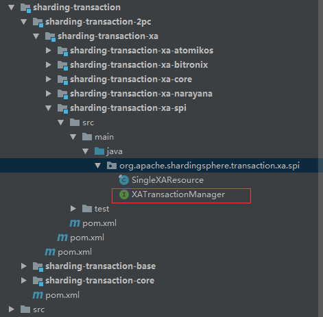
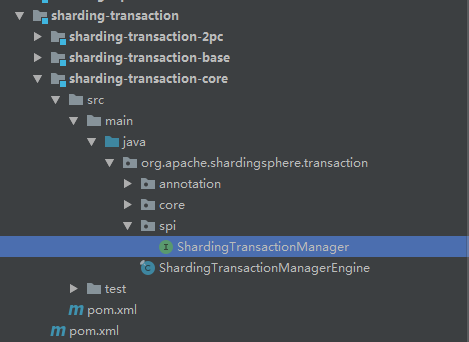

# 分布式事务

## 概念

> A **distributed transaction** is a [database transaction](https://en.wikipedia.org/wiki/Database_transaction) in which two or more network hosts are involved. 
>
> 有多个两个或者多个网络主机参与的数据库事务被称为分布式事务。

## 解决方案有哪些

- 刚性事务
- 柔性事务

|          | 本地事务         | 两（三）阶段事务 | *柔性事务*      |
| :------- | :--------------- | :--------------- | --------------- |
| 业务改造 | 无               | 无               | 实现相关接口    |
| 一致性   | 不支持           | 支持             | 最终一致        |
| 隔离性   | 不支持           | 支持             | 业务方保证      |
| 并发性能 | 无影响           | 严重衰退         | 略微衰退        |
| 适合场景 | 业务方处理不一致 | 短事务 & 低并发  | 长事务 & 高并发 |

**sharding-jdbc**作为一个分库分表中间件，并没有直接提供分布式事务的解决方案，而是集成了已有的解决方案。比如用于强一致性的的**Atomikos**（当然也可以选择其他的方案），用于弱一致性的**seata**。

## 原理分析

### 一些你需要知道的概念

在开始之前先对一些必要的概念进行简单的介绍。

X/Open分布式事务处理模型（Distributed Transaction Processing Model 简称DTP），包含以下组件部分：

- 应用程序（AP）定义事务边界并指定一组操作构成事务。
- 资源管理器（RMs），比如数据库或者文件系统提供访问共享资源的功能
- 事务管理器（TM），分配一个唯一标识符代表一个事务，监控它的进度并负责事务的完成和失败恢复。

XA协议：事务管理器和资源管理器之间的双向接口。 XA接口不是普通的应用程序编程接口（API）。 它是DTP软件组件之间的系统级接口。 

它们部分之间交互关系如图所示：


JTA（Java Transaction API）：

> Java Transaction API (JTA) specifies standard Java interfaces between a transaction manager and the parties involved in a distributed transaction system: the resource manager, the application server, and the transactional applications. 
>
> JTA在事务制定了在事务管理器与分布式系统涉及的各方之间的标准的Java接口：资源管理器（RM）、应用程序（AP）和事务管理器（TM）。

可以认为JTA规范具化了DTP模型以及XA协议在Java中的落地。

### atomikos集成原理

借用官方一张图，从全局上理解**Sharding-JDBC**在集成分布式事务框架的设计思路


要点主要有以下几点：

- **SPI**的应用使得事务管理器和具体的实现分离
- 装饰器模式的应用，可以将普通的连接转换为**XAConnection**

先来看下**XATransactionManager**的**SPI**的接口设计：



从图中不难看出`XATransactionManager`有三个实现类，它们分别是：

- `AtomikosTransactionManager`
- `BitronixXATransactionManager`
- `NarayanaXATransactionManager`

那么在使用**XA**分布式事务时，它们的实现类载入的过程代码内容如下：

```java
public final class XATransactionManagerLoader {
    
    private static final XATransactionManagerLoader INSTANCE = new XATransactionManagerLoader();
    
    private final XATransactionManager transactionManager;
    
    private XATransactionManagerLoader() {
        transactionManager = load();
    }
    
    private XATransactionManager load() {
        Iterator<XATransactionManager> xaTransactionManagers = ServiceLoader.load(XATransactionManager.class).iterator();
        if (!xaTransactionManagers.hasNext()) {
            return new AtomikosTransactionManager();
        }
        XATransactionManager result = xaTransactionManagers.next();
        if (xaTransactionManagers.hasNext()) {
            log.warn("There are more than one transaction mangers existing, chosen first one by default.");
        }
        return result;
    }
    
    /**
     * Get instance of XA transaction manager SPI loader.
     * 
     * @return instance of XA transaction manager SPI loader
     */
    public static XATransactionManagerLoader getInstance() {
        return INSTANCE;
    }
}
```

可以看到`load()`方法借助`ServiceLoader`将所有的实现类都统一加载，如果没有找到默认使用`AtomikosTransactionManager`，如果存在多个实现类就取第一个（不确定性，请尽量不要出现这种情况）。

再来看下**ShardingTransactionManager**设计



这里跟**XATransactionManager**同理，可以猜到`ShardingTransactionManager`的实现类会有两种，分别为：

- `XAShardingTransactionManager`，追求强一致性的框架
- `SeataATShardingTransactionManager`，追求最终一致的框架

它们实现类的加载代码`ShardingTransactionManagerEngine`中方法`loadShardingTransactionManager()`内容如下：

```java
private void loadShardingTransactionManager() {
    for (ShardingTransactionManager each : ServiceLoader.load(ShardingTransactionManager.class)) {
        if (transactionManagerMap.containsKey(each.getTransactionType())) {
            log.warn("Find more than one {} transaction manager implementation class, use `{}` now",
                each.getTransactionType(), transactionManagerMap.get(each.getTransactionType()).getClass().getName());
            continue;
        }
        transactionManagerMap.put(each.getTransactionType(), each);
    }
}
```

从代码里得知载入也是通过`ServiceLoader`进行，但是和`XATransactionManager`不同的是这里允许存在多个实现类，但是同一`TransactionType`只允许存在一个，`TransactionType`内容如下：

```java
public enum TransactionType {
    LOCAL, XA, BASE
}
```


上面剖析完了SPI机制在Sharding-JDBC中的应用过程，下面剖析原生的**Connection**是如何转换为**XAConnection**的。

首先来看获取数据库连接代码：

```java
private Connection createConnection(final String dataSourceName, final DataSource dataSource) throws SQLException {
    // 判断是否为使用ShardingTransaction，如果是则通过SPI机制加载对应的事务管理器，如果不是则直接返回原生连接
    Connection result = isInShardingTransaction() ? shardingTransactionManager.getConnection(dataSourceName) : dataSource.getConnection();
    replayMethodsInvocation(result);
    return result;
}
```

以下是通过事务管理器获取**XAConnection**连接代码：

```java
public Connection getConnection(final String dataSourceName) {
    // 获取XA连接
    SingleXAConnection singleXAConnection = singleXADataSourceMap.get(dataSourceName).getXAConnection();
    if (!enlistedXAResource.get().contains(dataSourceName)) {
        xaTransactionManager.enlistResource(singleXAConnection.getXAResource());
        enlistedXAResource.get().add(dataSourceName);
    }
    return singleXAConnection.getConnection();
}
```

通过**SingleXADataSource**获取连接代码如下：

```java
public SingleXAConnection getXAConnection() throws SQLException {
    // 如果是原生XA数据源则直接获取XA连接，否则进一步处理。
    return isOriginalXADataSource ? getXAConnectionFromXADataSource() : getXAConnectionFromNoneXADataSource();
}

/**
  * 通过原生XA连接池获取XA连接
  * @return
  * @throws SQLException
  */
private SingleXAConnection getXAConnectionFromXADataSource() throws SQLException {
    XAConnection xaConnection = xaDataSource.getXAConnection();
    return new SingleXAConnection(resourceName, xaConnection.getConnection(), xaConnection);
}

/**
  * 通过原生连接池进一步处理获取XA连接
  * @return
  * @throws SQLException
  */
private SingleXAConnection getXAConnectionFromNoneXADataSource() throws SQLException {
    Connection originalConnection = originalDataSource.getConnection();
    XAConnection xaConnection = XAConnectionFactory.createXAConnection(databaseType, xaDataSource, originalConnection);
    return new SingleXAConnection(resourceName, originalConnection, xaConnection);
}
```

通过**XAConnectionFactory**创建XA连接内容如下：

```java
public static XAConnection createXAConnection(final DatabaseType databaseType, final XADataSource xaDataSource, final Connection connection) {
    switch (databaseType) {
        case MySQL:
            return new MySQLXAConnectionWrapper().wrap(xaDataSource, connection);
        case PostgreSQL:
            return new PostgreSQLXAConnectionWrapper().wrap(xaDataSource, connection);
        case H2:
            return new H2XAConnectionWrapper().wrap(xaDataSource, connection);
        default:
            throw new UnsupportedOperationException(String.format("Cannot support database type: `%s`", databaseType));
    }
}
```

这里判断不同的数据库类型，提供了不同的实现，以MySQL为例对XA连接创建过程做进一步剖析。

```java
public final class MySQLXAConnectionWrapper implements XAConnectionWrapper {
    
    private static final String MYSQL_XA_DATASOURCE_5 = "com.mysql.jdbc.jdbc2.optional.MysqlXADataSource";

    private static final String MYSQL_XA_DATASOURCE_8 = "com.mysql.cj.jdbc.MysqlXADataSource";

    @SneakyThrows
    @Override
    public XAConnection wrap(final XADataSource xaDataSource, final Connection connection) {
        Connection physicalConnection = unwrapPhysicalConnection(xaDataSource.getClass().getName(), connection);
        Method method = xaDataSource.getClass().getDeclaredMethod("wrapConnection", Connection.class);
        method.setAccessible(true);
        return (XAConnection) method.invoke(xaDataSource, physicalConnection);
    }

    @SneakyThrows
    private Connection unwrapPhysicalConnection(final String xaDataSourceClassName, final Connection connection) {
        switch (xaDataSourceClassName) {
            case MYSQL_XA_DATASOURCE_5:
                return (Connection) connection.unwrap(Class.forName("com.mysql.jdbc.Connection"));
            case MYSQL_XA_DATASOURCE_8:
                return (Connection) connection.unwrap(Class.forName("com.mysql.cj.jdbc.JdbcConnection"));
            default:
                throw new UnsupportedOperationException(String.format("Cannot support xa datasource: `%s`", xaDataSourceClassName));
}
   
```

这里有两个重要的方法作用需要弄明白：

1. `Wrapper`中的`unwrap()`。这个类中的开头有这么一段注释”Interface for JDBC classes which provide the ability to retrieve the delegate instance when the instance in question is in fact a proxy class.“，翻译过来就是”提供了直接访问访问被代理的原生对象的功能“。那么应用到上述的代码里，通过调用该方法就可以获取原生的jdbc的connection对象。
2. `MysqlXADataSource`中的`wrapConnection()`，该方法在源码中的注释内容如下“Wraps a connection as a 'fake' XAConnection”，包装一个连接作为一个‘假装’的XA连接。

理解这两个方法的作用，也就明白了在Sharding-JDBC中是如何把ShardingConnection转变为XAConnection对象的了。

