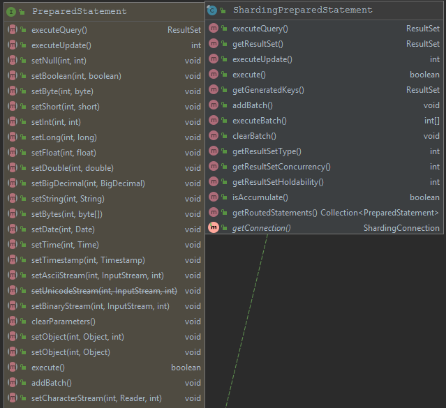

在学习一个新的技术、框架时，以**3W**作为指导性的原则非常有用（What、Why、How）。针对前两点在[概览](./overview.md)的中已经做出了简单的解答。至于**How**问题，由于涉及的点非常之多，本篇则只专注于剖析`Sharding-jdbc`是如何工作？如何在JDBC规范中织入框架的？它的切入点是什么的？这么说可能太过于抽象，举个简单例子。比如我们经常用到的`spring mvc`框架，它的切入点其实就是Servlet，通过`org.springframework.web.servlet.DispatcherServlet`类，将所有的请求都交由它进行路由处理。那么我们具化到`sharding-jdbc`中，则需要在本篇中弄明白类似的类到底是哪个，又是如何工作的。

## 从数据源说起

应用中不管是以什么方式配置分库分表规则，最终数据源对应的都是`DataSource`，那么在`sharding-jdbc`中通过编程方式创建数据源代码如下：

```java
public DataSource dataSource() throws SQLException {
        ShardingRuleConfiguration shardingRuleConfig = new ShardingRuleConfiguration();
        shardingRuleConfig.getTableRuleConfigs().add(getOrderTableRuleConfiguration());
        shardingRuleConfig.getTableRuleConfigs().add(getOrderItemTableRuleConfiguration());
        shardingRuleConfig.setMasterSlaveRuleConfigs(getMasterSlaveRuleConfigurations());
        shardingRuleConfig.getBindingTableGroups().add("t_order, t_order_item");
        Properties properties = new Properties();
        properties.setProperty("sql.show", "true");
    	// 起到装饰之用
        return ShardingDataSourceFactory.createDataSource(createDataSourceMap(), shardingRuleConfig, properties);
}
```

最后一行创建数据源源码内容如下：

```java
public static DataSource createDataSource(
        final Map<String, DataSource> dataSourceMap, final ShardingRuleConfiguration shardingRuleConfig, final Properties props) throws SQLException {
    return new ShardingDataSource(dataSourceMap, new ShardingRule(shardingRuleConfig, dataSourceMap.keySet()), props);
}
```

上面可以看到最后的`DataSource`已经变成了`ShardingDataSource`，它的源码内容如下：

```java
public class ShardingDataSource extends AbstractDataSourceAdapter {

    // 省略无关上下文

    /**
     * 创建被装饰过之后的数据连接
     */
    @Override
    public final ShardingConnection getConnection() {
        return new ShardingConnection(getDataSourceMap(), shardingContext, getShardingTransactionManagerEngine(), TransactionTypeHolder.get());
    }
    
    @Override
    public final void close() throws Exception {
        super.close();
        shardingContext.close();
    }
}
```

这里可以看到通过`sharding-jdbc`自有的`ShardingDataSource`创建自有的连接`ShardingConnection`，我们不妨大胆的猜测它应该也是对沿用了上面的套路，并对JDBC中的`java.sql.Connection`做了一定的实现并织入框架的东东。

## ShardingConnection

通过`ShardingConnection`与`Connection`UML类对比来体会下`sharding-jdbc`的切入扩展的点：


看到这么多对于`PreparedStatement`的方法实现，相信聪明的你已经猜测到`sharding-jdbc`对`PreparedStatement`扩展套路应该和`DataSource`、`Connection`是一样的。`ShardingPreparedStatement`与`PreparedStatement`UML类图对比如下：



很明显在执行SQL关键的方法上也是进行了相应的扩展，其中`execute()`方法内容如下：

```java
public boolean execute() throws SQLException {
    try {
        clearPrevious();
        // 负责SQL解析、改写、路由等
        shard();
        // 初始化执行器
        initPreparedStatementExecutor();
        // 对改写的SQL进行统一执行
        return preparedStatementExecutor.execute();
    } finally {
        clearBatch();
    }
}
```

