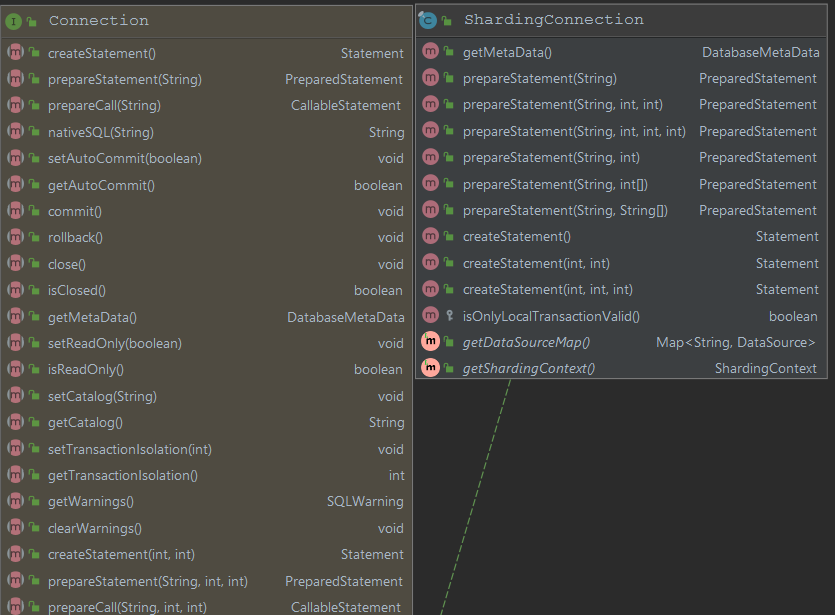

在学习一个新的技术、框架时，以**3W**作为指导性的原则非常有用（What、Why、How）。针对前两点在[概览](./overview.md)的中已经做出了简单的解答。至于**How**问题，由于涉及的点非常之多，本篇则只专注于剖析`Sharding-jdbc`是如何工作，如何在JDBC规范中织入框架的，它的切入点是什么的问题？这么说可能太过于抽象，举个简单例子。比如我们经常用到的`spring mvc`框架，它的切入点其实就是Servlet，通过`org.springframework.web.servlet.DispatcherServlet`类，将所有的请求交由它进行路由处理。那么我们具化到`sharding-jdbc`中，则需要在本篇中弄明白类似的类到底是哪个，又是如何工作的。

## 从数据源说起

应用中不管是以什么方式配置分库分表规则，最终数据源都是从`DataSource`获取，那么通过`sharding-jdbc`编程方式创建数据源内容如下：

```java
public DataSource dataSource() throws SQLException {
        ShardingRuleConfiguration shardingRuleConfig = new ShardingRuleConfiguration();
        shardingRuleConfig.getTableRuleConfigs().add(getOrderTableRuleConfiguration());
        shardingRuleConfig.getTableRuleConfigs().add(getOrderItemTableRuleConfiguration());
        shardingRuleConfig.setMasterSlaveRuleConfigs(getMasterSlaveRuleConfigurations());
        shardingRuleConfig.getBindingTableGroups().add("t_order, t_order_item");
        Properties properties = new Properties();
        properties.setProperty("sql.show", "true");
    	// 起到装饰之用
        return ShardingDataSourceFactory.createDataSource(createDataSourceMap(), shardingRuleConfig, properties);
}
```

最后一行创建数据源源码内容如下：

```java
public static DataSource createDataSource(
        final Map<String, DataSource> dataSourceMap, final ShardingRuleConfiguration shardingRuleConfig, final Properties props) throws SQLException {
    return new ShardingDataSource(dataSourceMap, new ShardingRule(shardingRuleConfig, dataSourceMap.keySet()), props);
}
```

到这里已经可以明显的看到，此时的`DataSource`已经变成了`ShardingDataSource`了。它的源码内容如下：

```java
public class ShardingDataSource extends AbstractDataSourceAdapter {

    /**
     * 保持分库分表规则、数据源等上下文信息
     */
    private final ShardingContext shardingContext;
    
    public ShardingDataSource(final Map<String, DataSource> dataSourceMap, final ShardingRule shardingRule) throws SQLException {
        this(dataSourceMap, shardingRule, new Properties());
    }
    
    public ShardingDataSource(final Map<String, DataSource> dataSourceMap, final ShardingRule shardingRule, final Properties props) throws SQLException {
        super(dataSourceMap);
        checkDataSourceType(dataSourceMap);
        shardingContext = new ShardingContext(getDataSourceMap(), shardingRule, getDatabaseType(), props);
    }
    
    private void checkDataSourceType(final Map<String, DataSource> dataSourceMap) {
        for (DataSource each : dataSourceMap.values()) {
            Preconditions.checkArgument(!(each instanceof MasterSlaveDataSource), "Initialized data sources can not be master-slave data sources.");
        }
    }

    /**
     * 创建被装饰过之后的数据连接
     */
    @Override
    public final ShardingConnection getConnection() {
        return new ShardingConnection(getDataSourceMap(), shardingContext, getShardingTransactionManagerEngine(), TransactionTypeHolder.get());
    }
    
    @Override
    public final void close() throws Exception {
        super.close();
        shardingContext.close();
    }
}
```

这个类中干了两件非常重要的事情：

1. 保持了关键性的信息：数据库分库分表的规则、所有数据源等
2. 创建自有的连接`ShardingConnection`,我们不妨大胆的猜测它应该也是对原生的`java.sql.Connection`做了进一步的装饰，并织入框架的东东。

## ShardingConnection

通过`ShardingConnection`与`Connection`UML类对比来体会下`sharding-jdbc`的切入扩展的点：



看到这么多对于`PreparedStatement`的方法实现，相信聪明的你已经猜测到`sharding-jdbc`对`PreparedStatement`扩展套路应该和`DataSource`、`Connection`是一样的。`ShardingPreparedStatement`与`PreparedStatement`UML类图对比如下：


很明显在关键的方法上也是进行了相应的扩展，具体代码在这里就不一一贴出了，待后续分析执行过程原理时在详细讲解。

