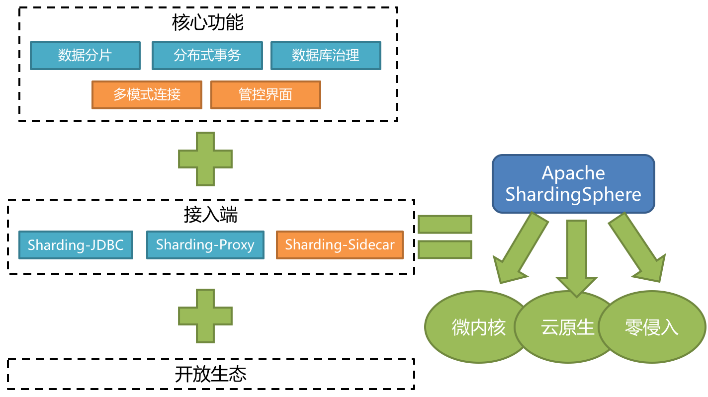
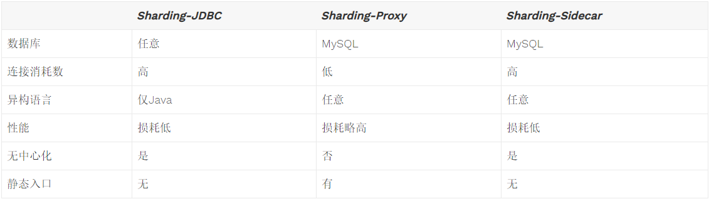

# ShardingSphere概览

了解一个技术最好的地方当然是它的官网，本章内容均来自官网。

> ShardingSphere是一套开源的分布式数据库中间件解决方案组成的生态圈，它由Sharding-JDBC、Sharding-Proxy和Sharding-Sidecar（计划中）这3款相互独立的产品组成。 他们均提供标准化的数据分片、分布式事务和数据库治理功能，可适用于如Java同构、异构语言、容器、云原生等各种多样化的应用场景。

## Sharding-JDBC简介

定位为轻量级Java框架，在Java的JDBC层提供的额外服务。 它使用客户端直连数据库，以jar包形式提供服务，无需额外部署和依赖，可理解为增强版的JDBC驱动，完全兼容JDBC和各种ORM框架。

- 适用于任何基于Java的ORM框架，如：JPA, Hibernate, Mybatis, Spring JDBC Template或直接使用JDBC。
- 基于任何第三方的数据库连接池，如：DBCP, C3P0, BoneCP, Druid, HikariCP等。
- 支持任意实现JDBC规范的数据库。目前支持MySQL，Oracle，SQLServer和PostgreSQL。

（后续的[入门例子](./quickstart.md)中采用了Mybatis+HikariCP+MySQL组合，带大家快速上手Sharding-JDBC。）

## Sharding-Proxy简介

定位为透明化的数据库代理端，提供封装了数据库二进制协议的服务端版本，用于完成对异构语言的支持。 目前先提供MySQL版本，它可以使用任何兼容MySQL协议的访问客户端(如：MySQL Command Client, MySQL Workbench等)操作数据，对DBA更加友好。

- 向应用程序完全透明，可直接当做MySQL使用。
- 适用于任何兼容MySQL协议的客户端。

## Sharding-JDBC VS Sharding-Proxy

### 性能对比

### 适用场景的区别

Sharding-JDBC采用无中心化架构，适用于Java开发的高性能的轻量级OLTP应用；Sharding-Proxy提供静态入口以及异构语言的支持，适用于OLAP应用以及对分片数据库进行管理和运维的场景。

## 功能特性

1. 数据分片
   - 分库 & 分表
   - 读写分离
   - 分片策略定制化
   - 无中心化分布式主键
2. 分布式事务
   - 标准化事务接口
   - XA强一致事务
   - 柔性事务
3. 数据库治理
   - 配置动态化
   - 编排 & 治理
   - 数据脱敏
   - 可视化链路追踪
   - 弹性伸缩(规划中)

