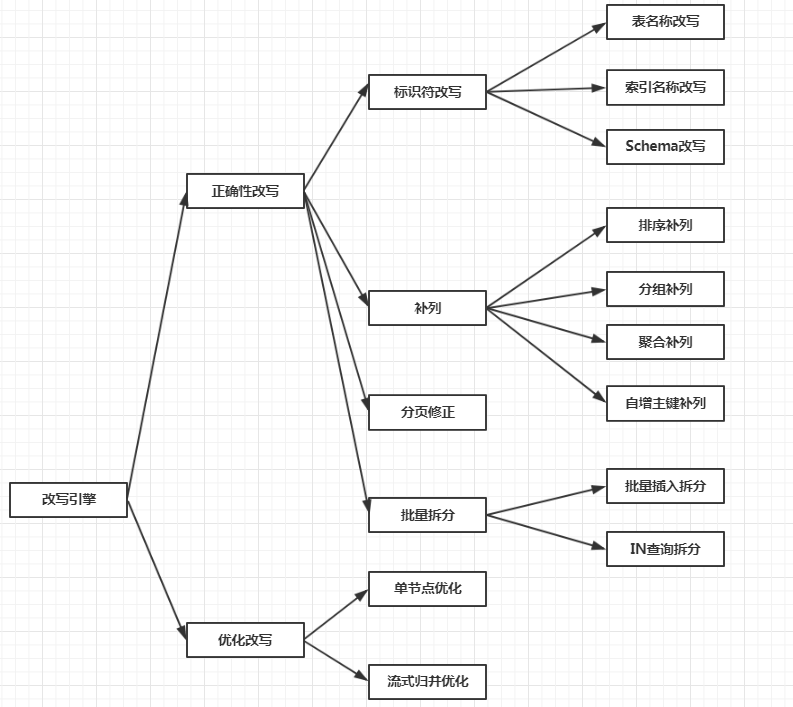

# SQL解析及改写

## 发展历史

相对于其他编程语言，SQL是比较简单的。 不过，它依然是一门完善的编程语言，因此对SQL的语法进行解析，与解析其他编程语言（如：Java语言、C语言、Go语言等）并无本质区别。在这里就不得不引出[抽象语法树](https://en.wikipedia.org/wiki/Abstract_syntax_tree)的概念。引用来自维基百科对其的解释：In computer science, an abstract syntax tree (AST), or just syntax tree, is a tree representation of the abstract syntactic structure of source code written in a programming language. 大意为：在计算机科学中，抽象语法树，或简称为语法树，是编程语言编写的源代码的树状结构的的抽象语法。关注两个关键点就能理解它到底是个什么东西了，第一点是树状的数据结构，第二点是抽象语法。为什么sharding-jdbc需要把SQL解析成抽象语法树呢？SQL在执行之前是以文本类型字符串存在的，sharding-jdbc作为分库分表的中间需要在执行前对SQL进行改写前置准备工作。此时就需要一个解决方案，可以结构化的完整表达一条SQL的语法信息，使得改写上下文可以能够方便的解析出操作类型（CURD）、查询列信息、表信息、条件信息、排序信息、分组信息以及分页信息等（当然还有一些函数需要支持），而抽象语法树显然就可以完美的胜任这份工作。

至于sharding-jdbc在SQL解析的发展历程这里就直接贴出官方的文档内容：

> SQL解析作为分库分表类产品的核心，其性能和兼容性是最重要的衡量指标。 ShardingSphere的SQL解析器经历了3代产品的更新迭代。
>
> 第一代SQL解析器为了追求性能与快速实现，在1.4.x之前的版本使用Druid作为SQL解析器。经实际测试，它的性能远超其它解析器。
>
> 第二代SQL解析器从1.5.x版本开始，ShardingSphere采用完全自研的SQL解析引擎。 由于目的不同，ShardingSphere并不需要将SQL转为一颗完全的抽象语法树，也无需通过访问器模式进行二次遍历。它采用对SQL`半理解`的方式，仅提炼数据分片需要关注的上下文，因此SQL解析的性能和兼容性得到了进一步的提高。
>
> 第三代SQL解析器则从3.0.x版本开始，ShardingSphere尝试使用ANTLR作为SQL解析的引擎，并计划根据`DDL -> TCL -> DAL –> DCL -> DML –>DQL`这个顺序，依次替换原有的解析引擎，目前仍处于替换迭代中。 使用ANTLR的原因是希望ShardingSphere的解析引擎能够更好的对SQL进行兼容。对于复杂的表达式、递归、子查询等语句，虽然ShardingSphere的分片核心并不关注，但是会影响对于SQL理解的友好度。 经过实例测试，ANTLR解析SQL的性能比自研的SQL解析引擎慢3-10倍左右。为了弥补这一差距，ShardingSphere将使用`PreparedStatement`的SQL解析的语法树放入缓存。 因此建议采用`PreparedStatement`这种SQL预编译的方式提升性能。

## 解析

对于抽象语法树的构建，由于其内容过于偏门和专业这里就不过多的展开讲解。（笔者水平有限大家多多包涵）

## 改写

sharding-jdbc改写引擎执行的改写的结构图如下所示：



下面挑个比较有代表性的改写点再结合源码进行剖析详细过程：

- 表名称改写

### 表名称改写

在上篇的[读写分离](./read_write_splitting.md)中就路由的过程（主要涉及库、表的路由，将逻辑上的库名和表名根据已知的分片规则映射为实际的物理名），那么下一步自然而然的就开始SQL的改写。改写的代码及注释内容如下：

```java
public SQLRouteResult shard(final String sql, final List<Object> parameters) {
    List<Object> clonedParameters = cloneParameters(parameters);
    // 执行路由操作(其中隐含了SQL解析过程)
    SQLRouteResult result = route(sql, clonedParameters);
    /**
     * 这里分两种情况讨论:
     * 1. 如果仅仅基于库做了分片,则原来的SQL不需要改写,直接发送给路由之后的实际数据源执行即可
     * 2. 如果基于表做了分片,则需要将原来的SQL改写(实际的表名已经发生了变化),然后再发送给路由的数据源执行
     * 这里添加的对象RouteUnit其抽象维度为数据源+SQL.
     */
    result.getRouteUnits().addAll(HintManager.isDatabaseShardingOnly() ? convert(sql, clonedParameters, result) : rewriteAndConvert(sql, clonedParameters, result));
    if (shardingProperties.getValue(ShardingPropertiesConstant.SQL_SHOW)) {
        boolean showSimple = shardingProperties.getValue(ShardingPropertiesConstant.SQL_SIMPLE);
        SQLLogger.logSQL(sql, showSimple, result.getSqlStatement(), result.getRouteUnits());
    }
    return result;
}
```

我们本次要讨论的内容，涉及的关键代码就一行，内容如下：

```java
HintManager.isDatabaseShardingOnly() ? convert(sql, clonedParameters, result) : rewriteAndConvert(sql, clonedParameters, result)
```

对代码解读如下：首先判断当前执行的SQL分片是否仅仅只是数据库分片即可，如果是那么SQL语句就不需要进行任何改写直接将原生的SQL语句发送到对应的数据源执行即可，但是如果涉及到需要对SQL改写的场景（表字段分片、补列等等）直接将原生SQL发送到数据库执行就不对了。改写的代码进一步剖析内容如下：

```java
 private Collection<RouteUnit> rewriteAndConvert(final String sql, final List<Object> parameters, final SQLRouteResult sqlRouteResult) {
        SQLRewriteEngine rewriteEngine = new SQLRewriteEngine(shardingRule, sql, databaseType, sqlRouteResult, parameters, sqlRouteResult.getOptimizeResult());
        // 执行改写过程，并将执行中间结果保持至sqlBuilder中，需要执行替换的部分已占位符的形式保持
        SQLBuilder sqlBuilder = rewriteEngine.rewrite(sqlRouteResult.getRoutingResult().isSingleRouting());
        Collection<RouteUnit> result = new LinkedHashSet<>();
        for (TableUnit each : sqlRouteResult.getRoutingResult().getTableUnits().getTableUnits()) {
            // 执行上面待替换部分，并真正需要执行的SQL语句
            result.add(new RouteUnit(each.getDataSourceName(), rewriteEngine.generateSQL(each, sqlBuilder, metaData.getDataSource())));
        }
        return result;
    }
```

剖析的执行步骤：

- 先执行通过改写引擎并执行其`rewrite`方法，将改写的信息保持在`sqlBuilder`中。
- 通过改写引擎进一步执行其`generateSQL`方法，将上一步改写的中间信息生成真正的SQL语句。
- 遍历`tableUnits`，并将改写之后的sql重新赋值。

`rewrite`方法内容如下：

```java
public SQLBuilder rewrite(final boolean isSingleRouting) {
    SQLBuilder result = new SQLBuilder(parameters);
    if (sqlTokens.isEmpty()) {
        return appendOriginalLiterals(result);
    }
    // 初始化不需要处理的sql
    appendInitialLiterals(!isSingleRouting, result);
    // 追加sql和需要替换部分
    appendTokensAndPlaceholders(!isSingleRouting, result);
    reviseParameters();
    return result;
}
```

`generateSQL`方法内容如下：

```java
public SQLUnit generateSQL(final TableUnit tableUnit, final SQLBuilder sqlBuilder, final ShardingDataSourceMetaData shardingDataSourceMetaData) {
    rewriteHook.start(tableUnit);
    try {
        SQLUnit result = sqlBuilder.toSQL(tableUnit, getTableTokens(tableUnit), shardingRule, shardingDataSourceMetaData);
        rewriteHook.finishSuccess(result);
        return result;
        // CHECKSTYLE:OFF
    } catch (final Exception ex) {
        // CHECKSTYLE:ON
        rewriteHook.finishFailure(ex);
        throw ex;
    }
}
```

进一步追踪`toSQL`源码内容如下：

```java
public SQLUnit toSQL(final TableUnit tableUnit, final Map<String, String> logicAndActualTableMap, final ShardingRule shardingRule, final ShardingDataSourceMetaData shardingDataSourceMetaData) {
        StringBuilder result = new StringBuilder();
        List<Object> insertParameters = new LinkedList<>();
        // segments中保持了需要做替换操作的占位符信息
        for (Object each : segments) {
            if (!(each instanceof ShardingPlaceholder)) {
                result.append(each);
                continue;
            }
            // 逻辑表名
            String logicTableName = ((ShardingPlaceholder) each).getLogicTableName();
            // 实际表名
            String actualTableName = logicAndActualTableMap.get(logicTableName);
            if (each instanceof TablePlaceholder) {
                // 执行表名替换操作
                appendTablePlaceholder((TablePlaceholder) each, actualTableName, result);
            } else if (each instanceof SchemaPlaceholder) {
                appendSchemaPlaceholder(shardingRule, shardingDataSourceMetaData, actualTableName, result);
            } else if (each instanceof IndexPlaceholder) {
                appendIndexPlaceholder((IndexPlaceholder) each, actualTableName, result);
            } else if (each instanceof InsertValuesPlaceholder) {
                appendInsertValuesPlaceholder(tableUnit, (InsertValuesPlaceholder) each, insertParameters, result);
            } else {
                result.append(each);
            }
        }
        return insertParameters.isEmpty() ? new SQLUnit(result.toString(), new ArrayList<>(parameters)) : new SQLUnit(result.toString(), insertParameters);
    }
```

## 参考文献

[官方文档](https://shardingsphere.apache.org/document/current/cn/features/sharding/principle/rewrite/)

[关于SQL解析，为何编程语言解析器ANTLR更胜一筹？ ](http://www.sohu.com/a/270427972_411876)

[维基百科对于AST解释](https://en.wikipedia.org/wiki/Abstract_syntax_tree)