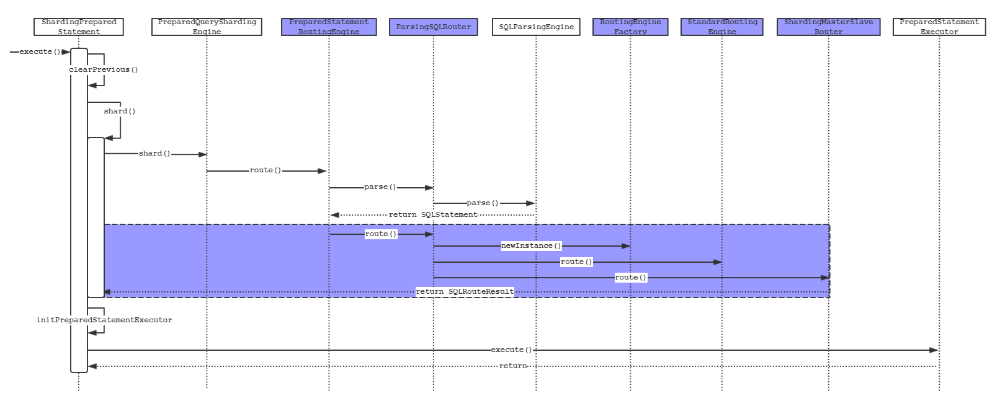

# 读写分离

## 背景

> 面对日益增加的系统访问量，数据库的吞吐量面临着巨大瓶颈。 对于同一时刻有大量并发读操作和较少写操作类型的应用系统来说，将数据库拆分为主库和从库，主库负责处理事务性的增删改操作，从库负责处理查询操作，能够有效的避免由数据更新导致的行锁，使得整个系统的查询性能得到极大的改善。
>
> 通过一主多从的配置方式，可以将查询请求均匀的分散到多个数据副本，能够进一步的提升系统的处理能力。 使用多主多从的方式，不但能够提升系统的吞吐量，还能够提升系统的可用性，可以达到在任何一个数据库宕机，甚至磁盘物理损坏的情况下仍然不影响系统的正常运行。
>
> 与将数据根据分片键打散至各个数据节点的水平分片不同，读写分离则是根据SQL语义的分析，将读操作和写操作分别路由至主库与从库。

## 核心功能

- 提供一主多从的读写分离配置，可独立使用，也可配合分库分表使用。
- 独立使用读写分离支持SQL透传。
- 同一线程且同一数据库连接内，如有写入操作，以后的读操作均从主库读取，用于保证数据一致性。
- 基于Hint的强制主库路由。

## 不支持项

- 主库和从库的数据同步。
- 主库和从库的数据同步延迟导致的数据不一致。
- 主库双写或多写。

## 实现原理

sharding-jdbc核心功能以下几个引擎所构成：解析引擎、路由引擎、改写引擎、执行引擎、归并引擎。各个引擎大致分工如下：

- 解析引擎：解析SQL语句，负责SQL语法树的构建，为后续的改写提供前置条件。
- 路由引擎：根据配置的分片字段与规则，解析具体的路由规则。
- 改写引擎：根据前两个引擎执行结果，对逻辑SQL进行改写生成实际需要执行的一条或者多条SQL语句。
- 执行引擎：负责执行由改写引擎重写生成的SQL依据。
- 归并引擎：负责对执行引擎的执行结果集进行汇总，做进一步的处理工作。

根据以上几个引擎的功能特点，可以推测出读写分离的功能主要在路由和改写两个步骤实现的。下面我们以读和写的两种业务场景分别展开进行分析实现过程。

### 读写分离的实现

先来一张时序图，我们先从全局的视角体会下一个查询SQL执行的大致流程。



图中被标注出来的部分是我们下面将要分析的重点部分。

代码执行入口为`ShardingPreparedStatement`中`execute()`，方法内容如下：

```java
@Override
public boolean execute() throws SQLException {
    try {
        clearPrevious();
        // 负责SQL解析、改写、路由等
        shard();
        initPreparedStatementExecutor();
        // 对改写的SQL进行统一执行
        return preparedStatementExecutor.execute();
    } finally {
        clearBatch();
    }
}
```

进一步追踪`shard()`方法，会进入到`PreparedQueryShardingEngine`的`shard()`，方法内容如下：

```java
public SQLRouteResult shard(final String sql, final List<Object> parameters) {
    List<Object> clonedParameters = cloneParameters(parameters);
    // 执行路由操作(其中隐含了SQL解析过程)
    SQLRouteResult result = route(sql, clonedParameters);
    /**
      * 这里分两种情况讨论:
      * 1. 如果仅仅基于库做了分片,则原来的SQL不需要改写,直接发送给路由之后的实际数据源执行即可
      * 2. 如果基于表做了分片,则需要将原来的SQL改写(实际的表名已经发生了变化),然后再发送给路由的数据源执行
      * 这里添加的对象RouteUnit其抽象维度为数据源+SQL.
      */
    result.getRouteUnits().addAll(HintManager.isDatabaseShardingOnly() ? convert(sql, clonedParameters, result) : rewriteAndConvert(sql, clonedParameters, result));
    if (shardingProperties.getValue(ShardingPropertiesConstant.SQL_SHOW)) {
        boolean showSimple = shardingProperties.getValue(ShardingPropertiesConstant.SQL_SIMPLE);
        SQLLogger.logSQL(sql, showSimple, result.getSqlStatement(), result.getRouteUnits());
    }
    return result;
}
```

继续深入`PreparedQueryShardingEngine`的`route`方法，内容如下：

```java
protected SQLRouteResult route(final String sql, final List<Object> parameters) {
    return routingEngine.route(parameters);
}
```

`PreparedStatementRoutingEngine`的`route`方法内容如下：

```java
public SQLRouteResult route(final List<Object> parameters) {
    if (null == sqlStatement) {
        // 解析SQL
        sqlStatement = shardingRouter.parse(logicSQL, true);
    }
    /**
      * 执行分片规则
      * 1. 根据分库分表规则统计需要执行的SQL的实际数据库与表名
      * 2. 根据读写分离规则再次过滤需要执行的SQL的实际数据与表名
      */
    return masterSlaveRouter.route(shardingRouter.route(logicSQL, parameters, sqlStatement));
}
```

这里我们先将关注的重点放到分片规则执行过程，执行过程分两步骤：

- 分库分表规则统计需要执行的SQL的实际数据库与表名
- 读写分离规则再次过滤需要执行的SQL的实际数据与表名

第一个步骤`ParsingSQLRouter`中`route()`方法内容如下：

```java
public SQLRouteResult route(final String logicSQL, final List<Object> parameters, final SQLStatement sqlStatement) {
    Optional<GeneratedKey> generatedKey = sqlStatement instanceof InsertStatement
            ? GeneratedKey.getGenerateKey(shardingRule, parameters, (InsertStatement) sqlStatement) : Optional.<GeneratedKey>absent();
    SQLRouteResult result = new SQLRouteResult(sqlStatement, generatedKey.orNull());
    OptimizeResult optimizeResult = OptimizeEngineFactory.newInstance(shardingRule, sqlStatement, parameters, generatedKey.orNull()).optimize();
    if (generatedKey.isPresent()) {
        setGeneratedKeys(result, generatedKey.get());
    }
    /**
     * 对于子查询需要校验分片规则
     * 1. 必须存在分片字段
     * 2. 分片必须是同一个字段
     * 如果存在多个相同的分片字段则需要合并
     */
    boolean needMerge = false;
    if (sqlStatement instanceof SelectStatement) {
        needMerge = isNeedMergeShardingValues((SelectStatement) sqlStatement);
    }
    if (needMerge) {
        checkSubqueryShardingValues(sqlStatement, optimizeResult.getShardingConditions());
        mergeShardingValues(optimizeResult.getShardingConditions());
    }
    /**
     * 根据分库分表规则统计需要执行的SQL的实际数据库与表名
     */
    RoutingResult routingResult = RoutingEngineFactory.newInstance(shardingRule, shardingMetaData.getDataSource(), sqlStatement, optimizeResult).route();

    // 改写SQL的limit
    if (sqlStatement instanceof SelectStatement && null != ((SelectStatement) sqlStatement).getLimit() && !routingResult.isSingleRouting()) {
        result.setLimit(getProcessedLimit(parameters, (SelectStatement) sqlStatement));
    }
    if (needMerge) {
        Preconditions.checkState(1 == routingResult.getTableUnits().getTableUnits().size(), "Must have one sharding with subquery.");
    }
    result.setRoutingResult(routingResult);
    result.setOptimizeResult(optimizeResult);
    return result;
}
```

核心代码通过`RoutingEngineFactory`创建`RoutingEngine`然后调用它的`route`方法。

```java
public static RoutingEngine newInstance(final ShardingRule shardingRule,
                                            final ShardingDataSourceMetaData shardingDataSourceMetaData, final SQLStatement sqlStatement, final OptimizeResult optimizeResult) {
    Collection<String> tableNames = sqlStatement.getTables().getTableNames();
    // 事务控制语句commit、rollback等
    if (SQLType.TCL == sqlStatement.getType()) {
        return new DatabaseBroadcastRoutingEngine(shardingRule);
    }
    // CREATE, ALTER, DROP, TRUNCATE等
    if (SQLType.DDL == sqlStatement.getType()) {
        return new TableBroadcastRoutingEngine(shardingRule, sqlStatement);
    }
    // Database administrator Language
    if (SQLType.DAL == sqlStatement.getType()) {
        return getDALRoutingEngine(shardingRule, sqlStatement, tableNames);
    }
    // Database control Language
    if (SQLType.DCL == sqlStatement.getType()) {
        return getDCLRoutingEngine(shardingRule, sqlStatement, shardingDataSourceMetaData);
    }
    // 是否属于默认数据源,区别于分片之后的数据源
    if (shardingRule.isAllInDefaultDataSource(tableNames)) {
        return new DefaultDatabaseRoutingEngine(shardingRule, tableNames);
    }
    // 广播表
    if (shardingRule.isAllBroadcastTables(tableNames)) {
        return SQLType.DQL == sqlStatement.getType() ? new UnicastRoutingEngine(shardingRule, tableNames) : new DatabaseBroadcastRoutingEngine(shardingRule);
    }
    if (optimizeResult.getShardingConditions().isAlwaysFalse() || tableNames.isEmpty()) {
        return new UnicastRoutingEngine(shardingRule, tableNames);
    }
    // 如果分片表数量为1或者分片的表分片逻辑相同（绑定关系）
    Collection<String> shardingTableNames = shardingRule.getShardingLogicTableNames(tableNames);
    if (1 == shardingTableNames.size() || shardingRule.isAllBindingTables(shardingTableNames)) {
        return new StandardRoutingEngine(sqlStatement, shardingRule, shardingTableNames.iterator().next(), optimizeResult);
    }
    // 更为复杂的情况,同时存在多个分片字段,并且分片逻辑不一样
    return new ComplexRoutingEngine(sqlStatement, shardingRule, tableNames, optimizeResult);
}
```

可以看到`RoutingEngineFactory`根据不同的场景选择不同的路由实现，我们以最为常见的`StandardRoutingEngine`的实现为例，分析它的`route`方法实现，内容如下：

```java
public RoutingResult route() {
    return generateRoutingResult(getDataNodes(shardingRule.getTableRule(logicTableName)));
}
```

按照方法的调用顺序挨个分析其执行过程：

- `shardingRule.getTableRule(logicTableName)`

  ```java
  public TableRule getTableRule(final String logicTableName) {
      // 根据逻辑表名,匹配实际表以及其对应的物理库名等信息
      Optional<TableRule> tableRule = findTableRule(logicTableName);
      if (tableRule.isPresent()) {
          return tableRule.get();
      }
      // 是否为广播表
      if (isBroadcastTable(logicTableName)) {
          return new TableRule(shardingDataSourceNames.getDataSourceNames(), logicTableName);
      }
      // 如果前两者都不是,并且默认数据源不为空
      if (!Strings.isNullOrEmpty(shardingDataSourceNames.getDefaultDataSourceName())) {
          return new TableRule(shardingDataSourceNames.getDefaultDataSourceName(), logicTableName);
      }
      throw new ShardingConfigurationException("Cannot find table rule and default data source with logic table: '%s'", logicTableName);
  }
  ```

- `getDataNodes(final TableRule tableRule)`

  ```java
  private Collection<DataNode> getDataNodes(final TableRule tableRule) {
      /**
       * 是否为Hint方式分片
       * 区别于通过SQL解析的方式确定分片策略,通过Hint手动指定的方式
       */
      if (shardingRule.isRoutingByHint(tableRule)) {
          return routeByHint(tableRule);
      }
      /**
       * 是否为通过条件分片
       */
      if (isRoutingByShardingConditions(tableRule)) {
          return routeByShardingConditions(tableRule);
      }
      return routeByMixedConditions(tableRule);
  }
  ```

- `generateRoutingResult()`

  ```java
  private RoutingResult generateRoutingResult(final Collection<DataNode> routedDataNodes) {
      RoutingResult result = new RoutingResult();
      for (DataNode each : routedDataNodes) {
          TableUnit tableUnit = new TableUnit(each.getDataSourceName());
          tableUnit.getRoutingTables().add(new RoutingTable(logicTableName, each.getTableName()));
          result.getTableUnits().getTableUnits().add(tableUnit);
      }
      return result;
  }
  ```
  
  通过以上三个步骤，第一步根据规则匹配实际物理表，第二步根据规则匹配实际数据源，第三步将匹配的内容返回做进一步处理。

到这里已经完成的分库分表规则的解析匹配过程，下一步继续对主从规则的匹配过程，内容如下：

```java
private void route(final MasterSlaveRule masterSlaveRule, final SQLRouteResult sqlRouteResult) {
    Collection<TableUnit> toBeRemoved = new LinkedList<>();
    Collection<TableUnit> toBeAdded = new LinkedList<>();
    for (TableUnit each : sqlRouteResult.getRoutingResult().getTableUnits().getTableUnits()) {
        // 判断是否为同一个逻辑数据源,不同则跳过
        if (!masterSlaveRule.getName().equalsIgnoreCase(each.getDataSourceName())) {
            continue;
        }
        // 移除当前each,因为当前each中保持的数据源还是逻辑库
        toBeRemoved.add(each);
        String actualDataSourceName;
        /**
         * 判断是否主库：
         * 1. 不是DQL(Data Query Language)
         * 2. 通过一个线程上次是否访问了主库(由ThreadLocal保持)
         * 3. 通过Hint方式直接指定访问主库
         */
        if (isMasterRoute(sqlRouteResult.getSqlStatement().getType())) {
            // 在ThreadLocal中设定标识,标记当前线程访问主库,那么后续当前线程的访问都会强制走主库
            MasterVisitedManager.setMasterVisited();
            // 获取逻辑数据源对应的主库真是数据源
            actualDataSourceName = masterSlaveRule.getMasterDataSourceName();
        } else {
            // 如果需要访问主库,通过轮训算法筛选一个从库数据源
            actualDataSourceName = masterSlaveRule.getLoadBalanceAlgorithm().getDataSource(
                    masterSlaveRule.getName(), masterSlaveRule.getMasterDataSourceName(), new ArrayList<>(masterSlaveRule.getSlaveDataSourceNames()));
        }
        // 创建包含真实的物理数据源
        toBeAdded.add(createNewTableUnit(actualDataSourceName, each));
    }
    sqlRouteResult.getRoutingResult().getTableUnits().getTableUnits().removeAll(toBeRemoved);
    sqlRouteResult.getRoutingResult().getTableUnits().getTableUnits().addAll(toBeAdded);
}
```

通过上面`isMasterRoute()`的方法可得知

- 当SQL为查询时会走从库，当SQL为其他的类型时会走主库。
- 当一个线程执行了非查询类型的SQL，比如做了更新删除等操作时，后续的步骤都会强制走主库
- 可以通过Hint强制指定走主库。