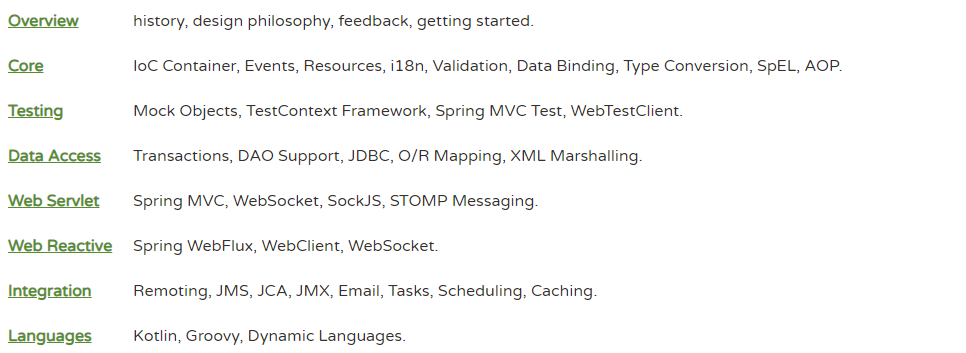

# Spring源码解析系列

Spring Framework从2004年由Rod Johnson大神发布了第一版后到现在（2019年）历经了15年的发展，已经形成了丰富的生态圈，见如下图。

虽然框架在不断的迭代更新，功能也越来越多，但是它核心设计思想依旧没有大的变动。那么我们的学习和研究的重点永远都是这些经得起时间考验的经典。故本系列内容不会涉猎全部的内容，仅仅会对**Core**、**Data Access**、**Spring MVC**重点内容进行研究探讨。

## 核心篇

