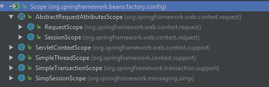

# Bean的生命周期及作用域

## 生命周期

### 时序图

从使用角度出发，Spring有两种最为常用的装配Bean的方式：通过配置文件声明各个Bean创建过程以及各个Bean之间的依赖关系；或者通过更加便捷的方式注解来达到同样的目的。这两种初始化的方式实现类的分别为：`AnnotationConfigApplicationContext`、`ClassPathXmlApplicationContext`。

两者初始化时序图如下所示：

注解方式


配置文件方式：


时序图对于第一次接触的同学可能有点稍微复杂了些，但是其中的细节不必过于关注。对以上过程可以从宏观上总结如下：两种解析方式最终呈现的结果都是解析完成后的`BeanDefinition`，而且都会调用`AbstractApplicationContext`的`refresh()`方法来完成加载，那么这个方法就是我们下面要分析的重中之重，我们先来看下这个方法的内容：

```java
public void refresh() throws BeansException, IllegalStateException {
		synchronized (this.startupShutdownMonitor) {
			// 初始化刷新的上下文
			// Prepare this context for refreshing.
			prepareRefresh();

			// 将Bean的配置解析为BeanDefinition,并注册到BeanDefinitionRegistry中供后续真正初始化时使用
			// Tell the subclass to refresh the internal bean factory.
			ConfigurableListableBeanFactory beanFactory = obtainFreshBeanFactory();

			// 准备BeanFactory上下文信息
			// Prepare the bean factory for use in this context.
			prepareBeanFactory(beanFactory);

			try {
				// Allows post-processing of the bean factory in context subclasses.
				postProcessBeanFactory(beanFactory);

				// 调用容器中所有实现了BeanFactoryPostProcessor接口实例的postProcessBeanFactory方法
				// Invoke factory processors registered as beans in the context.
				invokeBeanFactoryPostProcessors(beanFactory);

				// 将容器中所有实现了BeanPostProcessor接口的实例注册添加到到BeanFactory中beanPostProcessors属性中
				// Register bean processors that intercept bean creation.
				registerBeanPostProcessors(beanFactory);

				// 初始化MessageSource组件
				// Initialize message source for this context.
				initMessageSource();

				// 初始化事件广播组件
				// Initialize event multicaster for this context.
				initApplicationEventMulticaster();

				// 扩展方法,子类如果希望在refresh()方法执行的时候回调完成某些功能,可以重写onRefresh()方法
				// Initialize other special beans in specific context subclasses.
				onRefresh();

				// 将事件监听器添加到上面初始化过的广播组件中
				// Check for listener beans and register them.
				registerListeners();

				// 初始化所有剩余非延迟加载的实例
				// Instantiate all remaining (non-lazy-init) singletons.
				finishBeanFactoryInitialization(beanFactory);

				// 收尾工作
				// Last step: publish corresponding event.
				finishRefresh();
			}
			// 省略catach finally代码
		}
	}
```

将代码翻译为Bean生命周期的流程图如下：


### 示例

下面我们通过一个简单的示例来验证下我们上面的结论：

创建自定义的类`CustomBean`分别实现`BeanNameAware`、`BeanFactoryAware`、`ApplicationContextAware`、`InitializingBean`、`DisposableBean`接口，内容如下：

```java
public class CustomBean implements BeanNameAware, BeanFactoryAware, ApplicationContextAware,
		InitializingBean, DisposableBean {

	@Override
	public void setBeanName(String name) {
		System.out.println("BeanNameAware");
	}

	@Override
	public void setBeanFactory(BeanFactory beanFactory) throws BeansException {
		System.out.println("BeanFactoryAware");
	}

	@Override
	public void setApplicationContext(ApplicationContext applicationContext) throws BeansException {
		System.out.println("ApplicationContextAware");
	}

	@Override
	public void destroy() throws Exception {
		System.out.println("DisposableBean destroy");
	}

	@Override
	public void afterPropertiesSet() throws Exception {
		System.out.println("InitializingBean afterPropertiesSet");
	}
}
```

创建类`CustomBeanFactoryPostProcessor`实现`BeanFactoryPostProcessor`接口，内容如下：

```java
public class CustomBeanFactoryPostProcessor implements BeanFactoryPostProcessor {
	@Override
	public void postProcessBeanFactory(ConfigurableListableBeanFactory beanFactory) throws BeansException {
		System.out.println("BeanFactoryPostProcessor");
	}
}
```

创建类`CustomBeanPostProcessor`实现`BeanPostProcessor`接口，内容如下：

```java
public class CustomBeanPostProcessor implements BeanPostProcessor {

    @Override
    public Object postProcessBeforeInitialization(Object bean, String beanName) throws BeansException {
        System.out.println("BeanPostProcessor before");
        return bean;
    }

    @Override
    public Object postProcessAfterInitialization(Object bean, String beanName) throws BeansException{
        System.out.println("BeanPostProcessor after");
        return bean;
    }
}
```

``

创建测试类：

```java
@Configuration
public class Main {

	@Bean
	public CustomBean customBean() {
		return new CustomBean();
	}

	@Bean
	public CustomBeanFactoryPostProcessor customBeanFactoryPostProcessor() {
		return new CustomBeanFactoryPostProcessor();
	}

	@Bean
	public CustomBeanPostProcessor customBeanPostProcessor() {
		return new CustomBeanPostProcessor();
	}

	public static void main(String[] args) {
		AnnotationConfigApplicationContext context = new AnnotationConfigApplicationContext(Main.class);
		context.close();
	}
}
```

运行之后在控制台就能看到如下顺序的输出内容：

> BeanFactoryPostProcessor
> BeanNameAware
> BeanFactoryAware
> ApplicationContextAware
> BeanPostProcessor before
> InitializingBean afterPropertiesSet
> BeanPostProcessor after
> DisposableBean destroy

上面的示例简单的证实了Spring容器中Bean整个生命周期内的关键扩展点的作用顺序，熟悉这些扩展点有什么用呢？别着急，我们下面来看几个Spring内部进行的一些扩展，紧接着我们再介绍一些第三方框架的扩展点。

### 漫谈扩展点

#### BeanNameAware

作用：Spring通过回调该接口的`setBeanName(String name)`方法，将实现该接口Bean在容器中的名称传递。

调用时机：在Bean完成属性的装配之后，但是在还没完成实例初始化之前。

#### BeanFactoryAware

作用：Spring通过回调该接口的`setBeanFactory(BeanFactory beanFactory)`方法，将实现该接口的Bean的容器（BeanFactory）传递。

调用时机：仅挨着`BeanNameAware`，但是在还没完成实例初始化之前。

#### ApplicationContextAware

这个接口其实是借助于下面要介绍到`BeanPostProcessor `来实现的，感兴趣的可以看下`ApplicationContextAwareProcessor`的实现内容。

作用：同`BeanFactoryAware`类似，只是传递是`ApplicationContext`。

调用时机：同`BeanPostProcessor `一致。

#### InitializingBean 

#### DisposableBean 


## 作用域

### 科普

众所周知在Spring中一个Bean的作用域有以下几种：

- Singleton 整个容器内只存在一个实例，只会初始化一次，这也是Spring容器默认采用的作用域。

- Prototype 每次调用都会初始化一次，可以存在多个实例。

  和其他作用域相比，Spring并不管理原型Bean的完整生命周期，只负责完成创建然后把控制权交出去它的职责就结束了。

- Request 每次请求都会创建一个新实例，请求结束实例销毁。

- Application 整个Web应用生命周期内只存在一个实例，随着应用停止而销毁。

  跟Singleton最大的区别是单例的实例对象是存储在Spring容器中的，而在Application作用域的实例是存储在**ServletContext**中的。

- Session 整个会话周期内共享同一个实例，会话结束实例销毁。

### 深入原理

我们在上面简单的介绍了不同的作用域，那么这些神奇的作用域是如何实现的呢？Spring设计开发者又给我们预留了哪些扩展方式呢？

#### 实现原理分析

再神奇的Bean它也是需要创建出来才能拥有魔法般的生存特性，那么我们就先看下创建的过程中Spring对做了哪些骚操作。

代码摘自`AbstractBeanFactory`的`doGetBean`方法

```java
// Create bean instance.
// 如果是单例
if (mbd.isSingleton()) {
    // 先创建一个实例，并将实例传递给getSingleton方法，将其添加到缓存中，以供下次直接使用
    sharedInstance = getSingleton(beanName, () -> {
        try {
            return createBean(beanName, mbd, args);
        }
        catch (BeansException ex) {
            // Explicitly remove instance from singleton cache: It might have been put there
            // eagerly by the creation process, to allow for circular reference resolution.
            // Also remove any beans that received a temporary reference to the bean.
            destroySingleton(beanName);
            throw ex;
        }
    });
    bean = getObjectForBeanInstance(sharedInstance, name, beanName, mbd);
}
// 如果是原型
else if (mbd.isPrototype()) {
    // It's a prototype -> create a new instance.
    Object prototypeInstance = null;
    try {
        beforePrototypeCreation(beanName);
        // 直接创建
        prototypeInstance = createBean(beanName, mbd, args);
    }
    finally {
        afterPrototypeCreation(beanName);
    }
    bean = getObjectForBeanInstance(prototypeInstance, name, beanName, mbd);
}
// 如果是其他的作用域
else {
    String scopeName = mbd.getScope();
    final Scope scope = this.scopes.get(scopeName);
    if (scope == null) {
        throw new IllegalStateException("No Scope registered for scope name '" + scopeName + "'");
    }
    try {
        // 先创建一个实例，并将实例传递给Scope的get方法。
        Object scopedInstance = scope.get(beanName, () -> {
            beforePrototypeCreation(beanName);
            try {
                return createBean(beanName, mbd, args);
            }
            finally {
                afterPrototypeCreation(beanName);
            }
        });
        bean = getObjectForBeanInstance(scopedInstance, name, beanName, mbd);
    }
}
```

源码中将不同作用域的Bean创建分为三个分支做不同的处理

1. 如果是Singleton则首先创建一个实例，然后将实例添加到缓存中去，以供下次直接使用。
2. 如果是Prototype则直接创建一个实例，不做其他的处理，这样每次去获取实例时都需要重新创建。
3. 如果是其他类型作用域的实例，则首先完成实例的创建，然后通过调用**Scope**的`get(String name, ObjectFactory<?> objectFactory)`完成最终的创建过程。

所以我们下面分析的重点就转变为不同作用域对接口`Scope`实现了，先看与`Scope`相关类的UML类图。



从类的关系图已经隐隐约约看到了Request、Session的苗头了，还有一个ServletContextScope其实就是Application作用域的实现。

首先来看`AbstractRequestAttributesScope`关键实现部分：

```java
public abstract class AbstractRequestAttributesScope implements Scope {

	@Override
	public Object get(String name, ObjectFactory<?> objectFactory) {
		RequestAttributes attributes = RequestContextHolder.currentRequestAttributes();
		Object scopedObject = attributes.getAttribute(name, getScope());
		if (scopedObject == null) {
			scopedObject = objectFactory.getObject();
			attributes.setAttribute(name, scopedObject, getScope());
			// Retrieve object again, registering it for implicit session attribute updates.
			// As a bonus, we also allow for potential decoration at the getAttribute level.
			Object retrievedObject = attributes.getAttribute(name, getScope());
			if (retrievedObject != null) {
				// Only proceed with retrieved object if still present (the expected case).
				// If it disappeared concurrently, we return our locally created instance.
				scopedObject = retrievedObject;
			}
		}
		return scopedObject;
	}

	@Override
	@Nullable
	public Object remove(String name) {
		RequestAttributes attributes = RequestContextHolder.currentRequestAttributes();
		Object scopedObject = attributes.getAttribute(name, getScope());
		if (scopedObject != null) {
			attributes.removeAttribute(name, getScope());
			return scopedObject;
		}
		else {
			return null;
		}
	}

	@Override
	public void registerDestructionCallback(String name, Runnable callback) {
		RequestAttributes attributes = RequestContextHolder.currentRequestAttributes();
		attributes.registerDestructionCallback(name, callback, getScope());
	}
}
```


#### 实现自己的作用域