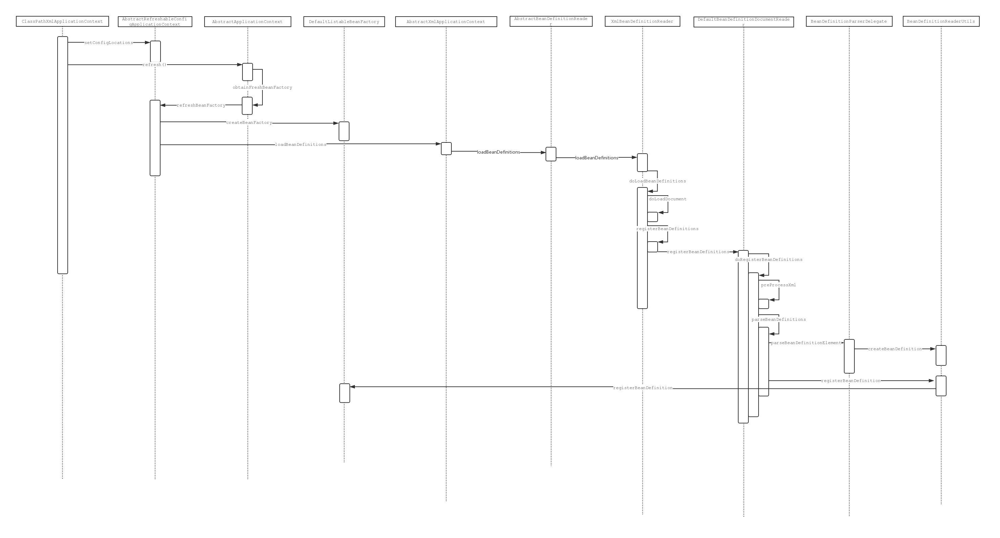

# Bean的生命周期及作用域

## 生命周期

### 时序图

从使用角度出发，Spring有两种最为常用的装配Bean的方式：通过配置文件声明各个Bean创建过程以及各个Bean之间的依赖关系；或者通过更加便捷的方式注解来达到同样的目的。这两种初始化的方式实现类的分别为：`AnnotationConfigApplicationContext`、`ClassPathXmlApplicationContext`。

两者初始化时序图如下所示：

注解方式


配置文件方式：



时序图对于第一次接触的同学可能有点稍微复杂了些，但是其中的细节不必过于关注。对以上过程可以从宏观上总结如下：两种解析方式最终呈现的结果都是解析完成后的`BeanDefinition`，而且都会调用`AbstractApplicationContext`的`refresh()`方法来完成加载，那么这个方法就是我们下面要分析的重中之重，我们先来看下这个方法的内容：

```java
public void refresh() throws BeansException, IllegalStateException {
		synchronized (this.startupShutdownMonitor) {
			// 初始化刷新的上下文
			// Prepare this context for refreshing.
			prepareRefresh();

			// 将Bean的配置解析为BeanDefinition,并注册到BeanDefinitionRegistry中供后续真正初始化时使用
			// Tell the subclass to refresh the internal bean factory.
			ConfigurableListableBeanFactory beanFactory = obtainFreshBeanFactory();

			// 准备BeanFactory上下文信息
			// Prepare the bean factory for use in this context.
			prepareBeanFactory(beanFactory);

			try {
				// Allows post-processing of the bean factory in context subclasses.
				postProcessBeanFactory(beanFactory);

				// 调用容器中所有实现了BeanFactoryPostProcessor接口实例的postProcessBeanFactory方法
				// Invoke factory processors registered as beans in the context.
				invokeBeanFactoryPostProcessors(beanFactory);

				// 将容器中所有实现了BeanPostProcessor接口的实例注册添加到到BeanFactory中beanPostProcessors属性中
				// Register bean processors that intercept bean creation.
				registerBeanPostProcessors(beanFactory);

				// 初始化MessageSource组件
				// Initialize message source for this context.
				initMessageSource();

				// 初始化事件广播组件
				// Initialize event multicaster for this context.
				initApplicationEventMulticaster();

				// 扩展方法,子类如果希望在refresh()方法执行的时候回调完成某些功能,可以重写onRefresh()方法
				// Initialize other special beans in specific context subclasses.
				onRefresh();

				// 将事件监听器添加到上面初始化过的广播组件中
				// Check for listener beans and register them.
				registerListeners();

				// 初始化所有剩余非延迟加载的实例
				// Instantiate all remaining (non-lazy-init) singletons.
				finishBeanFactoryInitialization(beanFactory);

				// 收尾工作
				// Last step: publish corresponding event.
				finishRefresh();
			}
			// 省略catach finally代码
		}
	}
```

将代码翻译为Bean生命周期的流程图如下：


### 示例

下面我们通过一个简单的示例来验证下我们上面的结论：

创建自定义的类`CustomBean`分别实现`BeanNameAware`、`BeanFactoryAware`、`ApplicationContextAware`、`InitializingBean`、`DisposableBean`接口，内容如下：

```java
public class CustomBean implements BeanNameAware, BeanFactoryAware, ApplicationContextAware,
		InitializingBean, DisposableBean {

	@Override
	public void setBeanName(String name) {
		System.out.println("BeanNameAware");
	}

	@Override
	public void setBeanFactory(BeanFactory beanFactory) throws BeansException {
		System.out.println("BeanFactoryAware");
	}

	@Override
	public void setApplicationContext(ApplicationContext applicationContext) throws BeansException {
		System.out.println("ApplicationContextAware");
	}

	@Override
	public void destroy() throws Exception {
		System.out.println("DisposableBean destroy");
	}

	@Override
	public void afterPropertiesSet() throws Exception {
		System.out.println("InitializingBean afterPropertiesSet");
	}
}
```

创建类`CustomBeanFactoryPostProcessor`实现`BeanFactoryPostProcessor`接口，内容如下：

```java
public class CustomBeanFactoryPostProcessor implements BeanFactoryPostProcessor {
	@Override
	public void postProcessBeanFactory(ConfigurableListableBeanFactory beanFactory) throws BeansException {
		System.out.println("BeanFactoryPostProcessor");
	}
}
```

创建类`CustomBeanPostProcessor`实现`BeanPostProcessor`接口，内容如下：

```java
public class CustomBeanPostProcessor implements BeanPostProcessor {

    @Override
    public Object postProcessBeforeInitialization(Object bean, String beanName) throws BeansException {
        System.out.println("BeanPostProcessor before");
        return bean;
    }

    @Override
    public Object postProcessAfterInitialization(Object bean, String beanName) throws BeansException{
        System.out.println("BeanPostProcessor after");
        return bean;
    }
}
```

``

创建测试类：

```java
@Configuration
public class Main {

	@Bean
	public CustomBean customBean() {
		return new CustomBean();
	}

	@Bean
	public CustomBeanFactoryPostProcessor customBeanFactoryPostProcessor() {
		return new CustomBeanFactoryPostProcessor();
	}

	@Bean
	public CustomBeanPostProcessor customBeanPostProcessor() {
		return new CustomBeanPostProcessor();
	}

	public static void main(String[] args) {
		AnnotationConfigApplicationContext context = new AnnotationConfigApplicationContext(Main.class);
		context.close();
	}
}
```

运行之后在控制台就能看到如下顺序的输出内容：

> BeanFactoryPostProcessor
> BeanNameAware
> BeanFactoryAware
> ApplicationContextAware
> BeanPostProcessor before
> InitializingBean afterPropertiesSet
> BeanPostProcessor after
> DisposableBean destroy

上面的示例简单的证实了Spring容器中Bean整个生命周期内的关键扩展点的作用顺序，熟悉这些扩展点有什么用呢？别着急，我们下面来看几个Spring内部进行的一些扩展，紧接着我们再介绍一些第三方框架的扩展点。

### 漫谈扩展点

#### BeanNameAware

作用：Spring通过回调该接口的`setBeanName(String name)`方法，将实现该接口Bean在容器中的名称传递。

调用时机：在Bean完成属性的装配之后，但是在还没完成实例初始化之前。

#### BeanFactoryAware

作用：Spring通过回调该接口的`setBeanFactory(BeanFactory beanFactory)`方法，将实现该接口的Bean的容器（BeanFactory）传递。

调用时机：仅挨着`BeanNameAware`，但是在还没完成实例初始化之前。

#### ApplicationContextAware

这个接口其实是借助于下面要介绍到`BeanPostProcessor `来实现的，感兴趣的可以看下`ApplicationContextAwareProcessor`的实现内容。

作用：同`BeanFactoryAware`类似，只是传递是`ApplicationContext`。

调用时机：同`BeanPostProcessor `一致。

#### InitializingBean 

当所有的Bean都完成了属性注入之后，回调`afterPropertiesSet()`方法。具体的应用场景可以参考`AbstractHandlerMethodMapping`的实现，它在该方法中完成了对控制器中的Method和Mapping的解析以及注册的工作。

#### DisposableBean 

当容器调用`close()`方法时会回调`destroy()`方法，可以在此方法中做一些资源清理的工作。比如可以回收线程资源，缓存资源等等。

下面即将要介绍的两个扩展接口是较为常用，我们也会花较多的篇幅做尽可能多的介绍和举例。

#### BeanFactoryPostProcessor

调用时机：刚刚将Bean解析为**BeanDefinition**之后，还没进行实例化和属性注入等操作。

应用场景：比如Spring借助`PropertyPlaceholderConfigurer`在Bean注入属性之前，先将配置文件中的属性载入进来。

## 作用域


### 需要了解的东东

众所周知在Spring中一个Bean的作用域有以下几种：

- Singleton 整个容器内只存在一个实例，只会初始化一次，这也是Spring容器默认采用的作用域。

- Prototype 每次调用都会初始化一次，可以存在多个实例。

  和其他作用域相比，Spring并不管理原型Bean的完整生命周期，只负责完成创建然后把控制权交出去它的职责就结束了。

- Request 每次请求都会创建一个新实例，请求结束实例销毁。

- Application 整个Web应用生命周期内只存在一个实例，随着应用停止而销毁。

  这里应用生命周期并非是Spring容器的生命周期，Spring容器是依附于ServletContext中的，而应用作用域的Bean也是保存在ServletContext中的，所以它们俩是平级的关系。并且即使一个ServletContext存在多个Spring容器，这个作用域的Bean也只有一份（比单例还牛。。。）。

  跟Singleton最大的区别是单例的实例对象是存储在Spring容器中的，而在Application作用域的实例是存储在**ServletContext**中的。

- Session 整个会话周期内共享同一个实例，会话结束实例销毁。

### 深入原理

我们在上面简单的介绍了不同的作用域，那么这些神奇的作用域是如何实现的呢？Spring设计开发者又给我们预留了哪些扩展方式呢？

#### 实现原理分析

在分析源码之前我们先来看一张总的时序图，先从上帝视角上理解下它的执行流程。


稍微对流程图做下解释，上下两块置为灰色区域的分别是容器初始化请求上下文以及创建Bean的两种场景。

初始化的入口不仅仅是图中的使用的`RequestContextListener`，在Web应用环境下`FrameworkServlet`的`processRequest`方法也进行了相同的工作。所以在使用Request、Session作用域的Bean是无需引入图中的监听器。第一部分初始化工作可以简单的理解为，通过`ThreadLocal`将`ServletRequestAttributes`保存到与线程变量里，而`ServletRequestAttributes`对象内容如下：

```java
public class ServletRequestAttributes extends AbstractRequestAttributes {
	// 省略部分代码
	private final HttpServletRequest request;

	@Nullable
	private HttpServletResponse response;

	@Nullable
	private volatile HttpSession session;

	// 省略一大波代码
}
```

其实就是把上述三个变量包裹一层放到线程中去了，在使用的时候又通过`RequestContextHolder`访问`ThreadLocal`再把它们取出来。而区分请求作用域与会话作用域的关键点在于存放Bean容器的载体，一个是**HttpServletRequest**一个是**HttpServletSession**。伴随着这个两个对象在应用容器中的生命周期特性，也就很自然的可以理解这两个作用域的特点了。下面我们把**ApplicationScope**这个稍微特殊点作用域拉出来单独分析，源码内容精简如下：

```java
public class ServletContextScope implements Scope, DisposableBean {

	private final ServletContext servletContext;
    
    // 省略部分代码

	@Override
	public Object get(String name, ObjectFactory<?> objectFactory) {
		Object scopedObject = this.servletContext.getAttribute(name);
		if (scopedObject == null) {
			scopedObject = objectFactory.getObject();
			this.servletContext.setAttribute(name, scopedObject);
		}
		return scopedObject;
	}
	// 省略部分代码
}

```

其实就是通过`ServletContext`作为容器存储，嗯。。。。。。就这样

上面其实是对各个作用域的Bean的生命周期的实现原理做了分析，但是这种Bean的创建和普通的Bean有什么区别呢？Spring又是如何把Bean的声明周期管理工作交出去的呢？带着这两个问题我们开始分析Bean的创建过程，代码摘自`AbstractBeanFactory`的`doGetBean`方法如下：

```java
// Create bean instance.
// 如果是单例
if (mbd.isSingleton()) {
    // 先创建一个实例，并将实例传递给getSingleton方法，将其添加到缓存中，以供下次直接使用
    sharedInstance = getSingleton(beanName, () -> {
        try {
         return createBean(beanName, mbd, args);
        }
        catch (BeansException ex) {
            // Explicitly remove instance from singleton cache: It might have been put there
            // eagerly by the creation process, to allow for circular reference resolution.
            // Also remove any beans that received a temporary reference to the bean.
            destroySingleton(beanName);
            throw ex;
        }
    });
    bean = getObjectForBeanInstance(sharedInstance, name, beanName, mbd);
}
// 如果是原型
else if (mbd.isPrototype()) {
    // It's a prototype -> create a new instance.
    Object prototypeInstance = null;
    try {
        beforePrototypeCreation(beanName);
        // 直接创建
        prototypeInstance = createBean(beanName, mbd, args);
    }
    finally {
        afterPrototypeCreation(beanName);
    }
    bean = getObjectForBeanInstance(prototypeInstance, name, beanName, mbd);
}
// 如果是其他的作用域
else {
    String scopeName = mbd.getScope();
    final Scope scope = this.scopes.get(scopeName);
    if (scope == null) {
        throw new IllegalStateException("No Scope registered for scope name '" + scopeName + "'");
    }
    try {
        // 先创建一个实例，并将实例传递给Scope的get方法。(lamdba表达式简化了ObjectFactory的实现)
        Object scopedInstance = scope.get(beanName, () -> {
            beforePrototypeCreation(beanName);
            try {
                return createBean(beanName, mbd, args);
            }
            finally {
                afterPrototypeCreation(beanName);
            }
        });
        bean = getObjectForBeanInstance(scopedInstance, name, beanName, mbd);
    }
}
```

源码中将不同作用域的Bean创建分为三个逻辑分支做不同的处理

1. 如果是Singleton则首先创建一个实例，然后将实例添加到缓存中去，以供下次创建时直接使用。
2. 如果是Prototype则直接创建一个实例，不做其他任何处理直接返回，这样每次去获取实例时都需要重新创建。
3. 如果是其他类型作用域的实例，则首先完成实例的创建，然后通过调用**Scope**的`get(String name, ObjectFactory<?> objectFactory)`完成最终的创建过程。

到这里刚刚提出的第一个问题的答案就自然出来了。 对于第二个问题Spring在创建完成Bean实例之后直接传递给`Scope`的`Object get(String name, ObjectFactory<?> objectFactory)`方法，至于Bean的生命周期控制，就看你怎么实现咯。。，那还不是任你把玩。（请注意前提是你还需要把自己实现的Scope想办法注册到**scopes**这属性中去）

### 实现自己的作用域

经历一大波分析之后，我们终于可以自己动手丰衣足食，定制我们自己的作用域了。但是开始之前，请允许我隆重介绍一个重量级的“人物”`CustomScopeConfigurer`,代码内容如下：

```java
public class CustomScopeConfigurer implements BeanFactoryPostProcessor, BeanClassLoaderAware, Ordered {

	@Nullable
	private Map<String, Object> scopes;

	private int order = Ordered.LOWEST_PRECEDENCE;

	@Nullable
	private ClassLoader beanClassLoader = ClassUtils.getDefaultClassLoader();


	/**
	 * Specify the custom scopes that are to be registered.
	 * <p>The keys indicate the scope names (of type String); each value
	 * is expected to be the corresponding custom {@link Scope} instance
	 * or class name.
	 */
	public void setScopes(Map<String, Object> scopes) {
		this.scopes = scopes;
	}

	/**
	 * Add the given scope to this configurer's map of scopes.
	 * @param scopeName the name of the scope
	 * @param scope the scope implementation
	 * @since 4.1.1
	 */
	public void addScope(String scopeName, Scope scope) {
		if (this.scopes == null) {
			this.scopes = new LinkedHashMap<>(1);
		}
		this.scopes.put(scopeName, scope);
	}


	public void setOrder(int order) {
		this.order = order;
	}

	@Override
	public int getOrder() {
		return this.order;
	}

	@Override
	public void setBeanClassLoader(@Nullable ClassLoader beanClassLoader) {
		this.beanClassLoader = beanClassLoader;
	}


	@Override
	public void postProcessBeanFactory(ConfigurableListableBeanFactory beanFactory) throws BeansException {
		if (this.scopes != null) {
			this.scopes.forEach((scopeKey, value) -> {
				if (value instanceof Scope) {
					beanFactory.registerScope(scopeKey, (Scope) value);
				}
				else if (value instanceof Class) {
					Class<?> scopeClass = (Class<?>) value;
					Assert.isAssignable(Scope.class, scopeClass, "Invalid scope class");
					beanFactory.registerScope(scopeKey, (Scope) BeanUtils.instantiateClass(scopeClass));
				}
				else if (value instanceof String) {
					Class<?> scopeClass = ClassUtils.resolveClassName((String) value, this.beanClassLoader);
					Assert.isAssignable(Scope.class, scopeClass, "Invalid scope class");
					beanFactory.registerScope(scopeKey, (Scope) BeanUtils.instantiateClass(scopeClass));
				}
				else {
					throw new IllegalArgumentException("Mapped value [" + value + "] for scope key [" +
							scopeKey + "] is not an instance of required type [" + Scope.class.getName() +
							"] or a corresponding Class or String value indicating a Scope implementation");
				}
			});
		}
	}

}
```

结合上面介绍的`BeanFactoryPostProcessor`接口的特性，以及上面出现的`scopes`和`beanFactory.registerScope()`方法的调用我觉得你必须能够理解（毕竟都看到这里了，实在不懂扒扒源码，结合博文理解一哈）。我们这里就实现一个跟Thread相关的Scope。（使用这种Bean的特性就是只要请求是由一个线程处理的那么Bean就永远是同一个，如果切换到另外一个线程里在使用这个Bean，对不起就需要重新创建啦。）

分三步走：

1. 先实现自定义的Scope，内容如下:

   ```java
   public class CustomScope implements Scope {
   
       private ThreadLocal<Map<String, Object>> threadLocal = new ThreadLocal<>();
   
       @Override
       public Object get(String s, ObjectFactory<?> objectFactory) {
          Map<String, Object> map = threadLocal.get();
           if (map == null) {
               synchronized (threadLocal) {
                   map = new HashMap<>();
                   map.put(s, objectFactory.getObject());
                   threadLocal.set(map);
               }
           }
           return map.get(s);
       }
   
       @Override
       public Object remove(String s) {
           Map<String, Object> map = threadLocal.get();
           return map.remove(s);
       }
   
       @Override
       public void registerDestructionCallback(String s, Runnable runnable) {
   
       }
   
       @Override
       public Object resolveContextualObject(String s) {
           return null;
       }
   
       @Override
       public String getConversationId() {
           return null;
       }
   }	
   ```


2. 将实现的作用作用域注册到容器中：

   ```java
   @Configuration
   public class CustomScopeBeanConfiger {
   
       @Bean
       CustomScopeConfigurer customScopeConfigurer() {
           CustomScopeConfigurer customScopeConfigurer = new CustomScopeConfigurer();
           customScopeConfigurer.addScope("threadScope", new CustomScope());
           return customScopeConfigurer;
       }
   
   }
   ```

3. 使用并验证

   ```java
   @Component
   @Scope(value = "threadScope", proxyMode = ScopedProxyMode.TARGET_CLASS)
   public class ThreadScopeBean {
   
       public ThreadScopeBean() {
           System.out.println("thread scope bean haa been created");
       }
   }
   
   ```

   同时为了作为对比我们也使用Singleton作用域标识另外一个Bean

   ```java
   @Component
   public class SingletonBean {
   
       public SingletonBean() {
           System.out.println("singleton bean has bean create");
       }
   }
   ```

   验证代码如下：

   ```java
   @RestController
   @RequestMapping("/")
   public class HomeController {
       @Autowired
       private SingletonBean singletonBean;
   
       @Autowired
       private ThreadScopeBean threadScopeBean;
   
       @RequestMapping("customScope")
       public void customScope() {
   
           new Thread(() -> {
               singletonBean.toString();
               threadScopeBean.toString();
               threadScopeBean.toString();
           }).start();
       }
   }
   ```

   下面启动程序，验证一下

   

   打开浏览器输入：http://localhost:8080/customScope，刷新几次后控制台输入内容如下：

   > singleton bean has bean create
   >
   > thread scope bean haa been created
   >
   > thread scope bean haa been created
   >
   > thread scope bean haa been created

   可以看到我们期待的效果已经出现了，done，验证完毕关机睡觉。


