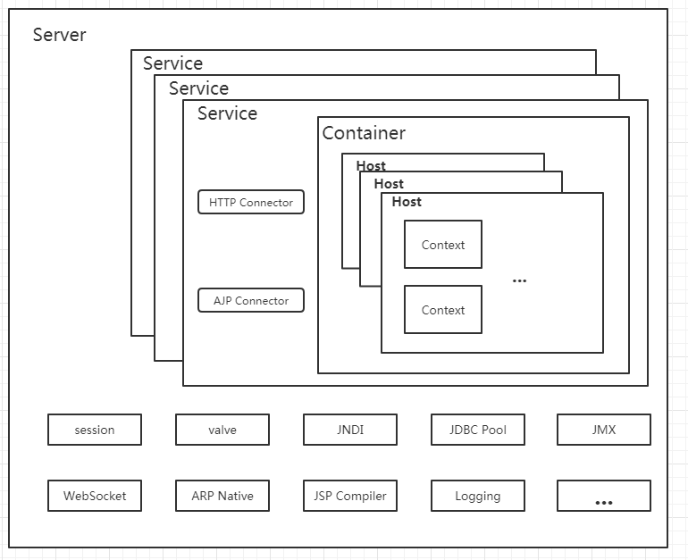

Table of Contents
=================

* [Tomcat系列开门篇\-走马观花](#tomcat%E7%B3%BB%E5%88%97%E5%BC%80%E9%97%A8%E7%AF%87-%E8%B5%B0%E9%A9%AC%E8%A7%82%E8%8A%B1)
  * [背景](#%E8%83%8C%E6%99%AF)
  * [基本的概念](#%E5%9F%BA%E6%9C%AC%E7%9A%84%E6%A6%82%E5%BF%B5)
  * [Tomcat的主要的组件及其功能](#tomcat%E7%9A%84%E4%B8%BB%E8%A6%81%E7%9A%84%E7%BB%84%E4%BB%B6%E5%8F%8A%E5%85%B6%E5%8A%9F%E8%83%BD)
    * [Server](#server)
    * [Service](#service)
    * [Connector](#connector)
    * [Engine](#engine)
    * [Host](#host)
    * [Context](#context)

# Tomcat系列开门篇-走马观花

##  背景
  用Java也有些年限了，断断续续看过一些关于Tomcat的原理分析的文章，也做过一些Tomcat性能调优的工作。但是始终有种“似是而非，似懂非懂”感觉。所以切身期望能够更加深入、全方位从源码级别重新认识下我们经常用到但又不怎么不怎么熟悉的Tomcat。本篇为系列中的开门篇，内容上更多是从宏观上认识下Tomcat，了解下其各个主要组件功能，做到对整体上有个印象的目的。直接深入细节必将陷入细节的漩涡，反而达不到很好的效果。

## 基本的概念
  这里引用下Wiki对Tomcat的解释。“Apache Tomcat, often referred to as Tomcat Server, is an open-source Java Servlet Container developed by the Apache Software Foundation (ASF). Tomcat implements several Java EE specifications including Java Servlet, JavaServer Pages (JSP), Java EL, and WebSocket, and provides a "pure Java" HTTP web server environment in which Java code can run.”渣翻如下：“Apache Tomcat经常被简称为Tomcat Server，它是一个开源的Java Servlet容器，由Apache Software Foundation开发。Tomcat 实现了Java EE规范，包含有：Java Servlet、JavaServer Pages（JSP）、Java EL、WebSocket并且提供了纯Java实现的Http Web服务器”。

## Tomcat的主要的组件及其功能

### Server

`Server`组件代表了整个Tomcat容器，官方提供了`Server`接口的默认实现类`StandardServer`，提供了如下的主要方法。


可以大致看出`Server`定义容器服务端口、容器地址、关闭端口，以及对`Service`组件的管理功能。

### Service

`Service`组件是由一个或者多个`Connector`和`Container`构成，用来处理请求。这种设计可以使得同一个应用既可以接收HTTP、也可以接受HTTPS的请求。一个`Server`中可以包含多个`Service`，但是他们的共享基本的JVM核心类和系统路径上的类的（可以参考[Tomcat类加载机制](./tomcat_classloader.md)），同样官方也提供了默认实现`StandardService`，主要方法如下：


可以看出提供了管理`Connector`、`Container`以及线程池的功能。

### Connector

用来处理来自客户端的连接，可以有多个，官方默认有支持**HTTP**协议和**AJP**协议的两种`Connector`。

### Engine

先看下`Engine`官方的默认实现类的UML图，可以看到实现类继承自`Container`，所以`Engine`是受`Service`组件管理的。


同时`Engine`支持同时配置多个`Host`，大致的配置文件内容如下。

```xml
<!-- 省略无关配置 -->
<Host name="自定义的域名"  appBase="应用存放路径"
      unpackWARs="true" autoDeploy="true">
</Host>
<Host name="自定义的域名"  appBase="应用存放路径"
      unpackWARs="true" autoDeploy="true">
</Host>
<!-- 省略无关配置 -->
```

### Host

`Host`代表了Tomcat Server的域名，并且支持别名。官方提供了该接口的标准实现类`StandardHost`,提供的抽象方法如下：


### Context

`Context`代表了一个Web应用。一个`Host`可以包含多个Web应用，但是每个应用都拥有唯一的一个路径。`Context`接口定义的方法有：


至此Tomcat的主要组件及其功能都已经简单介绍完毕，用一张图来做一个简单的总结。

