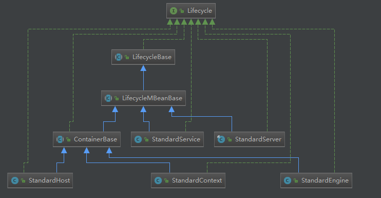

# Tomcat启动流程（中）

## 前言

上篇[Tomcat启动流程（上）](./startup_process_01.md)中分析了Tomcat大体的启动过程，但是`Host`、`Context`组件的初始化过程还没介绍。在开始之前，还需要做个铺垫先聊一聊Tomcat中监听器模式的设计和使用。

## Tomcat中的监听器模式的应用

监听器模式的三个重要组成元素分别为：事件源、事件对象、事件监听器。那么在Tomcat中是如何应用这个设计模式的？

1. 有哪些事件？
2. 有哪些主要的事件源？
3. 怎么将事件对象通知监听器？

弄清楚了以上几个问题，也就弄清楚了Tomcat中对监听器模式的设计和使用。

那么我们先来看下Tomcat中定义的事件有哪些(摘自`Lifecycle`)如下图所示。


第一个问题“有哪些事件？”

大致可以看出，基本是围绕着初始化、启动、停止、销毁四个方法衍生出的事件，每个方法又细分为前、中、后三个事件，还有额外的`CONFIGURE_START_EVENT`、`CONFIGURE_STOP_EVENT`以及`PERIODIC_EVENT`。通过事件名字便可以猜测出`CONFIGURE_XX`用于配置相关的过程处理，`PERIODIC_EVENT`用于周期性任务处理。

第一个问题“有哪些事件源？”

从`Lifecycle`类的关系图中可以看出，Tomcat的主要组件直接间接实现了`Lifecycle`相关接口，所以事件源也自然是由这些组件所产生。



第三个问题“怎么将事件对象通知监听器？”。在不直接看Tomcat源码前，我们可以进行大胆的猜测。不知道大家有没有注意开篇提到的`Lifecycle`接口中的`addLifecycleListener()`方法，根据名字可以看出这个是添加监听器的入口。那么肯定还需要有一个集合保存所有注册的监听器，每次有新的事件产生的时候，需要有个方法将对应的事件通知到各个监听器。为了验证我们方法，贴出`LifecycleBase`部分关键代码

```java
public abstract class LifecycleBase implements Lifecycle {

    /**
     * The list of registered LifecycleListeners for event notifications.
     */
    private final List<LifecycleListener> lifecycleListeners = new CopyOnWriteArrayList<>();

    @Override
    public void addLifecycleListener(LifecycleListener listener) {
        lifecycleListeners.add(listener);
    }

    protected void fireLifecycleEvent(String type, Object data) {
        LifecycleEvent event = new LifecycleEvent(this, type, data);
        for (LifecycleListener listener : lifecycleListeners) {
            listener.lifecycleEvent(event);
        }
    }

    @Override
    public final synchronized void init() throws LifecycleException {
        if (!state.equals(LifecycleState.NEW)) {
            invalidTransition(Lifecycle.BEFORE_INIT_EVENT);
        }

        try {
            setStateInternal(LifecycleState.INITIALIZING, null, false);
            initInternal();
            setStateInternal(LifecycleState.INITIALIZED, null, false);
        } catch (Throwable t) {
            ExceptionUtils.handleThrowable(t);
            setStateInternal(LifecycleState.FAILED, null, false);
            throw new LifecycleException(
                    sm.getString("lifecycleBase.initFail",toString()), t);
        }
    }

    protected abstract void initInternal() throws LifecycleException;

    protected synchronized void setState(LifecycleState state)
            throws LifecycleException {
        setStateInternal(state, null, true);
    }

 
    protected synchronized void setState(LifecycleState state, Object data)
            throws LifecycleException {
        setStateInternal(state, data, true);
    }

    private synchronized void setStateInternal(LifecycleState state,
            Object data, boolean check) throws LifecycleException {

        if (log.isDebugEnabled()) {
            log.debug(sm.getString("lifecycleBase.setState", this, state));
        }

        if (check) {
            // Must have been triggered by one of the abstract methods (assume
            // code in this class is correct)
            // null is never a valid state
            if (state == null) {
                invalidTransition("null");
                // Unreachable code - here to stop eclipse complaining about
                // a possible NPE further down the method
                return;
            }

            // Any method can transition to failed
            // startInternal() permits STARTING_PREP to STARTING
            // stopInternal() permits STOPPING_PREP to STOPPING and FAILED to
            // STOPPING
            if (!(state == LifecycleState.FAILED ||
                    (this.state == LifecycleState.STARTING_PREP &&
                            state == LifecycleState.STARTING) ||
                    (this.state == LifecycleState.STOPPING_PREP &&
                            state == LifecycleState.STOPPING) ||
                    (this.state == LifecycleState.FAILED &&
                            state == LifecycleState.STOPPING))) {
                // No other transition permitted
                invalidTransition(state.name());
            }
        }

        this.state = state;
        String lifecycleEvent = state.getLifecycleEvent();
        if (lifecycleEvent != null) {
            fireLifecycleEvent(lifecycleEvent, data);
        }
    }

    private void invalidTransition(String type) throws LifecycleException {
        String msg = sm.getString("lifecycleBase.invalidTransition", type,
                toString(), state);
        throw new LifecycleException(msg);
    }
}
```

其中`private final List<LifecycleListener> lifecycleListeners = new CopyOnWriteArrayList<>();`这一行代码验证了我们上面所有所有监听其需要一个集合保存的猜测。至于事件通知过程，这里以`init()`为例进行分析，调用的时序图如下面所示


`LifecycleBase`通过遍历注册的监听器集合中的监听器，并调用各个组件自主实现的`fireLifecycleEvent()`方法，将事件对象通知到各个监听器，到这里一个完整的事件产生以及事件的监听通知过程我们已经分析完毕。剩余的`start()`、`stop()`、`destory()`等方法的执行过程类似，内容比较简单大家可以自行阅读。下面内容正是开始回答上篇的问题：“Tomcat在哪里处理`web.xml`以及如何部署应用的呢？”为了解答这个问题不得不提到两个重要的类`HostConfig`和`ContextConfig`。既然`fireLifecycleEvent()`是组件监听事件被回调通知的入口，那么`HostConfig`和`ContextConfig`也肯定会实现对应的方法。看下这两个类和`LifecycleListener`UML关系图：


我们可以很直观的看到这两个类均实现了监听器接口，那么我们下面分析的重点就放在组件对`lifecycleEvent()`的方法实现上。

## HostConfig

```java
@Override
public void lifecycleEvent(LifecycleEvent event) {

    // Identify the host we are associated with
    try {
        host = (Host) event.getLifecycle();
        if (host instanceof StandardHost) {
            setCopyXML(((StandardHost) host).isCopyXML());
            setDeployXML(((StandardHost) host).isDeployXML());
            setUnpackWARs(((StandardHost) host).isUnpackWARs());
            setContextClass(((StandardHost) host).getContextClass());
        }
    } catch (ClassCastException e) {
        log.error(sm.getString("hostConfig.cce", event.getLifecycle()), e);
        return;
    }

    // Process the event that has occurred
    if (event.getType().equals(Lifecycle.PERIODIC_EVENT)) {
        check();
    } else if (event.getType().equals(Lifecycle.BEFORE_START_EVENT)) {
        beforeStart();
    } else if (event.getType().equals(Lifecycle.START_EVENT)) {
        start();
    } else if (event.getType().equals(Lifecycle.STOP_EVENT)) {
        stop();
    }
}
```

我们这里只重点关注`start()`的过程，`start`方法内容如下：

```java
public void start() {

    if (log.isDebugEnabled())
        log.debug(sm.getString("hostConfig.start"));

    try {
        ObjectName hostON = host.getObjectName();
        oname = new ObjectName
            (hostON.getDomain() + ":type=Deployer,host=" + host.getName());
        Registry.getRegistry(null, null).registerComponent
            (this, oname, this.getClass().getName());
    } catch (Exception e) {
        log.error(sm.getString("hostConfig.jmx.register", oname), e);
    }

    if (!host.getAppBaseFile().isDirectory()) {
        log.error(sm.getString("hostConfig.appBase", host.getName(),
                host.getAppBaseFile().getPath()));
        host.setDeployOnStartup(false);
        host.setAutoDeploy(false);
    }

    if (host.getDeployOnStartup())
        deployApps();
}
```

亲注意在倒数第二行出现的`deployApps()`方法，见名之意，推测应该就是执行部署应用部署的代码。继续追踪代码内容如下：

```java
protected void deployApps() {

    File appBase = host.getAppBaseFile();
    File configBase = host.getConfigBaseFile();
    String[] filteredAppPaths = filterAppPaths(appBase.list());
    // Deploy XML descriptors from configBase
    deployDescriptors(configBase, configBase.list());
    // Deploy WARs
    deployWARs(appBase, filteredAppPaths);
    // Deploy expanded folders
    deployDirectories(appBase, filteredAppPaths);
}
```

到这里我们已经能够直白看到Tomcat中的两种应用部署的方式：通过war包部署，也可以直接部署解压之后的文件。

## ContextConfig

```java
@Override
public void lifecycleEvent(LifecycleEvent event) {

    // Identify the context we are associated with
    try {
        context = (Context) event.getLifecycle();
    } catch (ClassCastException e) {
        log.error(sm.getString("contextConfig.cce", event.getLifecycle()), e);
        return;
    }

    // Process the event that has occurred
    if (event.getType().equals(Lifecycle.CONFIGURE_START_EVENT)) {
        configureStart();
    } else if (event.getType().equals(Lifecycle.BEFORE_START_EVENT)) {
        beforeStart();
    } else if (event.getType().equals(Lifecycle.AFTER_START_EVENT)) {
        // Restore docBase for management tools
        if (originalDocBase != null) {
            context.setDocBase(originalDocBase);
        }
    } else if (event.getType().equals(Lifecycle.CONFIGURE_STOP_EVENT)) {
        configureStop();
    } else if (event.getType().equals(Lifecycle.AFTER_INIT_EVENT)) {
        init();
    } else if (event.getType().equals(Lifecycle.AFTER_DESTROY_EVENT)) {
        destroy();
    }

}
```

这里我们重点探究启动时Tomcat对配置处理过程，`configureStart()`内容如下

```java
protected synchronized void configureStart() {
    // Called from StandardContext.start()
    webConfig();

    if (!context.getIgnoreAnnotations()) {
        applicationAnnotationsConfig();
    }
    if (ok) {
        validateSecurityRoles();
    }

    // Configure an authenticator if we need one
    if (ok) {
        authenticatorConfig();
    }

    // Dump the contents of this pipeline if requested
    if (log.isDebugEnabled()) {
        log.debug("Pipeline Configuration:");
        Pipeline pipeline = context.getPipeline();
        Valve valves[] = null;
        if (pipeline != null) {
            valves = pipeline.getValves();
        }
        if (valves != null) {
            for (int i = 0; i < valves.length; i++) {
                log.debug("  " + valves[i].getClass().getName());
            }
        }
        log.debug("======================");
    }

    // Make our application available if no problems were encountered
    if (ok) {
        context.setConfigured(true);
    } else {
        log.error(sm.getString("contextConfig.unavailable"));
        context.setConfigured(false);
    }
}
```

以上代码大致做了以下几个工作：

1. 解析应用`web.xml`配置
2. 解析`Listener`、`Filter`、`Servlet`等注解
3. 验证角色安全、用户认证配置等

进一步分析处理`web.xml`配置的`webConfig()`方法内容如下：

```java
protected void webConfig() {
    WebXmlParser webXmlParser = new WebXmlParser(context.getXmlNamespaceAware(),
            context.getXmlValidation(), context.getXmlBlockExternal());

    Set<WebXml> defaults = new HashSet<>();
    defaults.add(getDefaultWebXmlFragment(webXmlParser));

    WebXml webXml = createWebXml();

    // Parse context level web.xml
    InputSource contextWebXml = getContextWebXmlSource();
    if (!webXmlParser.parseWebXml(contextWebXml, webXml, false)) {
        ok = false;
    }

    ServletContext sContext = context.getServletContext();

    // Ordering is important here

    // Step 1. Identify all the JARs packaged with the application and those
    // provided by the container. If any of the application JARs have a
    // web-fragment.xml it will be parsed at this point. web-fragment.xml
    // files are ignored for container provided JARs.
    Map<String,WebXml> fragments = processJarsForWebFragments(webXml, webXmlParser);

    // Step 2. Order the fragments.
    Set<WebXml> orderedFragments = null;
    orderedFragments =
            WebXml.orderWebFragments(webXml, fragments, sContext);

    // Step 3. Look for ServletContainerInitializer implementations
    if (ok) {
        processServletContainerInitializers();
    }

    if  (!webXml.isMetadataComplete() || typeInitializerMap.size() > 0) {
        // Steps 4 & 5.
        processClasses(webXml, orderedFragments);
    }

    if (!webXml.isMetadataComplete()) {
        // Step 6. Merge web-fragment.xml files into the main web.xml
        // file.
        if (ok) {
            ok = webXml.merge(orderedFragments);
        }

        // Step 7. Apply global defaults
        // Have to merge defaults before JSP conversion since defaults
        // provide JSP servlet definition.
        webXml.merge(defaults);

        // Step 8. Convert explicitly mentioned jsps to servlets
        if (ok) {
            convertJsps(webXml);
        }

        // Step 9. Apply merged web.xml to Context
        if (ok) {
            configureContext(webXml);
        }
    } else {
        webXml.merge(defaults);
        convertJsps(webXml);
        configureContext(webXml);
    }

    if (context.getLogEffectiveWebXml()) {
        log.info("web.xml:\n" + webXml.toXml());
    }

    // Always need to look for static resources
    // Step 10. Look for static resources packaged in JARs
    if (ok) {
        // Spec does not define an order.
        // Use ordered JARs followed by remaining JARs
        Set<WebXml> resourceJars = new LinkedHashSet<>();
        for (WebXml fragment : orderedFragments) {
            resourceJars.add(fragment);
        }
        for (WebXml fragment : fragments.values()) {
            if (!resourceJars.contains(fragment)) {
                resourceJars.add(fragment);
            }
        }
        processResourceJARs(resourceJars);
        // See also StandardContext.resourcesStart() for
        // WEB-INF/classes/META-INF/resources configuration
    }

    // Step 11. Apply the ServletContainerInitializer config to the
    // context
    if (ok) {
        for (Map.Entry<ServletContainerInitializer,
                Set<Class<?>>> entry :
                    initializerClassMap.entrySet()) {
            if (entry.getValue().isEmpty()) {
                context.addServletContainerInitializer(
                        entry.getKey(), null);
            } else {
                context.addServletContainerInitializer(
                        entry.getKey(), entry.getValue());
            }
        }
    }
}
```

大致步骤如下

1. 创建了解析`web.xml`解析器
2. 解析`conf/web.xml`目录下默认的`web.xml`文件
3. 处理Jar包中`web-fragment.xml `配置内容
4. 处理实现了`ServletContainerInitializer`接口的类，相信使用过spring boot开发的同学对这个类一定比较熟悉。
5. 处理`Listener`、`Filter`、`Servlet`等注解。
6. 将分散在各处的`web-fragment.xml`合并到一个`web.xml`中，并应用到当前的`context`中。
7. 将实现了`ServletContainerInitializer`实例加载到`context`中。
8. 到这里一个应用的配置加载已经完毕，如果有多个应用会重复此过程至所有的应用都配置完毕。

## 总结

本篇完成对Tomcat中两个重要组件`Host`以及`Context`配置初始的分析过程。启动流程分析到这里已经将主要核心组件启动分析完毕。在[启动流程(下)](./startup_process_03.md)篇中将展开对Tomcat的线程模型展开分析。