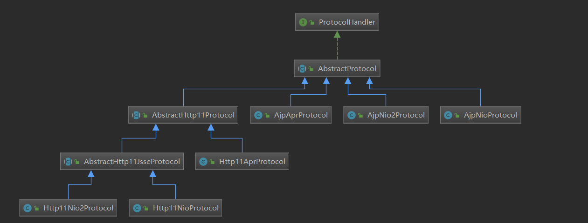
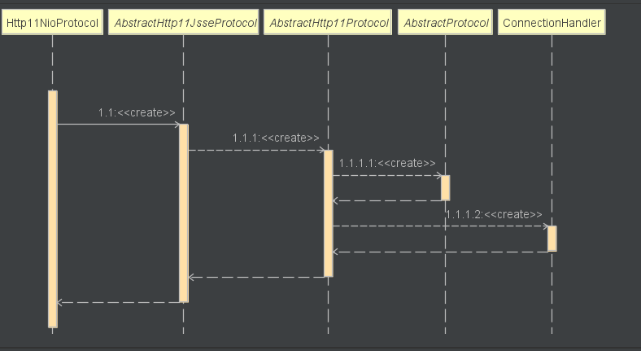
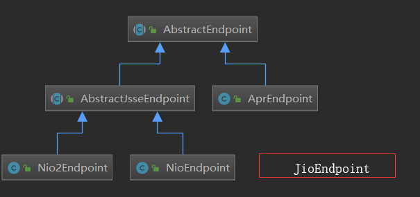
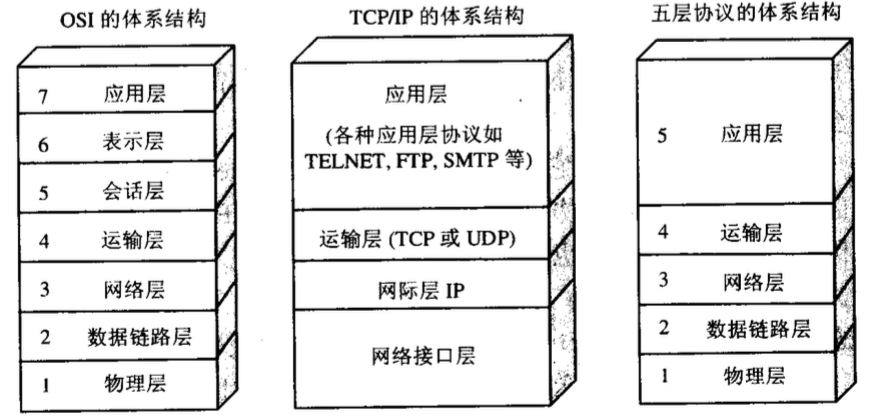
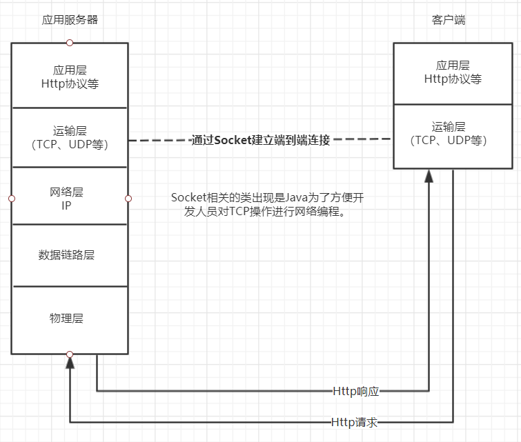

# Tomcat启动流程（下）

## 前言

在上篇中我们完成了对Tomcat中`Host`以及`Context`两个组件初始化分析，本篇则为启动流程分析的下篇，内容上重点关注一下几点：

1. APR和AJP是什么
2. Tomcat中`Connector`组件`init()`、`start()`过程
3. Tomcat提供了有哪些线程IO模型，以及各个模型的优缺点分析。
4. 各种调优参数说明

## APR和AJP是什么

### APR（[Apache Portable Runtime](https://en.wikipedia.org/wiki/Apache_Portable_Runtime)）

APR的设计目的是向外提供可预测且一致的接口，用于屏蔽特定于底层不同的平台的实现。它提供了卓越的可伸缩性、性能并且可以更好的和本地服务端技术集成。

### AJP（[Apache JServ Protocol](https://en.wikipedia.org/wiki/Apache_JServ_Protocol)）

AJP的设计目的是提升性能（特别是速度方面）、支持SSL协议。AJP是面向数据包的，基于性能的考量选择以二进制作为传输格式而不是选择更加易读的的纯文本格式。web服务器通过TCP协议与servlet容器通信。为了降低创建socket的造成损耗，web服务器将尝试与servlet容器维护一个持久的TCP连接，并在多个请求响应周期内重复使用该连接。一旦连接被分配给一个请求，连接在整个周期内都不会处理其他的请求。多个请求不会复用连接，这样使得编码变得更加容易，但是会导致更多的连接被同时创建。

## Connector

### Connector组件的初始化

`Connector`构造方法内容如下：

```java
public Connector() {
    this(null);
}

public Connector(String protocol) {
    setProtocol(protocol);
    // Instantiate protocol handler
    ProtocolHandler p = null;
    try {
        Class<?> clazz = Class.forName(protocolHandlerClassName);
        p = (ProtocolHandler) clazz.getConstructor().newInstance();
    } catch (Exception e) {
        log.error(sm.getString(
                "coyoteConnector.protocolHandlerInstantiationFailed"), e);
    } finally {
        this.protocolHandler = p;
    }

    if (Globals.STRICT_SERVLET_COMPLIANCE) {
        uriCharset = StandardCharsets.ISO_8859_1;
    } else {
        uriCharset = StandardCharsets.UTF_8;
    }
}
```

`Connector`先通过调用`setProtocol(String protocol)`方法适配到不同协议处理类，然后在将适配到的处理类通过反射机制调用其无参构造方法实例化。`Connnector`完成对象创建之后，Tomcat按照事件生命周期最开始发起`init`事件的通知。其父类`LifecycleBase`的`init`方法率先被通知执行，然后会将核心初始化过程交由子类`initInternal`方法实现，内容如下：

```java
protected void initInternal() throws LifecycleException {

    super.initInternal();

    // Initialize adapter
    adapter = new CoyoteAdapter(this);
    protocolHandler.setAdapter(adapter);

    // Make sure parseBodyMethodsSet has a default
    if (null == parseBodyMethodsSet) {
        setParseBodyMethods(getParseBodyMethods());
    }

    if (protocolHandler.isAprRequired() && !AprLifecycleListener.isAprAvailable()) {
        throw new LifecycleException(sm.getString("coyoteConnector.protocolHandlerNoApr",
                getProtocolHandlerClassName()));
    }
    if (AprLifecycleListener.isAprAvailable() && AprLifecycleListener.getUseOpenSSL() &&
            protocolHandler instanceof AbstractHttp11JsseProtocol) {
        AbstractHttp11JsseProtocol<?> jsseProtocolHandler =
                (AbstractHttp11JsseProtocol<?>) protocolHandler;
        if (jsseProtocolHandler.isSSLEnabled() &&
                jsseProtocolHandler.getSslImplementationName() == null) {
            // OpenSSL is compatible with the JSSE configuration, so use it if APR is available
            jsseProtocolHandler.setSslImplementationName(OpenSSLImplementation.class.getName());
        }
    }

    try {
        protocolHandler.init();
    } catch (Exception e) {
        throw new LifecycleException(
                sm.getString("coyoteConnector.protocolHandlerInitializationFailed"), e);
    }
}
```

1. 初始化`CoyoteAdapter`，并将当前的`Connector`于之关联。
2. 将`protocolHandler`对象关联`CoyoteAdapter`
3. 调用`ProtocolHandler`的初始化方法。

### Connector组件启动

```java
protected void startInternal() throws LifecycleException {

    // Validate settings before starting
    if (getPort() < 0) {
        throw new LifecycleException(sm.getString(
                "coyoteConnector.invalidPort", Integer.valueOf(getPort())));
    }

    setState(LifecycleState.STARTING);

    try {
        protocolHandler.start();
    } catch (Exception e) {
        throw new LifecycleException(
                sm.getString("coyoteConnector.protocolHandlerStartFailed"), e);
    }
}
```

1. 端口校验
2. `LifecycleState.STARTING`事件通知
3. 调用`ProtocolHandler start` 方法。

`ProtocolHandler `在`Connector`初始化以及启动过程中均有参与，说明其的重要性。下面就对其进一步进行剖析。

## Http11NioProtocol组件

在开始分析具体的组件之前，先把Tomcat处理`Protocol`相关的实现类继承关系图放上，希望大家能够有一个总体的认识，而不至于迷失于细节。



这里我们以经典的Http协议和NIO的组合`Http11NioProtocol` 作为例子进行剖析。

### 如何选择合适的协议处理类

协议处理类的选择可以追溯到`Connector`初始化时对`setProtocol`方法的调用，此时`Connector`会根据配置文件中协议的不同适配到不同的处理类，相关代码内容如下：

```java
public void setProtocol(String protocol) {

    boolean aprConnector = AprLifecycleListener.isAprAvailable() &&
            AprLifecycleListener.getUseAprConnector();

    if ("HTTP/1.1".equals(protocol) || protocol == null) {
        if (aprConnector) {
            setProtocolHandlerClassName("org.apache.coyote.http11.Http11AprProtocol");
        } else {
            setProtocolHandlerClassName("org.apache.coyote.http11.Http11NioProtocol");
        }
    } else if ("AJP/1.3".equals(protocol)) {
        if (aprConnector) {
            setProtocolHandlerClassName("org.apache.coyote.ajp.AjpAprProtocol");
        } else {
            setProtocolHandlerClassName("org.apache.coyote.ajp.AjpNioProtocol");
        }
    } else {
        setProtocolHandlerClassName(protocol);
    }
}
```

这里可以清楚看到Tomcat提供了一下几种适配处理类：

1. `org.apache.coyote.http11.Http11AprProtocol` HTTP/1.1协议和APR的组合
2. `org.apache.coyote.http11.Http11NioProtocol` HTTP/1.1协议和NIO的组合
3. `org.apache.coyote.ajp.AjpAprProtocol` AJP协议和APR的组合
4. `org.apache.coyote.ajp.AjpNioProtocol` AJP协议和NIO的组合

当然如果不需要Tomcat的自动适配，也支持通过直接指定类的全名来指定具体的处理类，比如可以直接指定类名`org.apache.coyote.ajp.AjpNio2Protocol`。

### 初始化及启动

`Http11NioProtocol`创建是`Connector`通过反射调用无参构造函数所完成，构造时序图如下所示：



请留意在时序图最右侧的出现的`ConnectionHandler`，`ConnectionHandler`主要处理来自TCP的连接、关闭等操作。（什么？为什么是来自`TCP`的？请穿越至[番外Tomcat与TCP](#番外Tomcat与TCP)）。构造的过程分析完毕，下面开始`init`过程分析。代码调用层级比较多，就不一一贴出。经过`Http11NioProtocol` -> `AbstractHttp11Protocol` ->  `AbstractProtocol` ->  `AbstractProtocol`，最终会调用`AbstractProtocol`的`init`方法，内容如下：

```java
public void init() throws Exception {
    // 省略无关代码
    String endpointName = getName();
    endpoint.setName(endpointName.substring(1, endpointName.length()-1));
    endpoint.setDomain(domain);
    endpoint.init();
}

// 初始化endpoint的地方
public Http11NioProtocol() {
    super(new NioEndpoint());
}
```

请注意上面代码中出现的`endpoint`是在`Http11NioProtocol`构造函数初始化的时候所指定的，硬编码写死为`NioEndpoint`。（关于`NioEndpoint`我们在下面进行分析）。到这里`Protocol`初始化过程分析完毕，继续分析它启动过程代码。

```java
public void start() throws Exception {
 	
    endpoint.start();

    // Start async timeout thread
    asyncTimeout = new AsyncTimeout();
    Thread timeoutThread = new Thread(asyncTimeout, getNameInternal() + "-AsyncTimeout");
    int priority = endpoint.getThreadPriority();
    if (priority < Thread.MIN_PRIORITY || priority > Thread.MAX_PRIORITY) {
        priority = Thread.NORM_PRIORITY;
    }
    timeoutThread.setPriority(priority);
    timeoutThread.setDaemon(true);
    timeoutThread.start();
}
```

1. 和初始化的时候一样也是调用了`NioEndpoint`的方法。
2. 启动线程，用来处理异步超时的请求。

## NioEndpoint

先来一张总体的继承图：



`AbstractProtocol`作为抽象类，具体实现子类有以下几种，每一种都代表了不同的线程模型。

1. `JIoEndpoint` 阻塞IO，在Tomcat 8.5.x版本以后被移除。
2. `AprEndpoint` 根据平台不同而不同
3. `NioEndpoint`、`Nio2Endpoint` 非阻塞IO

### 初始化

介绍完不同的`Endpoint`后，继续分析`NioEndpoint`初始化过程。`NioEndpoint`的`init`方法会调用父类`AbstractProtocol`的`init`方法，`init`方法又会调用具体子类实现的`bind`方法。熟悉Socket编程的各位见到`bind`方法是不是很亲切，大体就可以猜测到这个方法是用来建立默认8080端口的监听，等待请求连接过来，具体内容如下：

```java
public void bind() throws Exception {

    if (!getUseInheritedChannel()) {
        serverSock = ServerSocketChannel.open();
        socketProperties.setProperties(serverSock.socket());
        InetSocketAddress addr = (getAddress()!=null?new InetSocketAddress(getAddress(),getPort()):new InetSocketAddress(getPort()));
        serverSock.socket().bind(addr,getAcceptCount());
    } else {
        // Retrieve the channel provided by the OS
        Channel ic = System.inheritedChannel();
        if (ic instanceof ServerSocketChannel) {
            serverSock = (ServerSocketChannel) ic;
        }
        if (serverSock == null) {
            throw new IllegalArgumentException(sm.getString("endpoint.init.bind.inherited"));
        }
    }
    serverSock.configureBlocking(true); //mimic APR behavior

    // Initialize thread count defaults for acceptor, poller
    if (acceptorThreadCount == 0) {
        // FIXME: Doesn't seem to work that well with multiple accept threads
        acceptorThreadCount = 1;
    }
    if (pollerThreadCount <= 0) {
        //minimum one poller thread
        pollerThreadCount = 1;
    }
    setStopLatch(new CountDownLatch(pollerThreadCount));

    // Initialize SSL if needed
    initialiseSsl();

    selectorPool.open();
}
```

1. 通过`ServerSocketChannel`建立了监听在8080的服务。

2. 将`acceptorThreadCount`及`pollerThreadCount`初始化为1。（看到acceptor相信了解过reactor模式的同学已经猜测到了Reactor模型）

3. 调用`selectorPool.open()`

到这里`NioEndpoint`也初始化完毕。

### 启动

```java
public void startInternal() throws Exception {

    if (!running) {
        running = true;
        paused = false;

        processorCache = new SynchronizedStack<>(SynchronizedStack.DEFAULT_SIZE,
                socketProperties.getProcessorCache());
        eventCache = new SynchronizedStack<>(SynchronizedStack.DEFAULT_SIZE,
                        socketProperties.getEventCache());
        nioChannels = new SynchronizedStack<>(SynchronizedStack.DEFAULT_SIZE,
                socketProperties.getBufferPool());

        // Create worker collection
        if ( getExecutor() == null ) {
            createExecutor();
        }

        initializeConnectionLatch();

        // Start poller threads
        pollers = new Poller[getPollerThreadCount()];
        for (int i=0; i<pollers.length; i++) {
            pollers[i] = new Poller();
            Thread pollerThread = new Thread(pollers[i], getName() + "-ClientPoller-"+i);
            pollerThread.setPriority(threadPriority);
            pollerThread.setDaemon(true);
            pollerThread.start();
        }

        startAcceptorThreads();
    }
}
```

1. `createExecutor()`创建线程池（默认情况下初始化大小为10，最大值为200）
2. `initializeConnectionLatch()`连接数量限制器（默认连接上限10000）。
3. 创建`Acceptor`以及`Poller`，默认大小均为1。

## Reactor模式


Acceptor内容如下：

```java
protected class Acceptor extends AbstractEndpoint.Acceptor {

    @Override
    public void run() {

        int errorDelay = 0;

        // Loop until we receive a shutdown command
        while (running) {

            // Loop if endpoint is paused
            while (paused && running) {
                state = AcceptorState.PAUSED;
                try {
                    Thread.sleep(50);
                } catch (InterruptedException e) {
                    // Ignore
                }
            }

            if (!running) {
                break;
            }
            state = AcceptorState.RUNNING;

            try {
                //if we have reached max connections, wait
                countUpOrAwaitConnection();

                SocketChannel socket = null;
                try {
                    // Accept the next incoming connection from the server
                    // socket
                    socket = serverSock.accept();
                } catch (IOException ioe) {
                    // We didn't get a socket
                    countDownConnection();
                    if (running) {
                        // Introduce delay if necessary
                        errorDelay = handleExceptionWithDelay(errorDelay);
                        // re-throw
                        throw ioe;
                    } else {
                        break;
                    }
                }
                // Successful accept, reset the error delay
                errorDelay = 0;

                // Configure the socket
                if (running && !paused) {
                    // setSocketOptions() will hand the socket off to
                    // an appropriate processor if successful
                    if (!setSocketOptions(socket)) {
                        closeSocket(socket);
                    }
                } else {
                    closeSocket(socket);
                }
            } catch (Throwable t) {
                ExceptionUtils.handleThrowable(t);
                log.error(sm.getString("endpoint.accept.fail"), t);
            }
        }
        state = AcceptorState.ENDED;
    }
}
```

## 番外Tomcat与TCP

且听我慢慢道来（手动滑稽），下面呈上计算机的网络模型图。



我们一般使用Tomcat服务器对外提供服务大部分都是在应用层（包括HTTP协议、WebSocket协议等），一个完整的请求到响应的过程如图所示



Tomat在交互的过程中通过Java中的Socket来处理来自客户端的请求，然后进一步处理之后接解析到应用层的HTTP协议，交给我们的应用去处理。