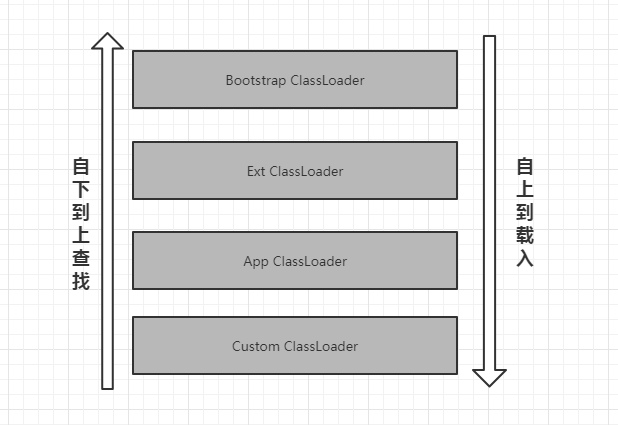
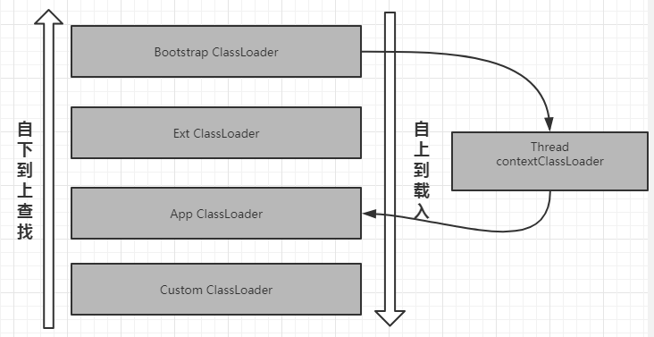
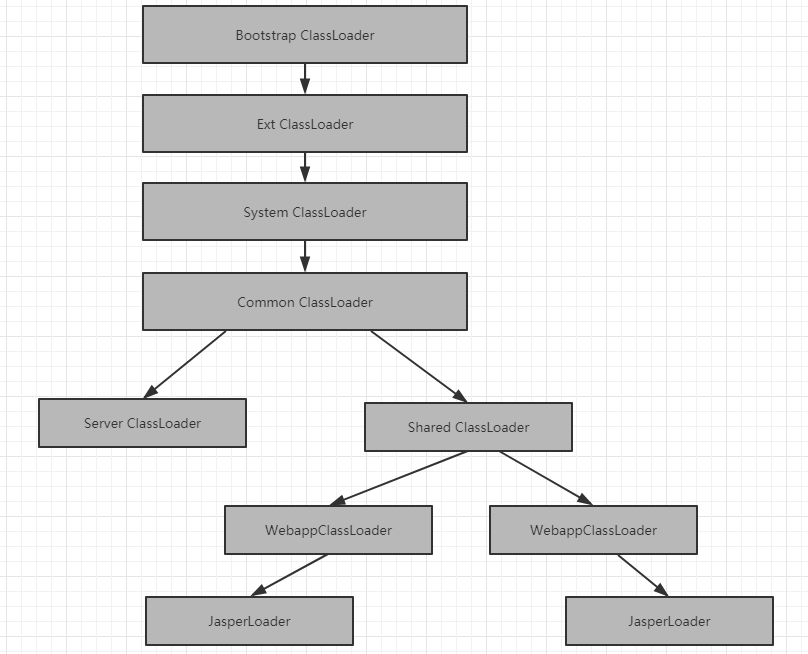
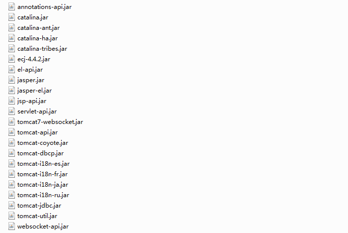

## Tomcat中的类加载机制

### JDK类加载器

在开始Tomcat自定义类加载机制之前，简单了解下正统的JDK中的类加载机制。

#### JDK中的三种类加载器：

- 最顶层加载器`Bootstrap ClassLoader`，加载JVM运行期间需要的核心类库（rt.jar等），由底层c实现。加载的目录列表可通过运行`Arrays.stream(System.getProperty("sun.boot.class.path").split(";")).forEach(System.out::println);`获得目录地址。

- `ExtClassLoader`加载`JRE/lib/ext`或者`java.ext.dirs`目录下的类。可通过运行`Arrays.stream(System.getProperty("java.ext.dirs").split(";")).forEach(System.out::println);`获得目录地址。

- `AppClassLoader`加载系统变量`CLASSPATH`、命令行`-cp`或者`-classpath`、`Manifest`等指定的目录下的类文件。

- Custom ClassLoader 自定义加载器。

#### JDK类加载器加载规则：

- 自下向上查找。

- 自上到下加载。

  

总体来讲在加载一个类的时候按照`AppClassLoader` >> `ExtClassLoader` >>  `Bootstrap ClassLoader`的顺序依次查找有没有加载，如果已经加载则直接返回被加载过的类对象，如果没有被加载过则继续按照这个顺序传递继续查找。假设一直到`Bootstrap ClassLoader`这一层还是没有找到，则会执行**自上到下加载的规则**。按照`Bootstrap ClassLoader`>> `ExtClassLoader` >> `AppClassLoader `顺序查找各自目录下有无指定的类，如果有则载入结束，如果没有则向下传递继续查找直至找到或者抛出`ClassNotFoundException`。

### JDK类加载机制利和弊
- 优点
  JDK类加载机制带来的好处是，使得被加载的类随着它的加载器具备一种带有优先级的层级关系。可以保证核心类的稳定性，不能被随意的修改。

- 缺点
  双亲委派模型决定了上层的加载器无法使用被下层的加载器载入的类。Java核心类库中的JNDI、JDBC等由厂商提供实现的类，就无法在JVM启动时由`Bootstrap ClassLoader`载入。为了解决这个问题JDK在`Thread`类中引入了**线程上下文的加载器**的概念。通过在线程中设定`contextClassLoader`（默认情况下设定的是`AppClassLoader`）来绕过双亲委派模型限制。

  

### Tomcat类加载机制

#### Tomcat所有的类加载器总览

#### Tomcat体系下各个类加载器以及其默认加载内容
- Bootstrap ClassLoader

- Ext ClassLoader

- System ClassLoader

  `System ClassLoader`其实对应的就是`App Classloader`

  正常情况下会加载系统变量`CLASSPATH`路径下的内容。但是Tomcat正常的启动时通过脚本`catalina.sh`或者`start.up`，脚本忽略了原有`CLASSPATH`下的内容，并指定了以下内容会被加载：

  - *$CATALINA_HOME/bin/bootstrap.jar* 包含`main()`方法，用来启动Tomcat服务。
  - *$CATALINA_BASE/bin/tomcat-juli.jar* 或者*$CATALINA_HOME/bin/tomcat-juli.jar*  日志相关。
  - *$CATALINA_HOME/bin/commons-daemon.jar* 提供守护线程等功能。

  当然这个类加载器所加载的类可以被Tomcat以及各个Web应用所访问的到的。

- Common ClassLoader

  提供额外的类供Tomcat以及各个Web应用所访问。正常情况下各个应用的类不应该放到这里，它只会搜索被定义在*$CATALINA_BASE/conf/catalina.properties*文件下*`common.loader`属性所指定的位置下的资源。默认配置内容如下：`${catalina.base}/lib,${catalina.base}/lib/*.jar,${catalina.home}/lib,${catalina.home}/lib/*.jar`

  默认加载一下jar包文件:

  ​	

- Server Classloader

  同`Common ClassLoader`有这类似的地方，加载内容也是通过配置文件中的`server.loader`属性声明，默认为空。可以向上访问Tomcat所加载的类。

- Shared ClassLoader

  加载内容也是通过配置文件中的`shared.loader`属性声明，默认为空。也可以向上访问Tomcat所加载的类。

- WebappClassLoader

  Tomcat实例会为每个Web应用都创建唯一独立的WebappClassLoader，并且会加载当前应用`/WEB-INF/classes`和`/WEB-INF/lib` 目录资源，并且只有当前应用可以访问，其他的应用是访问不了的。

- JasperLoader

  仅加载和Jsp编译之后的class文件相关的类文件。

#### 一个Tomcat Web 应用查找类和资源的时候默认的查找顺序

- 默认的加载顺序
  1. 首先查找由Bootstrap ClassLoader所加载的类资源
  2. 当前Web应用下`/WEB-INF/classes`目录下的类资源
  3. 当前Web应用下`/WEB-INF/lib/`目录下的类资源
  4. App ClassLoader所加载的类资源
  5. 由Common ClassLoader所加载的类资源

- 如果配置了`context.xml`文件‘<Loader delegate="true"/>’，加载顺序则变为
  1. 首先查找由Bootstrap ClassLoader所加载的类资源
  2. App ClassLoader所加载的类资源
  3. 由Common ClassLoader所加载的类资源
  4. 当前Web应用下`/WEB-INF/classes`目录下的类资源
  5. 当前Web应用下`/WEB-INF/lib/`目录下的类资源

